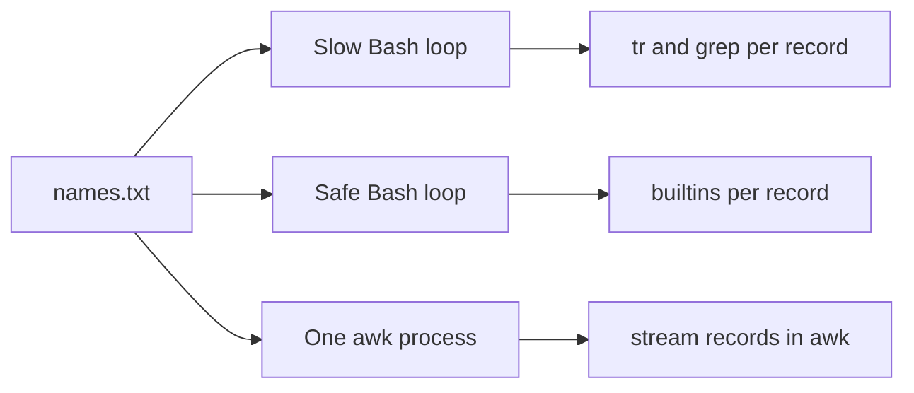

# 04 - Bash Performance

## Learning Goal

Measure Bash scripts, recognize slow patterns caused by repeated process creation and unsafe file reading, rewrite small shell loops safely, and know when one external tool such as `awk`, `grep`, `find`, or `xargs` is faster and clearer.

## Run These Examples In Bash

This lesson teaches Bash. Some commands look similar in other shells, but the examples use Bash syntax such as `TIMEFORMAT`, `./script.sh`, `$name`, heredocs, `${name^^}`, `mapfile`, and `[[ ... ]]`.

Check your Bash version first:

```bash
bash --version
```

On Windows, use WSL or Git Bash. Do not paste Bash syntax directly into PowerShell:

```powershell
wsl bash --version
```

Once WSL is installed, beginners should usually enter the Linux shell and run the examples there:

```powershell
wsl
```

Git Bash is also acceptable for this lesson, especially when WSL is not available. PowerShell's `Measure-Command { wsl ... }` measures the cost of launching WSL too, so it is not a fair way to compare two Bash script rewrites.

On macOS, Terminal opens `zsh` by default. Start Bash or run scripts with Bash explicitly:

```bash
bash
bash script.sh
```

From `zsh`, use `bash -c` when the command relies on Bash features such as `TIMEFORMAT`:

```bash
bash -c 'TIMEFORMAT="real=%3R user=%3U sys=%3S"; time ./slow-names.sh'
```

The `${name^^}` case-conversion expansion is Bash-specific, not POSIX shell or `zsh`. `mapfile` is also Bash-specific. On macOS, the system Bash may be older than Bash versions commonly found on Linux, so `awk` is often the safest portable choice for examples that need uppercase conversion.

Apple Silicon does not require architecture-specific Bash code in this lesson. The practical concern is which shell and command-line tools are installed and which versions they are.

## Why Performance Problems Happen

Bash is good at coordinating programs, working with files, and handling operating-system automation. It is not usually the best place to do millions of tiny text operations one command at a time.

Bash performance problems often come from a few patterns:

- Starting an external command inside a loop.
- Reading files with command substitution, then accidentally splitting records into words.
- Building a pipeline without understanding process and scope behavior.
- Running one command per file or record when the work could be batched.
- Keeping structured data processing in Bash after the problem belongs in `awk`, `jq`, or Python.

The goal is not to make every script clever. The goal is to measure first, remove the biggest avoidable cost, and keep the result readable.

## Mental Model

Bash does two broad kinds of work:

- Shell work: expansions, variables, loops, arithmetic, `[[ ... ]]`, redirects, and builtins such as `read`, `printf`, and `mapfile`.
- Process work: running another program, such as `tr`, `grep`, `sed`, `awk`, `find`, `xargs`, `jq`, or Python.

Shell work happens in the Bash process. External commands require Bash to set up an execution environment, ask the operating system to run another program, connect input and output, and wait for the result.

One external command is fine. Thousands of external commands inside a loop are often slow. That does not mean "avoid external tools." One `awk` process can beat a Bash loop for a large line-oriented file because `awk` streams the records and does the inner work in a tool built for that data shape.

Pipelines connect commands with pipes. In Bash, each element of a multi-command pipeline usually runs in its own subshell. That process boundary affects both performance and whether variable changes survive after the pipeline finishes.



## Measure First

Measure the original script before rewriting. Then change one thing and measure again on the same machine. Timing numbers vary by hardware, operating system, shell version, filesystem cache, and background load, so compare local before-and-after results instead of copying someone else's numbers.

Bash has a `time` reserved word:

```bash
time ./script.sh
```

It reports:

- `real`: wall-clock time from start to finish.
- `user`: CPU time spent running program code.
- `sys`: CPU time spent in the kernel, often from process creation, file I/O, and other operating-system work.

Set Bash's `TIMEFORMAT` variable when you want compact, repeatable output:

```bash
bash -c 'TIMEFORMAT="real=%3R user=%3U sys=%3S"; time ./slow-names.sh'
```

There is also an external `time` program. On Linux and macOS it is commonly available as `/usr/bin/time`, but its options are not identical everywhere:

```bash
/usr/bin/time -p ./slow-names.sh
```

The `-p` option prints `real`, `user`, and `sys` in a portable format.

GNU systems often provide extra detail with:

```bash
/usr/bin/time -v ./slow-names.sh
```

Do not treat `-v` as universal. macOS `/usr/bin/time` does not use GNU `-v`; it commonly supports `-l` for resource details:

```bash
/usr/bin/time -l -p ./slow-names.sh
```

## Read Files Safely

Use this pattern for line-by-line reading:

```bash
while IFS= read -r line; do
  printf '%s\n' "$line"
done < input.txt
```

The details matter:

- `IFS=` prevents `read` from trimming leading and trailing IFS whitespace.
- `read -r` prevents backslashes from being treated as escapes.
- `< input.txt` redirects the file into the loop without starting `cat`.
- `printf` is more predictable than `echo` for arbitrary data.

Avoid this pattern:

```text
for word in $(cat input.txt); do
  printf '%s\n' "$word"
done
```

Command substitution removes trailing newlines, then Bash performs word splitting and filename expansion on the unquoted result. A line such as `ada lovelace` becomes two loop items, and an input value containing `*` can match filenames in the current directory.

When a file fits comfortably in memory and you really want an array of lines, Bash's `mapfile` can read it:

```bash
mapfile -t lines < input.txt

for line in "${lines[@]}"; do
  printf '%s\n' "$line"
done
```

When you need the whole file as one string, Bash can read it without `cat`:

```bash
contents=$(< input.txt)
```

Whole-file capture is not a streaming line-reading pattern. Use it only when the whole file should be in memory.

## Avoid Repeated Subprocesses

This loop starts external programs for every line:

```bash
while IFS= read -r name; do
  upper=$(printf '%s\n' "$name" | tr '[:lower:]' '[:upper:]')
  if printf '%s\n' "$upper" | grep -q 'A'; then
    printf '%s\n' "$upper"
  fi
done < names.txt
```

The repeated `tr` and `grep` calls can dominate runtime for large files.

When your Bash version supports the feature, use parameter expansion for small shell-level string work:

```bash
while IFS= read -r name; do
  upper=${name^^}
  if [[ $upper == *A* ]]; then
    printf '%s\n' "$upper"
  fi
done < names.txt
```

`${name^^}` is Bash case modification. It is not POSIX shell syntax and it is not `zsh` syntax. If version compatibility matters, or if the input is large record-oriented text, use `awk`:

```bash
awk '
{
  upper = toupper($0)
  if (upper ~ /A/) {
    print upper
  }
}
' names.txt
```

## Batch External Commands

If you need an external tool, try to run it once over many inputs instead of once per input.

Slow for many files:

```bash
for file in ./*.log; do
  grep -H 'ERROR' "$file"
done
```

Often enough for a normal shell glob:

```bash
grep -H 'ERROR' ./*.log
```

Safer for recursively discovered filenames, when you know there is at least one match:

```bash
find . -type f -name '*.log' -print0 | xargs -0 grep -H 'ERROR'
```

`find -print0` writes a null byte after each path. `xargs -0` reads null-delimited input. Together, they handle filenames containing spaces, tabs, quotes, and newlines.

Many GNU examples use `xargs -r` to avoid running the command when there is no input. Do not copy that option into cross-platform examples without checking the target system: GNU and BSD/macOS `xargs` differ.

When the input may be empty and you want a portable recursive grep, use `find -exec ... {} +` instead:

```bash
find . -type f -name '*.log' -exec grep -H 'ERROR' {} +
```

## Pipeline Costs And Scope

Pipelines are idiomatic shell. They are also process boundaries.

This looks reasonable, but the final `count` may still be `0`:

```bash
count=0

printf '%s\n' alpha beta gamma | while IFS= read -r line; do
  count=$((count + 1))
done

printf 'count=%s\n' "$count"
```

The loop is part of a pipeline, so Bash usually runs it in a subshell. The `count` change happens in that subshell and does not survive in the parent shell.

When you need loop state afterward, redirect input into the loop:

```bash
count=0

while IFS= read -r line; do
  count=$((count + 1))
done < names.txt

printf 'count=%s\n' "$count"
```

Use pipelines freely when their output is the result and you do not need modified shell variables afterward.

## When To Use Bash Or Another Tool

Stay in Bash when the script coordinates commands, checks exit statuses, moves files, handles simple variables, or does a small amount of control flow.

Choose a more specific tool when the data shape asks for it:

- Use `awk` for line-oriented text, fields, totals, grouping, reports, and portable uppercase conversion.
- Use `grep` once over many files or records when you are filtering by text.
- Use `find` for recursive filesystem searches and file predicates.
- Use `xargs` when many paths or records should be passed to a command in batches.
- Use `jq` for JSON instead of parsing JSON with `grep`, `cut`, or `sed`.
- Use Python when the script needs complex data structures, nontrivial parsing, libraries, tests, or maintainable application logic.

The performance win often comes from moving the inner loop into one tool designed for the records.

## Common Mistakes

- Measuring only after rewriting, so there is no baseline.
- Spending time optimizing tiny scripts where readability matters more.
- Starting one command per record, such as `tr`, `grep`, `sed`, `awk`, or `jq` inside a large loop.
- Using `for item in $(cat file)` and accidentally processing words instead of lines.
- Leaving command substitutions unquoted and triggering word splitting and filename expansion.
- Expecting variables changed in a pipeline-fed loop to survive after the pipeline.
- Copying GNU-only options, such as GNU `time -v` or GNU `xargs -r`, into macOS instructions without checking.
- Pasting Bash heredocs, `TIMEFORMAT`, `chmod`, `./script.sh`, `$name`, or `[[ ... ]]` directly into PowerShell.
- Keeping JSON or complex parsing in Bash after the problem clearly belongs in `jq` or Python.

## Exercise

Create the exercise files from inside Bash, not directly in PowerShell.

On Windows, enter WSL first:

```powershell
wsl
```

On macOS, start Bash from Terminal if your prompt is `zsh`:

```bash
bash
```

Create `names.txt`:

```bash
cat > names.txt <<'EOF'
ada lovelace
Grace Hopper
alan turing
Katherine Johnson
EOF
```

Create a deliberately slow and flawed script:

```bash
cat > slow-names.sh <<'EOF'
#!/usr/bin/env bash

count=0

for name in $(cat names.txt); do
  upper=$(echo "$name" | tr '[:lower:]' '[:upper:]')
  if echo "$upper" | grep -q 'A'; then
    count=$((count + 1))
    echo "$upper"
  fi
done

echo "count=$count"
EOF

chmod +x slow-names.sh
```

Then:

1. Measure `slow-names.sh`.
2. Identify the performance and correctness problems.
3. Rewrite it as a safe Bash streaming loop.
4. Rewrite it as one `awk` program.
5. Compare the output and decide which rewrite you would choose for a very large file.

## Worked Answer

Measure the original with Bash's `time` reserved word:

```bash
bash -c 'TIMEFORMAT="real=%3R user=%3U sys=%3S"; time ./slow-names.sh'
```

Or use external `time` in portable output mode:

```bash
/usr/bin/time -p ./slow-names.sh
```

On GNU systems only, this may provide more detail:

```bash
/usr/bin/time -v ./slow-names.sh
```

On macOS, use the local manual page to confirm options. For resource details, this form is commonly available:

```bash
/usr/bin/time -l -p ./slow-names.sh
```

Problems in the original script:

- `$(cat names.txt)` reads the whole file, then word-splits it, so `ada lovelace` becomes `ada` and `lovelace`.
- Unquoted command substitution output is also subject to filename expansion.
- The loop processes words, not lines.
- `echo "$name" | tr ...` starts external commands for each item.
- `echo "$upper" | grep -q ...` starts more external commands for each item.
- `echo` is less predictable than `printf`.
- The script uses Bash for the loop but does simple string work through repeated subprocesses.

The slow script's output is:

```text
ADA
GRACE
ALAN
KATHERINE
count=4
```

That output is wrong if the task is to preserve matching lines. `ada lovelace` and `alan turing` were split apart.

Safe Bash streaming rewrite:

```bash
cat > fast-names-bash.sh <<'EOF'
#!/usr/bin/env bash

count=0

while IFS= read -r name; do
  upper=${name^^}
  if [[ $upper == *A* ]]; then
    count=$((count + 1))
    printf '%s\n' "$upper"
  fi
done < names.txt

printf 'count=%s\n' "$count"
EOF

chmod +x fast-names-bash.sh
./fast-names-bash.sh
```

Expected output:

```text
ADA LOVELACE
GRACE HOPPER
ALAN TURING
KATHERINE JOHNSON
count=4
```

This version streams the file, preserves each line, uses Bash case modification, uses `[[ ... ]]` for pattern matching, and avoids external commands inside the loop.

For maximum macOS compatibility, or for large record-oriented files, prefer the `awk` rewrite:

```bash
cat > fast-names-awk.sh <<'EOF'
#!/usr/bin/env bash

awk '
{
  upper = toupper($0)
  if (upper ~ /A/) {
    count++
    print upper
  }
}
END {
  print "count=" count
}
' names.txt
EOF

chmod +x fast-names-awk.sh
./fast-names-awk.sh
```

Expected output:

```text
ADA LOVELACE
GRACE HOPPER
ALAN TURING
KATHERINE JOHNSON
count=4
```

For a very large file, choose the `awk` version. It starts one process, streams the input, and performs the record processing in a language designed for line-oriented text. The Bash rewrite is useful when the surrounding script is already Bash, the file is modest, and your Bash version supports the features you used.

## Next Step

Return to the advanced Bash README and continue with the next numbered lesson. As you write future scripts, measure first, look for repeated subprocesses, and move large inner loops into the right tool.

## Sources Used

- GNU Bash Manual: Pipelines - https://www.gnu.org/software/bash/manual/bash.html#Pipelines
- GNU Bash Manual: Command Execution Environment - https://www.gnu.org/software/bash/manual/bash.html#Command-Execution-Environment
- GNU Bash Manual: Bash Builtin Commands - https://www.gnu.org/software/bash/manual/bash.html#Bash-Builtins
- GNU Bash Manual: Command Substitution - https://www.gnu.org/software/bash/manual/bash.html#Command-Substitution
- GNU Bash Manual: Word Splitting - https://www.gnu.org/software/bash/manual/bash.html#Word-Splitting
- GNU Bash Manual: Filename Expansion - https://www.gnu.org/software/bash/manual/bash.html#Filename-Expansion
- GNU Bash Manual: Shell Parameter Expansion - https://www.gnu.org/software/bash/manual/bash.html#Shell-Parameter-Expansion
- Linux man-pages: `time(1)` - https://man7.org/linux/man-pages/man1/time.1.html
- GNU Findutils Manual: Safe File Name Handling - https://www.gnu.org/software/findutils/manual/html_node/find_html/Safe-File-Name-Handling.html
- GNU Findutils Manual: `xargs` options - https://www.gnu.org/software/findutils/manual/html_node/find_html/xargs-options.html
- GNU Awk Manual: String Functions, including `toupper` - https://www.gnu.org/software/gawk/manual/html_node/String-Functions.html
- Apple Support: Change the default shell in Terminal on Mac - https://support.apple.com/guide/terminal/change-the-default-shell-trml113/mac
- Microsoft Learn: Install WSL - https://learn.microsoft.com/en-us/windows/wsl/install
- Git for Windows: Git Bash - https://gitforwindows.org/
- macOS local manual pages: run `man time` and `man xargs` on the target Mac. If a web link is required, mirrors such as https://manp.gs/mac/1/time and https://leopard-adc.pepas.com/documentation/Darwin/Reference/ManPages/man1/xargs.1.html can be useful, but verify against the local manual page because macOS command options can change by release.
