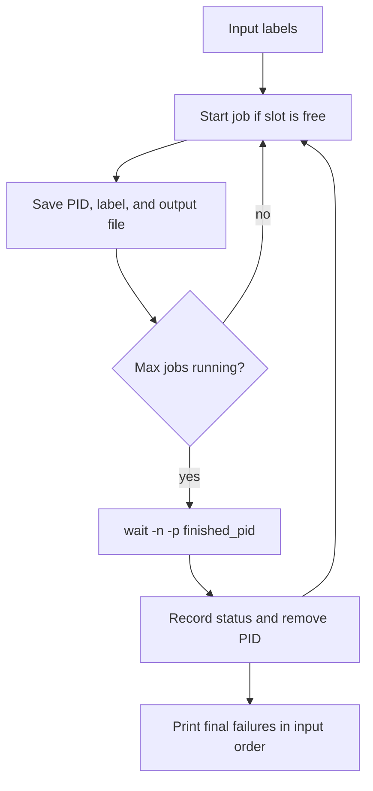

# 05 - Parallel Work

## Learning Goal

Run independent Bash tasks in parallel, limit how many run at once, collect each job's exit status safely, keep output readable, and clean up child processes when the script is interrupted.

## Requirements

The worked answer in this lesson requires GNU Bash 5.1 or newer. Bash 5.1 added `wait -p VARNAME` and improved `wait -n` so it can wait for an explicit list of jobs or process IDs.

Check your version:

```bash
bash --version
bash -c '(( BASH_VERSINFO[0] > 5 || (BASH_VERSINFO[0] == 5 && BASH_VERSINFO[1] >= 1) )) && echo "Bash is compatible" || echo "Need Bash 5.1+"'
```

Compatible examples include Bash 5.1.16, 5.2.x, and 5.3.x. Not compatible: 3.2.57, 4.4.x, or 5.0.x.

On Windows, Bash syntax is not PowerShell syntax. Use PowerShell only to install or launch WSL, then run the lesson commands inside WSL/Linux Bash:

```powershell
wsl --install
wsl bash -lc 'bash --version'
wsl bash -lc 'cd /mnt/c/path/to/project && bash ./parallel_check.sh api db bad-cache worker fail-auth'
```

Commands such as `chmod +x`, `./parallel_check.sh`, `trap`, `kill`, `mktemp`, and `wait -n -p` run inside WSL/Linux Bash. PowerShell is just the launcher in these examples.

On macOS, the default interactive shell is usually `zsh`, but this lesson is about Bash scripts. Check the Bash you will actually run:

```zsh
bash --version
bash ./parallel_check.sh api db bad-cache worker fail-auth
```

If `bash --version` reports an older Bash, install and use a newer Bash, for example with Homebrew, then verify the actual `bash` on your `PATH`. Apple Silicon (`arm64`) changes native install paths and `PATH` setup, but it does not change Bash language semantics.

## Why It Matters

Many shell scripts repeat the same slow operation for many independent inputs: check URLs, compress files, run tests, resize images, or scan logs. Running those jobs one at a time is simple, but it can waste time when each job spends most of its life waiting for disk, network, or another program.

Parallel Bash is useful when the work is independent and the parent script stays organized. The hard part is not starting jobs; `&` does that. The hard parts are remembering which PID belongs to which input, waiting without losing failures, keeping output from different jobs separate, choosing a safe concurrency limit, and stopping children when the parent script is cancelled.

## Core Idea

Putting `&` after a command starts it asynchronously in the background. Bash immediately continues to the next command. The special parameter `$!` expands to the process ID of the most recent background job. Capture it immediately, before any other background command can change it.

```bash
some_command &
pid=$!
echo "started PID $pid"
```

Use `wait` to collect results:

- `wait PID` waits for one child and returns that child's exit status.
- Plain `wait` waits for all known background jobs, but it does not tell you which input failed, so it is unsuitable for per-input reports.
- `wait -n` waits for the next listed child, or the next unwaited-for child if no list is given.
- `wait -n -p var "${pids[@]}"` waits for the next PID from that explicit list and stores the completed identifier in `var`, which lets you map the result back to the original input.

These are Bash features. Other shells may not have `wait -n` or `wait -p`, and older Bash versions do not support the worked answer.

## Start Jobs And Wait

Start background jobs with `&`, capture `$!` immediately, then wait for each PID when you need its result.

```bash
#!/usr/bin/env bash

sleep 2 &
pid_a=$!

sleep 1 &
pid_b=$!

wait "$pid_a"
status_a=$?

wait "$pid_b"
status_b=$?

echo "job $pid_a exited with $status_a"
echo "job $pid_b exited with $status_b"
```

Both sleeps run at the same time. The script waits for `pid_a` first, so it may not print anything until the two-second job finishes, even though the one-second job finished earlier. The status variables still correctly capture each job's result.

Plain `wait` is fine when you only care that all jobs have finished:

```bash
for file in *.log; do
  gzip -k "$file" &
done

wait
echo "all compression jobs are done"
```

Use `wait PID` or `wait -n -p var "${pids[@]}"` when each job's identity and result matter.

## Bounded Concurrency

Starting one background job per input can overload the machine or an external service. Bounded concurrency keeps only a fixed number of jobs running.

Good starting points:

- CPU-bound work: start near the number of logical CPUs, then measure.
- Disk-heavy work: use fewer jobs if the disk starts thrashing.
- Network or API work: respect rate limits, connection limits, and service terms.
- Unknown work: start small, such as 2 to 4 jobs, and increase only after observing CPU, memory, disk, network, and error rates.

Avoid unbounded process creation. A script that launches thousands of processes at once can exhaust memory, file descriptors, process table entries, or remote service limits.

This example runs at most three jobs at a time:

```bash
#!/usr/bin/env bash

max_jobs=3
running=0
failures=0

for item in alpha beta gamma delta epsilon zeta; do
  (
    echo "checking $item"
    sleep "$(( (${#item} % 3) + 1 ))"
    [[ $item != delta ]]
  ) &

  ((running++))

  if (( running >= max_jobs )); then
    wait -n
    status=$?
    ((running--))
    if (( status != 0 )); then
      ((failures++))
    fi
  fi
done

while (( running > 0 )); do
  wait -n
  status=$?
  ((running--))
  if (( status != 0 )); then
    ((failures++))
  fi
done

echo "$failures job(s) failed"
```

`wait -n` waits for whichever child finishes next. That frees one slot, so the loop can start another job. This pattern is good when you need a simple failure count but do not need to know which PID finished.

## Track PID Metadata

When you need to report which input failed, store metadata by PID. Associative arrays are a natural fit:

```bash
#!/usr/bin/env bash

declare -A item_by_pid
declare -A status_by_pid
pids=()

for item in api db cache worker; do
  (
    echo "checking $item"
    sleep "$(( (${#item} % 2) + 1 ))"
    [[ $item != cache ]]
  ) &

  pid=$!
  pids+=("$pid")
  item_by_pid["$pid"]=$item
done

while ((${#pids[@]} > 0)); do
  wait -n -p finished_pid "${pids[@]}"
  status=$?

  status_by_pid["$finished_pid"]=$status
  printf '%s finished with status %d\n' "${item_by_pid[$finished_pid]}" "$status"

  next=()
  for pid in "${pids[@]}"; do
    [[ $pid == "$finished_pid" ]] || next+=("$pid")
  done
  pids=("${next[@]}")
done
```

Passing the current PID list to `wait -n -p` makes the completed identifier usable as a key. Save `$?` immediately after `wait`; any command you run next will replace it.



## Isolate Output

Parallel jobs should not write unsynchronized records to the same file. Short appends may appear to work, but output from real commands can interleave, arrive out of order, or leave partial logs when jobs fail.

Bad shared append:

```bash
for label in one two three four; do
  {
    echo "start $label"
    sleep 1
    echo "done $label"
  } >>results.log &
done
wait
```

Better per-job output:

```bash
tmpdir=$(mktemp -d)
pids=()
declare -A label_by_pid
declare -A output_by_pid

for label in one two three four; do
  output=$tmpdir/$label.out
  {
    echo "start $label"
    sleep 1
    echo "done $label"
  } >"$output" 2>&1 &

  pid=$!
  pids+=("$pid")
  label_by_pid["$pid"]=$label
  output_by_pid["$pid"]=$output
done

for pid in "${pids[@]}"; do
  wait "$pid"
  printf '== %s ==\n' "${label_by_pid[$pid]}"
  cat "${output_by_pid[$pid]}"
done

rm -rf "$tmpdir"
```

Separate files let each job write freely. The parent decides when and in what order to print or merge the output.

## Cleanup On Interrupt

If the parent script receives `Ctrl-C` or `TERM`, background children may keep running unless you stop them. Track PIDs and install a trap.

```bash
#!/usr/bin/env bash

pids=()

cleanup() {
  trap - INT TERM

  if ((${#pids[@]} > 0)); then
    kill "${pids[@]}" 2>/dev/null || true
    wait "${pids[@]}" 2>/dev/null || true
  fi

  exit 130
}

trap cleanup INT TERM

for item in a b c d; do
  sleep 30 &
  pids+=("$!")
done

wait
```

`kill` asks children to terminate. The follow-up `wait` reaps them so the script does not leave completed children behind. The trap removes itself first so a second signal can use the default behavior.

## xargs -P

`xargs` can run a command for many inputs without writing your own PID loop, but `-P` is not POSIX-standard `xargs`. GNU `xargs` and BSD/macOS `xargs` both document `-P`, but details differ. Check your local manual with `man xargs` before relying on a specific behavior.

Bounded example:

```bash
find logs -type f -name '*.log' -print0 |
  xargs -0 -n 1 -P 4 gzip -k
```

Important options:

- `-0` reads NUL-separated input. This pairs with `find -print0` and safely handles spaces and newlines in filenames on implementations that support both options.
- `-n 1` passes one input item to each command invocation.
- `-P 4` runs up to four command invocations at the same time on GNU and BSD/macOS implementations that support it.

Caveats:

- Do not present GNU-only behavior, such as special `-P 0` handling, as portable.
- Output from parallel invocations can interleave unless the command writes to separate files.
- Shell functions and aliases are not directly available to `xargs`; use a script or `bash -c` carefully.
- Quoting with `bash -c` is easy to get wrong. Prefer passing input as positional parameters rather than interpolating it into a command string.
- `xargs` is best when each input maps cleanly to one command. Use a Bash PID loop when you need custom cleanup, progress tracking, or rich status reports.

## GNU Parallel Overview

GNU Parallel is a dedicated tool for running jobs in parallel. It is more capable than a small Bash loop, especially for preserving output, replacing placeholders, spreading work across inputs, and controlling job order.

```bash
printf '%s\n' alpha beta gamma delta |
  parallel -j 4 'echo checking {}; sleep 1'
```

Useful basics:

- `-j 4` runs up to four jobs at once.
- `{}` is replaced with the current input item.
- `--keep-order` prints output in input order instead of completion order.

Example:

```bash
printf '%s\n' alpha beta gamma delta |
  parallel -j 4 --keep-order 'echo "checked {}"'
```

GNU Parallel may not be installed by default. Check with `parallel --version`, and use `xargs -P` or a Bash loop when portability matters.

## When Not To Parallelize

Do not parallelize just because you can.

- Avoid parallel work when jobs must happen in a strict order.
- Avoid it when every job writes to the same database row, file, lock, or external service without coordination.
- Avoid it when the bottleneck is already saturated, such as a single slow disk or a rate-limited API.
- Avoid it when failures require immediate stop-and-rollback behavior that the script does not implement.
- Avoid it for tiny tasks where process startup costs more than the work.
- Avoid high parallelism on production systems unless you understand CPU, memory, file descriptor, network, and service limits.

## Common Mistakes

- Reading `$!` too late. Capture it immediately after the command with `&`.
- Running plain `wait` once and assuming you know which input failed.
- Losing the status by running `echo`, `printf`, or another command before saving `$?`.
- Using `set -e` around `wait` without care. A failed child can make the parent exit before it records the failure.
- Forgetting that variables changed inside `( ... ) &` are changed in a subshell, not in the parent shell.
- Letting every input start at once instead of bounding concurrency.
- Writing all job output to the same file and expecting clean records.
- Forgetting to remove completed PIDs from a list used with `wait -n -p`.
- Assuming `wait -n` and `wait -p` exist in every shell or older Bash version.
- Killing children on interrupt but forgetting to `wait` for them afterward.

## Exercise

Build `parallel_check.sh`.

Requirements:

- Require Bash 5.1 or newer and exit 2 with a helpful message if the running Bash is too old.
- Accept labels as command-line arguments and exit 2 with usage text when no labels are given.
- Simulate a check for each label.
- Limit concurrency to three running checks.
- Capture PIDs as jobs are started.
- Store PID/job metadata so each completion maps back to its label and output file.
- Use `wait -n -p` to learn which job finished.
- Write each job's output to a separate temporary output file.
- Print progress lines in completion order.
- Print failed output in the original input order after all jobs finish.
- Clean up child jobs and temporary files on `Ctrl-C`, `TERM`, and normal exit.
- Exit 0 if every check passes, 1 if any check fails, 2 for usage or version errors, and 130 for interrupt or termination.

Suggested behavior for the simulated check: sleep for a small label-dependent delay, print a few lines, and fail labels containing `fail` or `bad`.

## Worked Answer

Save this as `parallel_check.sh`.

```bash
#!/usr/bin/env bash
set -u
set -o pipefail

if ! (( BASH_VERSINFO[0] > 5 || (BASH_VERSINFO[0] == 5 && BASH_VERSINFO[1] >= 1) )); then
  echo "Need Bash 5.1+ for wait -n -p with explicit PID lists" >&2
  exit 2
fi

if (($# == 0)); then
  echo "usage: $0 LABEL [LABEL ...]" >&2
  exit 2
fi

max_jobs=3
tmpdir=$(mktemp -d)

declare -a pids=()
declare -a labels=("$@")
declare -A label_by_pid=()
declare -A index_by_pid=()
declare -A output_by_index=()
declare -A status_by_index=()

cleanup_files() {
  rm -rf "$tmpdir"
}

stop_children() {
  trap - INT TERM EXIT

  if ((${#pids[@]} > 0)); then
    kill "${pids[@]}" 2>/dev/null || true
    wait "${pids[@]}" 2>/dev/null || true
  fi

  cleanup_files
  exit 130
}

trap stop_children INT TERM
trap cleanup_files EXIT

simulate_check() {
  local label=$1
  local delay=$(( (${#label} % 3) + 1 ))

  echo "start $label"
  sleep "$delay"
  echo "delay ${delay}s"

  if [[ $label == *fail* || $label == *bad* ]]; then
    echo "result $label: failed"
    return 1
  fi

  echo "result $label: ok"
}

safe_name() {
  local raw=$1
  printf '%s' "${raw//[^A-Za-z0-9_.-]/_}"
}

remove_pid() {
  local remove=$1
  local pid
  local next=()

  for pid in "${pids[@]}"; do
    [[ $pid == "$remove" ]] || next+=("$pid")
  done

  pids=("${next[@]}")
}

reap_one() {
  local finished_pid
  local status
  local index
  local label

  wait -n -p finished_pid "${pids[@]}"
  status=$?

  index=${index_by_pid[$finished_pid]}
  label=${label_by_pid[$finished_pid]}
  status_by_index["$index"]=$status

  if (( status == 0 )); then
    printf 'ok: %s\n' "$label"
  else
    printf 'failed: %s (status %d)\n' "$label" "$status"
  fi

  remove_pid "$finished_pid"
}

start_check() {
  local index=$1
  local label=${labels[$index]}
  local output
  local pid

  output=$(mktemp "$tmpdir/${index}_$(safe_name "$label").XXXXXX.out")

  simulate_check "$label" >"$output" 2>&1 &
  pid=$!

  pids+=("$pid")
  label_by_pid["$pid"]=$label
  index_by_pid["$pid"]=$index
  output_by_index["$index"]=$output
}

for index in "${!labels[@]}"; do
  start_check "$index"

  if ((${#pids[@]} >= max_jobs)); then
    reap_one
  fi
done

while ((${#pids[@]} > 0)); do
  reap_one
done

failed=0
for index in "${!labels[@]}"; do
  if (( ${status_by_index["$index"]:-1} != 0 )); then
    ((failed++))
  fi
done

if (( failed > 0 )); then
  echo
  echo "failed output:"

  for index in "${!labels[@]}"; do
    label=${labels[$index]}
    if (( ${status_by_index["$index"]:-1} != 0 )); then
      printf '\n== %s ==\n' "$label"
      cat "${output_by_index[$index]}"
    fi
  done

  echo
  printf 'summary: %d failed, %d total\n' "$failed" "$#"
  exit 1
fi

printf 'summary: 0 failed, %d total\n' "$#"
```

Example run on Linux, WSL, or macOS with Bash 5.1+:

```bash
chmod +x parallel_check.sh
./parallel_check.sh api db bad-cache worker fail-auth
```

If you do not want to mark it executable, run it through Bash:

```bash
bash ./parallel_check.sh api db bad-cache worker fail-auth
```

Expected behavior:

- No more than three checks run at the same time.
- Successful labels print `ok: LABEL`.
- Labels containing `bad` or `fail` print progress failures in completion order.
- Failed jobs have their saved output printed after all jobs finish, in the original input order.
- `Ctrl-C` or `TERM` kills running checks, waits for them, removes the temporary directory, and exits with status 130.
- The script exits with status 0, 1, 2, or 130 according to the exercise requirements.

## Next Step

Return to the advanced Bash lesson list and look for the next place where parallel work can simplify a slow loop. Before changing it, identify the input list, the safe concurrency limit, the output strategy, and the cleanup behavior.

## Sources Used

- GNU Bash NEWS, Bash 5.1 changes for `wait -p` and `wait -n`: https://git.savannah.gnu.org/cgit/bash.git/tree/NEWS?h=bash-5.1
- GNU Bash Reference Manual: Lists of Commands, for `&` and asynchronous commands: https://www.gnu.org/software/bash/manual/html_node/Lists.html
- GNU Bash Reference Manual: Special Parameters, for `$!` and `$?`: https://www.gnu.org/software/bash/manual/html_node/Special-Parameters.html
- GNU Bash Reference Manual: Job Control Builtins, for `wait`, `wait -n`, `wait -p`, and `kill`: https://www.gnu.org/software/bash/manual/html_node/Job-Control-Builtins.html
- GNU Bash Reference Manual: Signals, for signal behavior while waiting: https://www.gnu.org/software/bash/manual/html_node/Signals.html
- GNU Bash Reference Manual: Bourne Shell Builtins, for `trap`: https://www.gnu.org/software/bash/manual/html_node/Bourne-Shell-Builtins.html
- GNU Findutils Manual: Controlling Parallelism, for GNU `xargs -P`: https://www.gnu.org/software/findutils/manual/html_node/find_html/Controlling-Parallelism.html
- GNU Findutils Manual: xargs options, for GNU `-0`, `-n`, and `-P`: https://www.gnu.org/software/findutils/manual/html_node/find_html/xargs-options.html
- POSIX `xargs`, for the portable baseline that does not standardize `-P`: https://pubs.opengroup.org/onlinepubs/9799919799/utilities/xargs.html
- FreeBSD `xargs`, for BSD/macOS-style `-P` documentation: https://man.freebsd.org/cgi/man.cgi?query=xargs&sektion=1
- Apple Terminal User Guide: Use zsh as the default shell on Mac: https://support.apple.com/guide/terminal/use-zsh-as-the-default-shell-trml113/mac
- Microsoft Learn: Install WSL: https://learn.microsoft.com/windows/wsl/install
- Microsoft Learn: Basic commands for WSL: https://learn.microsoft.com/windows/wsl/basic-commands
- Homebrew installation documentation: https://docs.brew.sh/Installation
- GNU Parallel Tutorial, for `parallel -j`, `{}`, and `--keep-order`: https://www.gnu.org/software/parallel/parallel_tutorial.html
