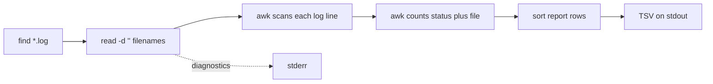

# 06 - Advanced Text Pipelines

## Learning Goal

Build robust Bash text pipelines that keep data and diagnostics separate, detect failures, process streams incrementally, preserve headers, handle filenames safely, and recognize when plain text tools are the wrong parser.

## Streams And Pipelines

Unix-style command-line tools usually communicate through three streams:

- `stdin`: input read by a command.
- `stdout`: normal output written by a command.
- `stderr`: diagnostic and error output written by a command.

A pipeline connects the `stdout` of one command to the `stdin` of the next:

```bash
grep 'ERROR' app.log | sort | uniq -c
```

Redirection changes where streams come from or go:

```bash
grep 'ERROR' < app.log > errors.txt
grep 'ERROR' app.log 2> grep-diagnostics.txt
```

Keep machine-readable output on `stdout` and progress, warnings, usage messages, and errors on `stderr`. That lets another command or script consume the data without also parsing human diagnostics:

```bash
printf 'scanning %s\n' "$log_dir" >&2
printf '%s\t%s\t%s\n' "$count" "$status" "$file"
```

Bash also supports `|&`, which pipes both `stdout` and `stderr` into the next command:

```bash
make |& tee build.log
```

Use `|&` only when mixing normal output and diagnostics is intentional. It is useful for build logs, but it is usually wrong for data pipelines.

## Pipeline Status And Failure Detection

By default, Bash reports the exit status of the last command in a pipeline:

```bash
grep 'ERROR' missing.log | sort
printf 'pipeline status: %s\n' "$?"
```

If `grep` fails but `sort` succeeds, the pipeline can still appear successful because `sort` is the last command. In scripts that need pipeline failures to matter, enable `pipefail`:

```bash
set -o pipefail
grep 'ERROR' missing.log | sort
```

With `pipefail`, a pipeline returns `0` only when every command succeeds. If one or more commands fail, Bash returns the status of the rightmost failed command.

Bash also stores each command's status in `PIPESTATUS`:

```bash
grep 'ERROR' app.log | sort | uniq -c
statuses=("${PIPESTATUS[@]}")
printf 'grep=%s sort=%s uniq=%s\n' "${statuses[0]}" "${statuses[1]}" "${statuses[2]}"
```

Copy `PIPESTATUS` immediately after the pipeline. Running another command, including `printf`, replaces it with the status information for that newer command.

`grep` has a useful special case:

- `0`: at least one selected line was found.
- `1`: no lines were selected.
- `2`: an error occurred.

That means "no matches" is not the same thing as a broken command.

## Core Text Tools

Use small tools for line-oriented text:

```bash
grep -E 'status=(500|503)' app.log
cut -f1,3 report.tsv
tr '[:upper:]' '[:lower:]' < names.txt
sort -t $'\t' -k2,2 report.tsv
uniq -c repeated-lines.txt
awk -F '\t' '{ counts[$2]++ } END { for (key in counts) print counts[key], key }' report.tsv
sed -n '1,5p' app.log
```

Important details:

- `uniq` only combines adjacent duplicate records, so it is normally used after `sort`.
- Locale can affect ordering and character classes. Use `LC_ALL=C` when bytewise reproducibility matters.
- GNU, BSD, and macOS versions of `sed`, `awk`, `grep`, `sort`, `find`, and `xargs` are not identical. Check local manuals before relying on non-POSIX options.

For example, this portable `awk` pattern avoids gawk-only capture arrays:

```bash
awk '
  match($0, /status=[0-9][0-9][0-9]/) {
    status = substr($0, RSTART + 7, 3)
    print status
  }
' app.log
```

The `match` call sets `RSTART`, and `substr` extracts the three digits after `status=`.

## Build Pipelines Incrementally

Build long pipelines one stage at a time. Inspect each stage before adding the next one:

```bash
head -n 20 app.log
grep -E 'status=[0-9][0-9][0-9]' app.log | head
grep -E 'status=[0-9][0-9][0-9]' app.log |
  awk 'match($0, /status=[0-9][0-9][0-9]/) { print substr($0, RSTART + 7, 3) }' |
  head
```

Then add counting and sorting:

```bash
grep -E 'status=[0-9][0-9][0-9]' app.log |
  awk 'match($0, /status=[0-9][0-9][0-9]/) { print substr($0, RSTART + 7, 3) }' |
  sort |
  uniq -c |
  sort -k1,1nr -k2,2n
```

Use `tee` to save or inspect an intermediate stream while still passing it onward:

```bash
grep 'ERROR' app.log |
  tee error-lines.sample |
  awk 'match($0, /status=[0-9][0-9][0-9]/) { print substr($0, RSTART + 7, 3) }'
```

## Preserving Headers

Sorting a whole file with a header usually moves the header into the data. Read the header first, print it, then sort the remaining body:

```bash
{
  IFS= read -r header
  printf '%s\n' "$header"
  LC_ALL=C sort -t $'\t' -k2,2
} < report.tsv
```

This pattern is appropriate for simple line-oriented TSV. It is not a complete CSV parser. Real CSV can contain quoted commas, escaped quotes, and embedded newlines, so use Python's `csv` module for real CSV. JSON has nesting and quoting rules too, so use a JSON parser such as `jq` for JSON. Those are conceptual recommendations here; this lesson's exercise does not require either tool.

## Filename Safety

Filenames can contain spaces, quotes, backslashes, tabs, and newlines. Do not use command substitution to loop over `find` output:

```text
for file in $(find logs -name '*.log'); do
  ...
done
```

That splits names on whitespace and can corrupt filenames.

Use NUL-delimited filenames from `find -print0` and read them with `read -r -d ''`:

```bash
find "$log_dir" -type f -name '*.log' -print0 |
  while IFS= read -r -d '' file; do
    printf 'checking %s\n' "$file" >&2
    grep -H 'ERROR' "$file"
  done
```

Always quote path variables such as `"$file"` and `"$log_dir"`.

Some systems provide `sort -z` for NUL-delimited records, but it is non-POSIX. If you use it, check that the local `sort` supports it. The worked answer below avoids `sort -z`.

This lesson's final report is TSV, so the worked script rejects filenames containing tabs or newlines before writing TSV. For arbitrary filenames, use a NUL-delimited output format or a structured format such as JSON instead of TSV.

## Data Flow



The filename stream is NUL-delimited until each file is opened. The log content stream is line-oriented, and the final report is tab-delimited text.

## Platform Notes

These examples are Bash examples.

- Windows PowerShell cannot run Bash syntax directly. On Windows, run the scripts in WSL or Git Bash.
- macOS on Apple Silicon uses `zsh` as the default interactive shell, but you can still run Bash scripts with `bash script-name`.
- Do not translate Bash examples into PowerShell environment-variable syntax. In Bash, use forms such as `LC_ALL=C sort file.txt`.
- Use project-relative paths such as `logs` or `./summarize_errors.sh`; avoid hard-coded home-directory or drive-letter paths.
- The exercise needs only Bash plus standard text tools. It does not require Homebrew, GNU coreutils, Python, or `jq`.
- Apple Silicon has no special pure-shell architecture issue for this lesson.

## Common Mistakes

- Assuming a pipeline failed only when the last command failed.
- Reading `PIPESTATUS` after another command has overwritten it.
- Treating `grep` status `1` as the same thing as status `2`.
- Sending diagnostics to `stdout` in a script whose output is meant for another program.
- Using `|&` when the next stage expects clean data.
- Expecting `uniq -c` to count duplicates that are not adjacent.
- Sorting a header row together with data rows.
- Depending on locale-specific ordering when bytewise order is required.
- Using gawk-only `awk` extensions in scripts meant to run with other awk implementations.
- Parsing real CSV or JSON with simple field splitting.
- Looping over `for file in $(find ...)`.
- Forgetting to quote paths.
- Emitting TSV for filenames that may contain tabs or newlines.

## Exercise

Write `summarize_errors.sh`.

Requirements:

- Accept exactly one directory argument.
- Recursively find `*.log` files under that directory.
- Support filenames with spaces.
- Reject filenames containing tabs or newlines before producing TSV.
- Treat logs as simple line-oriented text.
- Extract status codes written as `status=500`, `status=404`, and similar three-digit values.
- Count matches by status code and source file.
- Write only final TSV data to `stdout`.
- Write usage, progress, and error diagnostics to `stderr`.
- Use `set -o pipefail`.
- Copy `PIPESTATUS` immediately after the main pipeline.
- Sort final output by count descending, status code ascending, then source file ascending.
- Produce rows in this exact format:

```text
count<TAB>status_code<TAB>source_file
```

Example output:

```text
12	500	logs/api server.log
7	503	logs/worker.log
2	404	logs/api server.log
```

## Worked Answer

One complete solution:

```bash
#!/usr/bin/env bash
set -o pipefail

if [[ $# -ne 1 ]]; then
  printf 'usage: %s LOG_DIR\n' "$0" >&2
  exit 2
fi

log_dir=$1

if [[ ! -d $log_dir ]]; then
  printf 'error: not a directory: %s\n' "$log_dir" >&2
  exit 2
fi

printf 'scanning log files under %s\n' "$log_dir" >&2

while IFS= read -r -d '' file; do
  case $file in
    *$'\t'*|*$'\n'*)
      printf 'error: TSV output cannot safely represent filename: %s\n' "$file" >&2
      exit 2
      ;;
  esac
done < <(find "$log_dir" -type f -name '*.log' -print0)

find "$log_dir" -type f -name '*.log' -print0 |
  while IFS= read -r -d '' file; do
    awk -v source_file="$file" '
      match($0, /status=[0-9][0-9][0-9]/) {
        status = substr($0, RSTART + 7, 3)
        print status "\t" source_file
      }
    ' "$file" || exit $?
  done |
  awk -F '\t' '
    {
      status = $1
      file = $2
      key = status SUBSEP file
      counts[key]++
    }
    END {
      for (key in counts) {
        split(key, parts, SUBSEP)
        printf "%d\t%s\t%s\n", counts[key], parts[1], parts[2]
      }
    }
  ' |
  LC_ALL=C sort -t $'\t' -k1,1nr -k2,2n -k3,3

statuses=("${PIPESTATUS[@]}")

# PIPESTATUS must be copied immediately after the pipeline. Any command run before
# this assignment would replace the array with statuses for that newer command.
if (( statuses[0] != 0 || statuses[1] != 0 || statuses[2] != 0 || statuses[3] != 0 )); then
  printf 'error: pipeline failed: find=%s scan_loop=%s count_awk=%s final_sort=%s\n' \
    "${statuses[0]}" "${statuses[1]}" "${statuses[2]}" "${statuses[3]}" >&2
  exit 1
fi
```

Notes:

- `find -print0` and `read -r -d ''` keep the filename input stream safe for names with spaces.
- The preflight loop rejects tabs and newlines in filenames before any TSV rows are written because the required report format is TSV.
- The first `awk` scans each log line and prints `status<TAB>source_file`.
- The second `awk` counts by the pair of status code and file.
- The final `sort` uses tab-delimited fields: count descending, status ascending, file ascending.
- `LC_ALL=C` makes the final bytewise ordering reproducible where that matters.
- Diagnostics go to `stderr`; final TSV rows go to `stdout`.

To run it from Bash:

```bash
chmod +x summarize_errors.sh
./summarize_errors.sh logs
```

On Windows, run those Bash commands inside WSL or Git Bash, not directly in PowerShell.

## Next Step

Return to this level's README and continue with the next numbered lesson.

## Sources Used

- GNU Bash Manual, Pipelines: https://www.gnu.org/software/bash/manual/html_node/Pipelines.html
- GNU Bash Manual, The Set Builtin (`pipefail`): https://www.gnu.org/software/bash/manual/html_node/The-Set-Builtin.html
- GNU Bash Manual, Bash Variables (`PIPESTATUS`): https://www.gnu.org/software/bash/manual/html_node/Bash-Variables.html
- GNU Bash Manual, Bash Builtins (`read -r -d`): https://www.gnu.org/software/bash/manual/html_node/Bash-Builtins.html
- GNU Coreutils Manual, `sort`: https://www.gnu.org/software/coreutils/manual/html_node/sort-invocation.html
- GNU Coreutils Manual, `uniq`: https://www.gnu.org/software/coreutils/manual/html_node/uniq-invocation.html
- GNU Grep Manual, Exit Status: https://www.gnu.org/software/grep/manual/html_node/Exit-Status.html
- GNU Findutils Manual, Safe File Name Handling: https://www.gnu.org/software/findutils/manual/html_node/find_html/Safe-File-Name-Handling.html
- POSIX `sort`: https://pubs.opengroup.org/onlinepubs/9699919799/utilities/sort.html
- POSIX `awk`: https://pubs.opengroup.org/onlinepubs/9699919799/utilities/awk.html
- Apple Support, Mac startup shell defaults to zsh: https://support.apple.com/en-us/102360
- Microsoft Learn, Windows Subsystem for Linux: https://learn.microsoft.com/windows/wsl/
- Git for Windows, Git Bash included with Git for Windows: https://gitforwindows.org/
- Python documentation, `csv` module: https://docs.python.org/3/library/csv.html
- jq Manual: https://jqlang.github.io/jq/manual/
- macOS `sort` manual mirror: https://keith.github.io/xcode-man-pages/sort.1.html
- macOS `xargs` manual mirror: https://keith.github.io/xcode-man-pages/xargs.1.html
- macOS `find` manual mirror: https://keith.github.io/xcode-man-pages/find.1.html

Reviewer caveat: the macOS manual links above are mirrors of Apple command man pages, included so reviewers can compare BSD/macOS behavior against GNU and POSIX documentation.
