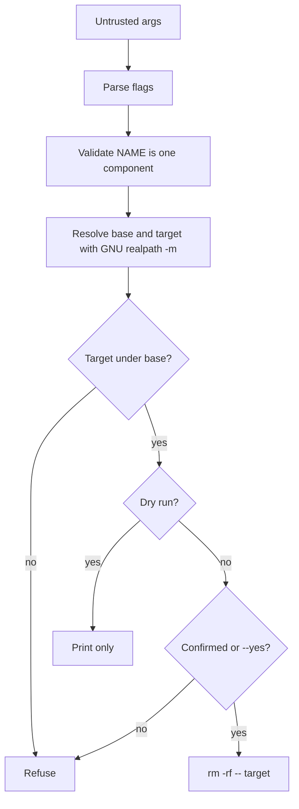

# 07 - Security for Scripts

## Learning Goal

Write a GNU coreutils-oriented Bash cleanup script that safely handles untrusted arguments, validates paths before deletion, uses private temporary storage, avoids command and path injection, and runs correctly in WSL Ubuntu or Git Bash on Windows and on macOS Apple Silicon with Homebrew GNU coreutils.

## Environment

This is a Bash lesson, not a PowerShell scripting lesson. PowerShell is used only for Windows setup commands such as installing WSL or Git for Windows.

Windows learners should run the script in WSL Ubuntu when possible. Git Bash is a workable alternative for this lesson, but it is a different Unix-like environment built on MSYS2. Do not assume every Linux package is already present in Git Bash.

macOS Apple Silicon learners can use the default zsh shell for setup commands, then run the lesson script with Bash. Stock macOS does not provide GNU `realpath -m` as a command-line guarantee for this lesson. Install Homebrew GNU coreutils and use `grealpath`, or pass `REALPATH_BIN=grealpath` when running the script.

### Windows Setup: WSL Ubuntu

Run these commands in Windows PowerShell:

```powershell
wsl --install
wsl --list --verbose
wsl
```

Then run these commands inside WSL Bash:

```bash
sudo apt update
sudo apt install -y shellcheck coreutils
bash --version
realpath --version
mktemp --version
shellcheck --version
```

### Windows Setup: Git Bash Alternative

Run this command in Windows PowerShell:

```powershell
winget install --id Git.Git -e --source winget
```

Then open Git Bash and check the tools:

```bash
bash --version
realpath --version
mktemp --version
shellcheck --version
```

Git Bash does not mean ShellCheck is installed. If `shellcheck --version` fails, install ShellCheck separately for Windows or run ShellCheck from WSL.

### macOS Apple Silicon Setup

Run these setup commands in the default macOS zsh shell:

```zsh
uname -m
brew install shellcheck coreutils
shellcheck --version
grealpath --version
```

`uname -m` should print `arm64` on Apple Silicon. Homebrew's GNU coreutils commands often have a `g` prefix, so this lesson uses `grealpath` on macOS.

### PowerShell Note

Use PowerShell only for the Windows setup commands above. Do not paste Bash syntax into PowerShell and expect it to behave the same way.

PowerShell environment-variable syntax is different:

```powershell
$env:NAME = 'value'
```

Bash can set an environment variable for one command like this:

```bash
NAME=value command
```

PowerShell parsing and quoting rules also differ from Bash. A command line that is safe or valid in Bash may be parsed differently in PowerShell.

## Why Script Security Matters

Bash scripts often run in places with access to important files, credentials, and deployment targets. A script that works with friendly input can still be unsafe when an argument contains spaces, wildcards, command separators, traversal such as `..`, or a leading dash.

The goal is to reduce ambiguity:

- Quote expansions so data stays one argument.
- Use `--` before user-controlled operands so names are not treated as options.
- Validate path components before joining paths.
- Resolve paths and verify containment before deleting.
- Avoid `eval`; do not turn data into shell code.
- Keep secrets out of logs, dry-run output, and temporary files.
- Use private temporary directories and restrictive permissions.
- Control `PATH` for sensitive commands.

## Quoting, Word Splitting, And Globbing

After Bash expands an unquoted variable, it performs word splitting and filename expansion. Word splitting can turn one value into many arguments. Filename expansion, also called globbing, can turn `*`, `?`, or `[abc]` into matching file names.

Bad:

```bash
rm -rf $base/$name
```

If `name='old build'`, the command receives two words. If `name='*'`, the shell may expand it before `rm` runs.

Better:

```bash
target="${base}/${name}"
rm -rf -- "$target"
```

This is not complete path validation, but it prevents word splitting, globbing, and option injection for the final operand.

Quote command substitutions too:

```bash
version="$(git describe --tags)"
printf 'version=%s\n' "$version"
```

When building dynamic arguments, use arrays instead of a command string:

```bash
args=(-R --include='*.log' -- "$pattern" "$base")
grep "${args[@]}"
```

## Do Not Use eval

`eval` asks Bash to parse a string as shell code. If any part of that string comes from input, a user can change what code runs.

Bad:

```bash
cmd="grep $pattern $file"
eval "$cmd"
```

Good:

```bash
grep -- "$pattern" "$file"
```

Data should be passed as arguments, not re-parsed as code.

## End Of Options

Many commands treat operands beginning with `-` as options. Use `--` to mark the end of options before file names, patterns, or other user-controlled operands.

Bad:

```bash
rm -rf "$name"
grep "$pattern" "$file"
```

Good:

```bash
rm -rf -- "$name"
grep -- "$pattern" "$file"
```

This matters even when validation is strong. It is cheap defense in depth.

## Path Traversal

Path traversal happens when input escapes the directory a script meant to operate in. Inputs such as `../secret`, `/tmp/other`, or names that resolve through symlinks can move a target outside the intended base.

For this lesson, `NAME` must be exactly one path component:

- It must not be empty.
- It must not begin with `/`.
- It must not contain `/`.
- It must not contain `..`.

Then the script resolves both base and target with GNU coreutils `realpath -m` and checks that the target is under the resolved base:

```bash
base_real="$("$realpath_path" -m -- "$base")"
target_real="$("$realpath_path" -m -- "${base_real}/${name}")"

case "$target_real" in
  "$base_real"/*) ;;
  *) die 'resolved target escapes base' ;;
esac
```

The `"$base_real"/*` pattern prevents prefix mistakes such as accepting `/tmp/base-evil` as being inside `/tmp/base`.

## PATH Policy

For sensitive scripts, use a narrow `PATH` before running core commands:

```bash
export PATH='/usr/sbin:/usr/bin:/sbin:/bin'
```

However, this lesson must support Homebrew GNU coreutils on macOS and Git Bash/MSYS2 layouts on Windows. Those tools may live outside `/usr/bin` and `/bin`. Resolve selected tools before narrowing `PATH`, then call the resolved paths:

```bash
REALPATH_BIN="${REALPATH_BIN:-realpath}"
realpath_path="$(command -v -- "$REALPATH_BIN")"
mktemp_path="$(command -v -- mktemp)"

export PATH='/usr/sbin:/usr/bin:/sbin:/bin'
```

Outside sensitive scripts, you may deliberately add Homebrew, Git Bash, or MSYS2 tool directories to your shell startup files. Inside sensitive scripts, prefer explicit resolution for the specific tools you need.

## Temporary Files And umask

Do not invent temporary names using `$$`, timestamps, or predictable paths. Use `mktemp -d` to create a private temporary directory, and clean it with `trap`.

```bash
umask 077
tmpdir="$("$mktemp_path" -d)"
trap 'rm -rf -- "$tmpdir"' EXIT HUP INT TERM
```

`umask 077` makes newly created files and directories private to the current user unless a command changes permissions explicitly.

## Secrets

Environment variables are useful for configuration, but they are not a secret-management system. Secrets can leak through logs, debug tracing, shell history, crash output, or child processes.

Bad:

```bash
set -x
printf 'token=%s\n' "$API_TOKEN"
```

Good:

```bash
set +x
: "${API_TOKEN:?API_TOKEN is required}"
```

Do not log secrets. Do not print secrets in dry-run output. Do not store secrets in temporary files unless you have a clear need and the file is private and short-lived.

## Safe Cleanup Flow



## Common Mistakes

- Assuming quotes prevent path traversal. Quotes preserve arguments; they do not prove a path is safe.
- Writing `rm -rf "$base/$name"` without rejecting absolute names, slashes, and `..`.
- Using `[[ "$target" == "$base"* ]]`, which can accept `/tmp/base-evil` as if it were under `/tmp/base`.
- Forgetting `--` before a file name that might begin with `-`.
- Building commands in strings and running them with `eval`.
- Trusting the caller's `PATH` for sensitive commands.
- Resetting `PATH` before resolving `grealpath` or Git Bash tools.
- Creating temporary files with predictable names in `/tmp`.
- Printing tokens while debugging with `set -x`.
- Treating `--dry-run` as a log message while still deleting.
- Claiming stock macOS supports GNU `realpath -m`.
- Running Bash examples in PowerShell.

## Exercise

Build `safe-clean.sh`.

Requirements:

- Accept `--base DIR`, `--name NAME`, `--dry-run`, and `--yes`.
- Validate `NAME` is one component: not empty, not absolute, no `/`, and no `..`.
- Use GNU coreutils `realpath -m`.
- Require the resolved target to be under the resolved base.
- Refuse `/` as the base.
- Refuse to delete the base itself.
- Require the target to be an existing directory.
- Set `umask 077`.
- Resolve `REALPATH_BIN` and `mktemp` before narrowing `PATH`.
- Use a narrow `PATH` for sensitive core commands.
- Use `mktemp -d` and `trap`.
- Quote expansions.
- Use `--` before user-controlled operands.
- Do not use `eval`.
- Do not log secrets.
- In `--dry-run` mode, delete nothing.
- Ask for confirmation unless `--yes` is passed.
- Run ShellCheck.

Create a test directory:

```bash
mkdir -p scratch/old-build scratch/'-starts-with-dash'
```

Try these cases in WSL or Git Bash:

```bash
bash safe-clean.sh --base ./scratch --name old-build --dry-run
bash safe-clean.sh --base ./scratch --name '../oops' --dry-run
bash safe-clean.sh --base ./scratch --name '/tmp/oops' --dry-run
bash safe-clean.sh --base ./scratch --name '-starts-with-dash' --dry-run
shellcheck safe-clean.sh
```

Try these cases on macOS after installing Homebrew coreutils:

```bash
REALPATH_BIN=grealpath bash safe-clean.sh --base ./scratch --name old-build --dry-run
REALPATH_BIN=grealpath bash safe-clean.sh --base ./scratch --name '../oops' --dry-run
REALPATH_BIN=grealpath bash safe-clean.sh --base ./scratch --name '-starts-with-dash' --dry-run
shellcheck safe-clean.sh
```

Do not run `REALPATH_BIN=grealpath shellcheck safe-clean.sh`; ShellCheck analyzes the script and does not need the runtime `REALPATH_BIN` setting.

## Worked Answer

This answer assumes Bash plus GNU `realpath -m` behavior. It uses standard `mktemp`, `rm`, and common `--` option handling from the narrowed system `PATH`. On macOS, run it with `REALPATH_BIN=grealpath bash safe-clean.sh ...`.

```bash
#!/usr/bin/env bash
set -euo pipefail

usage() {
  printf 'Usage: %s --base DIR --name NAME [--dry-run] [--yes]\n' "$0" >&2
}

die() {
  printf 'error: %s\n' "$1" >&2
  exit 1
}

base=''
name=''
dry_run=false
yes=false

while (($#)); do
  case "$1" in
    --base)
      (($# >= 2)) || die '--base requires DIR'
      base="$2"
      shift 2
      ;;
    --name)
      (($# >= 2)) || die '--name requires NAME'
      name="$2"
      shift 2
      ;;
    --dry-run)
      dry_run=true
      shift
      ;;
    --yes)
      yes=true
      shift
      ;;
    --help|-h)
      usage
      exit 0
      ;;
    *)
      usage
      die "unknown argument: $1"
      ;;
  esac
done

[[ -n "$base" ]] || die '--base is required'
[[ -n "$name" ]] || die '--name is required'

REALPATH_BIN="${REALPATH_BIN:-realpath}"
realpath_path="$(command -v -- "$REALPATH_BIN")" || die "GNU realpath command not found: $REALPATH_BIN"
mktemp_path="$(command -v -- mktemp)" || die 'mktemp is required'

umask 077
export PATH='/usr/sbin:/usr/bin:/sbin:/bin'

# Do not print or store secrets in this script. Keep output limited to paths.
tmpdir="$("$mktemp_path" -d)"
cleanup() {
  rm -rf -- "$tmpdir"
}
trap cleanup EXIT HUP INT TERM

[[ "$name" != /* ]] || die 'NAME must not be absolute'
[[ "$name" != */* ]] || die 'NAME must not contain /'
[[ "$name" != *..* ]] || die 'NAME must not contain ..'

base_real="$("$realpath_path" -m -- "$base")"
target_real="$("$realpath_path" -m -- "${base_real}/${name}")"

[[ "$base_real" != '/' ]] || die 'refusing to use / as base'
[[ -d "$base_real" ]] || die 'base must be an existing directory'

# The target must be under base, not the base itself and not a prefix match.
case "$target_real" in
  "$base_real"/*) ;;
  *) die 'resolved target escapes base' ;;
esac

[[ "$target_real" != "$base_real" ]] || die 'target must not be the base directory'
[[ -e "$target_real" ]] || die 'target does not exist'
[[ -d "$target_real" ]] || die 'target must be a directory'

printf 'Resolved target: %s\n' "$target_real"

if [[ "$dry_run" == true ]]; then
  printf 'Dry run: would run rm -rf -- %q\n' "$target_real"
  exit 0
fi

if [[ "$yes" != true ]]; then
  printf 'Delete this directory? Type yes to continue: '
  IFS= read -r answer
  [[ "$answer" == yes ]] || die 'cancelled'
fi

rm -rf -- "$target_real"
printf 'Deleted: %s\n' "$target_real"
```

Important details:

- `REALPATH_BIN` defaults to `realpath`, but macOS users can set `REALPATH_BIN=grealpath`.
- `realpath_path` and `mktemp_path` are resolved before `PATH` is narrowed.
- The script uses GNU `realpath -m`; do not replace it with stock macOS assumptions.
- `NAME` must be one component before any path is resolved.
- The containment check is `case "$target_real" in "$base_real"/*)`, not a loose prefix check.
- The deletion command is `rm -rf -- "$target_real"`.
- `--dry-run` exits before deletion.

## ShellCheck

ShellCheck catches many common Bash mistakes, including SC2086 for unquoted expansions that can trigger word splitting and globbing.

Run it from the same Unix-like environment where you are editing the script:

```bash
shellcheck safe-clean.sh
```

ShellCheck does not prove a script is secure. It is a fast reviewer that helps you notice risky Bash patterns before a script reaches real data.

## Next Step

Return to the advanced Bash README and continue with the next numbered lesson, `08 - CI Automation`.

## Sources Used

- GNU Bash Manual, Quoting: https://www.gnu.org/software/bash/manual/html_node/Quoting.html
- GNU Bash Manual, Word Splitting: https://www.gnu.org/software/bash/manual/html_node/Word-Splitting.html
- GNU Bash Manual, Filename Expansion: https://www.gnu.org/software/bash/manual/html_node/Filename-Expansion.html
- GNU Bash Manual, Bourne Shell Builtins: https://www.gnu.org/software/bash/manual/html_node/Bourne-Shell-Builtins.html
- OWASP, Command Injection: https://owasp.org/www-community/attacks/Command_Injection
- OWASP, Path Traversal: https://owasp.org/www-community/attacks/Path_Traversal
- OWASP Cheat Sheet Series, Secrets Management: https://cheatsheetseries.owasp.org/cheatsheets/Secrets_Management_Cheat_Sheet.html
- MITRE CWE-427, Uncontrolled Search Path Element: https://cwe.mitre.org/data/definitions/427.html
- GNU Coreutils Manual, `realpath`: https://www.gnu.org/software/coreutils/manual/html_node/realpath-invocation.html
- GNU Coreutils Manual, `mktemp`: https://www.gnu.org/software/coreutils/manual/html_node/mktemp-invocation.html
- GNU Coreutils Manual, Common Options: https://www.gnu.org/software/coreutils/manual/html_node/Common-options.html
- GNU Coreutils Manual, `rm`: https://www.gnu.org/software/coreutils/manual/html_node/rm-invocation.html
- Microsoft Learn, Install WSL: https://learn.microsoft.com/windows/wsl/install
- Microsoft Learn, Basic commands for WSL: https://learn.microsoft.com/windows/wsl/basic-commands
- Microsoft Learn, What is the Windows Subsystem for Linux: https://learn.microsoft.com/windows/wsl/about
- Git for Windows, Install: https://git-scm.com/downloads/win
- Microsoft Learn, PowerShell about_Parsing: https://learn.microsoft.com/powershell/module/microsoft.powershell.core/about/about_parsing
- Microsoft Learn, PowerShell about_Quoting_Rules: https://learn.microsoft.com/powershell/module/microsoft.powershell.core/about/about_quoting_rules
- Microsoft Learn, PowerShell about_Environment_Variables: https://learn.microsoft.com/powershell/module/microsoft.powershell.core/about/about_environment_variables
- Microsoft Learn, PowerShell about_Path_Syntax: https://learn.microsoft.com/powershell/module/microsoft.powershell.core/about/about_path_syntax
- Homebrew Formula, ShellCheck: https://formulae.brew.sh/formula/shellcheck
- Homebrew Formula, Coreutils: https://formulae.brew.sh/formula/coreutils
- ShellCheck: https://www.shellcheck.net/
- ShellCheck GitHub: https://github.com/koalaman/shellcheck
- ShellCheck SC2086: https://www.shellcheck.net/wiki/SC2086
- Apple Developer Documentation, `realpath(3)`: https://developer.apple.com/library/archive/documentation/System/Conceptual/ManPages_iPhoneOS/man3/realpath.3.html
