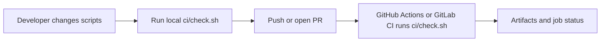

# 08 - CI Automation

## Learning Goal

Build a Bash-centered CI check that runs locally and in hosted CI, validates scripts with `bash -n`, ShellCheck, and Bats, handles failures without hiding later stages, and keeps environment variables, secrets, logs, and artifacts safe.

## Keep The Logic In Bash

CI YAML should coordinate work: choose triggers, runners, permissions, caches, artifacts, and environment. The project-specific check should live in `ci/check.sh` so developers and CI run the same command.

```yaml
- name: Run Bash checks
  shell: bash
  run: ./ci/check.sh
```

That split matters. If the real checks live only in GitHub Actions or GitLab CI YAML, a developer cannot reliably reproduce them before pushing. If the logic lives in Bash, the hosted runner becomes another place to run the same script.

A good `ci/check.sh` should:

- Start with `set -Eeuo pipefail`.
- Find the repository root from `${BASH_SOURCE[0]}` instead of assuming the caller's current directory.
- Create logs and artifacts directories.
- Discover files deterministically with `find ... -print0 | sort -z`.
- Store file lists in quoted arrays and pass them without word splitting.
- Accumulate failures so syntax, lint, and tests can all report before the final exit.
- Log stage names and non-secret summaries, not raw command strings that may include secrets.

```bash
#!/usr/bin/env bash
set -Eeuo pipefail

script_dir="$(cd -- "$(dirname -- "${BASH_SOURCE[0]}")" && pwd -P)"
repo_root="$(cd -- "${script_dir}/.." && pwd -P)"
cd "$repo_root"
```

`set -e` is not a complete error-handling model. Bash intentionally disables `errexit` in some conditional contexts, and pipelines need `pipefail` if an earlier command should fail the pipeline. CI scripts should still use explicit `if ! command; then status=1; fi` blocks when a failing command is expected and should be reported cleanly.

## Local Runs

Run local checks from the same Bash environment that CI expects.

On Windows PowerShell, launch a specific Bash environment. Do not paste Bash syntax directly into PowerShell unless you are invoking Bash explicitly.

For Git Bash, either use `bash` if Git Bash is already on `PATH`, or call the Git for Windows Bash executable:

```powershell
git update-index --chmod=+x ci/check.sh scripts/hello.sh
bash --version
bash ./ci/check.sh
& "C:\Program Files\Git\bin\bash.exe" ./ci/check.sh
```

For WSL, run the command inside the Linux filesystem view of your repository. Replace `/mnt/c/path/to/repo` with the WSL path to this repo:

```powershell
git update-index --chmod=+x ci/check.sh scripts/hello.sh
wsl bash -lc 'cd /mnt/c/path/to/repo && ./ci/check.sh'
```

`git update-index --chmod=+x` records the executable bit in Git, which is useful on Windows where the working tree may not preserve Unix executable permissions. A newer Git workflow may also use:

```powershell
git add --chmod=+x ci/check.sh scripts/hello.sh
```

On macOS Apple Silicon, the default interactive shell is usually `zsh`, but this lesson still runs Bash explicitly or executes files with Bash shebangs:

```zsh
bash --version
chmod +x ci/check.sh scripts/hello.sh
./ci/check.sh
```

Local ShellCheck is an excellent preflight. CI should install ShellCheck and fail if it is missing or reports problems.

## Line Endings

Bash scripts should use LF line endings. Add a repository `.gitattributes` file so Windows checkouts do not accidentally write CRLF into shell files:

```gitattributes
*.sh text eol=lf
*.bash text eol=lf
*.bats text eol=lf
```

This keeps scripts friendlier to Linux and macOS runners and avoids confusing errors from `/usr/bin/env bash` when files contain Windows line endings.

## Validation Stages

A practical Bash CI check has three required stages:

1. `bash -n` parses scripts without executing them.
2. `shellcheck` catches unsafe shell patterns such as unquoted expansions, unreachable commands, and suspicious redirects.
3. `bats` runs behavior tests for scripts and command-line tools.

Use Bats installation deliberately. For reproducible CI, pin the Bats version or install from a known release. For local development, a package manager such as Homebrew, apt, or a Git Bash source install can be acceptable as long as developers know CI is the source of truth.

## Safe Logging

Logs and artifacts are useful, but they can leak information. Avoid `set -x` in CI scripts that may touch secrets. If you wrap commands, log stage names or non-secret summaries instead of raw `$*`.

Risky:

```bash
run_logged() {
  printf '+ %s\n' "$*"
  "$@"
}
```

Safer:

```bash
run_stage() {
  local name="$1"
  shift
  log "Stage: ${name}"
  "$@" 2>&1 | tee -a "$log_file"
}
```

Environment variables are inputs. Use defaults for non-secret settings, and validate secrets only when a stage needs them:

```bash
artifact_dir="${ARTIFACT_DIR:-artifacts}"

if [[ "${RELEASE_MODE:-}" == "1" ]]; then
  : "${DEPLOY_TOKEN:?DEPLOY_TOKEN is required for release mode}"
fi
```

Never print secret values, authorization headers, generated `.env` files, or raw process arguments that may contain tokens.

## Complete `ci/check.sh`

```bash
#!/usr/bin/env bash
set -Eeuo pipefail

script_dir="$(cd -- "$(dirname -- "${BASH_SOURCE[0]}")" && pwd -P)"
repo_root="$(cd -- "${script_dir}/.." && pwd -P)"
cd "$repo_root"

artifact_dir="${ARTIFACT_DIR:-artifacts}"
log_dir="${LOG_DIR:-${artifact_dir}/logs}"
log_file="${log_dir}/ci.log"

mkdir -p -- "$artifact_dir" "$log_dir"
: > "$log_file"

log() {
  printf '%s\n' "$*" | tee -a "$log_file"
}

run_stage() {
  local name="$1"
  shift

  log "Stage: ${name}"
  "$@" 2>&1 | tee -a "$log_file"
}

status=0

log "repo_root=${repo_root}"
log "bash_version=${BASH_VERSION}"
log "runner_os=${RUNNER_OS:-local}"

mapfile -d '' shell_files < <(
  find . \
    \( -path './.git' -o -path './artifacts' -o -path './node_modules' -o -path './vendor' \) -prune -o \
    -type f \
    \( -name '*.sh' -o -name '*.bash' \) \
    -print0 |
  sort -z
)

mapfile -d '' bats_files < <(
  find . \
    \( -path './.git' -o -path './artifacts' -o -path './node_modules' -o -path './vendor' \) -prune -o \
    -type f \
    -name '*.bats' \
    -print0 |
  sort -z
)

log "shell_files=${#shell_files[@]}"
log "bats_files=${#bats_files[@]}"

if ((${#shell_files[@]} == 0)); then
  log "No shell files found."
else
  for file in "${shell_files[@]}"; do
    if ! run_stage "bash -n ${file}" bash -n "$file"; then
      log "FAIL bash -n: ${file}"
      status=1
    fi
  done
fi

if command -v shellcheck >/dev/null 2>&1; then
  if ((${#shell_files[@]} > 0)); then
    if ! run_stage "ShellCheck" shellcheck -- "${shell_files[@]}"; then
      log "FAIL ShellCheck"
      status=1
    fi
  fi
else
  log "FAIL ShellCheck: shellcheck is required in CI"
  status=1
fi

if ((${#bats_files[@]} > 0)); then
  if command -v bats >/dev/null 2>&1; then
    if ! run_stage "Bats" bats -- "${bats_files[@]}"; then
      log "FAIL Bats"
      status=1
    fi
  else
    log "FAIL Bats: .bats files exist, but bats is not installed"
    status=1
  fi
else
  log "SKIP Bats: no .bats files found"
fi

if ((status == 0)); then
  log "CI checks passed."
else
  log "CI checks failed."
fi

exit "$status"
```

This script still logs file names, because file names are normal diagnostic information. It does not log raw command lines or environment dumps. The null-delimited `find` output and quoted arrays allow paths with spaces to work correctly.

## GitHub Actions Workflow

This Ubuntu example keeps YAML thin. It installs tools, runs `ci/check.sh`, and uploads artifacts even if checks fail.

```yaml
name: Bash CI

on:
  push:
  pull_request:

permissions:
  contents: read

jobs:
  check:
    runs-on: ubuntu-latest
    env:
      CI_MODE: github-actions
      EXAMPLE_API_TOKEN: ${{ secrets.EXAMPLE_API_TOKEN }}

    steps:
      - name: Checkout
        uses: actions/checkout@v4

      - name: Cache Bats source
        uses: actions/cache@v4
        with:
          path: ~/.cache/bats-core
          key: bats-core-v1.11.1

      - name: Install tools
        shell: bash
        run: |
          set -Eeuo pipefail
          sudo apt-get update
          sudo apt-get install -y shellcheck

          mkdir -p ~/.cache
          if [[ ! -d ~/.cache/bats-core/.git ]]; then
            git clone --depth 1 --branch v1.11.1 https://github.com/bats-core/bats-core.git ~/.cache/bats-core
          fi
          sudo ~/.cache/bats-core/install.sh /usr/local

      - name: Run checks
        shell: bash
        run: ./ci/check.sh

      - name: Upload artifacts
        if: always()
        uses: actions/upload-artifact@v4
        with:
          name: bash-ci-artifacts
          path: artifacts/
          if-no-files-found: warn
```

`CI_MODE` is non-secret configuration. `EXAMPLE_API_TOKEN` is a secret reference; scripts should only check whether it is present when needed and should never print it. GitHub-hosted runners provide a fresh hosted environment for jobs, but workflow files should still install or pin tools that the project requires instead of relying on an accidental image detail.

## GitLab CI Note

GitLab Runner supports Bash for Unix systems, and Bash is the default shell context for Unix shell executors. Official GitLab Runner documentation says Bash is not supported on Windows; Windows shell jobs use PowerShell variants or Windows Batch instead. For Bash-centered CI, use a Unix runner or a container image with Bash.

```yaml
stages:
  - check

bash-check:
  stage: check
  image: bash:5.2
  before_script:
    - apk add --no-cache git shellcheck
    - git clone --depth 1 --branch v1.11.1 https://github.com/bats-core/bats-core.git /tmp/bats-core
    - /tmp/bats-core/install.sh /usr/local
  script:
    - bash ./ci/check.sh
  artifacts:
    when: always
    paths:
      - artifacts/
```

## CI Flow



## Common Mistakes

- Putting all checking logic in YAML, which makes local and hosted checks drift apart.
- Running Bash commands directly in Windows PowerShell instead of launching WSL or Git Bash with `bash`.
- Forgetting to record executable bits on Windows with `git update-index --chmod=+x` or `git add --chmod=+x`.
- Letting CRLF line endings into `.sh` or `.bats` files.
- Treating missing ShellCheck as a pass in CI.
- Using `$0` for repo-root detection when `${BASH_SOURCE[0]}` is the Bash-specific variable that points at the current script.
- Depending on the caller's current directory.
- Assuming `set -e` catches every failure.
- Expanding file lists with unquoted command substitution, which breaks on spaces and newlines.
- Running `find` without stable sorting, which creates noisy CI output.
- Logging secrets with `set -x`, `env`, `printenv`, or raw `$*`.
- Uploading artifacts only on successful jobs.
- Caching generated results instead of caching installable dependencies.

## Exercise

Create a Bash CI setup for a small repository.

Requirements:

- Add `.gitattributes` rules for LF shell and Bats files.
- Add `scripts/hello.sh` that prints `hello, ci`.
- Add `test/hello.bats` that verifies the script output.
- Add `ci/check.sh`.
- Resolve the repo root from `${BASH_SOURCE[0]}`.
- Use `set -Eeuo pipefail`.
- Write logs under `artifacts/`.
- Find shell files and Bats files deterministically with `find`, null separators, and `sort -z`.
- Run `bash -n`, ShellCheck, and Bats.
- Require ShellCheck in CI.
- Fail if `.bats` files exist but Bats is missing.
- Accumulate failures so all stages report.
- Add `.github/workflows/bash-ci.yml`.
- Keep CI logic in `ci/check.sh`; YAML should install tools, run the script, and upload artifacts.

## Worked Answer

`.gitattributes`:

```gitattributes
*.sh text eol=lf
*.bash text eol=lf
*.bats text eol=lf
```

`scripts/hello.sh`:

```bash
#!/usr/bin/env bash
set -Eeuo pipefail

printf 'hello, ci\n'
```

`test/hello.bats`:

```bash
#!/usr/bin/env bats

@test "hello script prints the expected message" {
  run bash scripts/hello.sh
  [ "$status" -eq 0 ]
  [ "$output" = "hello, ci" ]
}
```

`ci/check.sh`:

```bash
#!/usr/bin/env bash
set -Eeuo pipefail

script_dir="$(cd -- "$(dirname -- "${BASH_SOURCE[0]}")" && pwd -P)"
repo_root="$(cd -- "${script_dir}/.." && pwd -P)"
cd "$repo_root"

artifact_dir="${ARTIFACT_DIR:-artifacts}"
log_dir="${LOG_DIR:-${artifact_dir}/logs}"
log_file="${log_dir}/ci.log"

mkdir -p -- "$artifact_dir" "$log_dir"
: > "$log_file"

log() {
  printf '%s\n' "$*" | tee -a "$log_file"
}

run_stage() {
  local name="$1"
  shift
  log "Stage: ${name}"
  "$@" 2>&1 | tee -a "$log_file"
}

status=0

mapfile -d '' shell_files < <(
  find . \
    \( -path './.git' -o -path './artifacts' \) -prune -o \
    -type f \( -name '*.sh' -o -name '*.bash' \) \
    -print0 |
  sort -z
)

mapfile -d '' bats_files < <(
  find . \
    \( -path './.git' -o -path './artifacts' \) -prune -o \
    -type f -name '*.bats' \
    -print0 |
  sort -z
)

log "repo_root=${repo_root}"
log "bash_version=${BASH_VERSION}"
log "shell_files=${#shell_files[@]}"
log "bats_files=${#bats_files[@]}"

for file in "${shell_files[@]}"; do
  if ! run_stage "bash -n ${file}" bash -n "$file"; then
    log "FAIL bash -n: ${file}"
    status=1
  fi
done

if command -v shellcheck >/dev/null 2>&1; then
  if ((${#shell_files[@]} > 0)); then
    if ! run_stage "ShellCheck" shellcheck -- "${shell_files[@]}"; then
      log "FAIL ShellCheck"
      status=1
    fi
  fi
else
  log "FAIL ShellCheck: shellcheck is required"
  status=1
fi

if ((${#bats_files[@]} > 0)); then
  if command -v bats >/dev/null 2>&1; then
    if ! run_stage "Bats" bats -- "${bats_files[@]}"; then
      log "FAIL Bats"
      status=1
    fi
  else
    log "FAIL Bats: .bats files exist, but bats is not installed"
    status=1
  fi
else
  log "SKIP Bats: no .bats files found"
fi

exit "$status"
```

`.github/workflows/bash-ci.yml`:

```yaml
name: Bash CI

on:
  push:
  pull_request:

permissions:
  contents: read

jobs:
  check:
    runs-on: ubuntu-latest
    env:
      CI_MODE: github-actions
      EXAMPLE_API_TOKEN: ${{ secrets.EXAMPLE_API_TOKEN }}

    steps:
      - name: Checkout
        uses: actions/checkout@v4

      - name: Cache Bats source
        uses: actions/cache@v4
        with:
          path: ~/.cache/bats-core
          key: bats-core-v1.11.1

      - name: Install tools
        shell: bash
        run: |
          set -Eeuo pipefail
          sudo apt-get update
          sudo apt-get install -y shellcheck

          mkdir -p ~/.cache
          if [[ ! -d ~/.cache/bats-core/.git ]]; then
            git clone --depth 1 --branch v1.11.1 https://github.com/bats-core/bats-core.git ~/.cache/bats-core
          fi
          sudo ~/.cache/bats-core/install.sh /usr/local

      - name: Run checks
        shell: bash
        run: ./ci/check.sh

      - name: Upload artifacts
        if: always()
        uses: actions/upload-artifact@v4
        with:
          name: bash-ci-artifacts
          path: artifacts/
          if-no-files-found: warn
```

Optional `.gitlab-ci.yml`:

```yaml
stages:
  - check

bash-check:
  stage: check
  image: bash:5.2
  before_script:
    - apk add --no-cache git shellcheck
    - git clone --depth 1 --branch v1.11.1 https://github.com/bats-core/bats-core.git /tmp/bats-core
    - /tmp/bats-core/install.sh /usr/local
  script:
    - bash ./ci/check.sh
  artifacts:
    when: always
    paths:
      - artifacts/
```

Run it locally on Windows PowerShell by launching a specific Bash environment.

Git Bash example:

```powershell
git update-index --chmod=+x ci/check.sh scripts/hello.sh
bash --version
bash ./ci/check.sh
```

WSL example:

```powershell
git update-index --chmod=+x ci/check.sh scripts/hello.sh
wsl bash -lc 'cd /mnt/c/path/to/repo && ./ci/check.sh'
```

Run it locally on macOS Apple Silicon:

```zsh
bash --version
chmod +x ci/check.sh scripts/hello.sh
./ci/check.sh
```

Expected result:

- `bash -n` parses `ci/check.sh` and `scripts/hello.sh`.
- ShellCheck runs and must pass.
- Bats runs `test/hello.bats`.
- `artifacts/logs/ci.log` records non-secret stage output.
- The script exits `0` only when all required checks pass.

## Next Step

Return to the [advanced Bash README](README.md) and continue with the next numbered lesson.

## Sources Used

- GNU Bash Manual, The Set Builtin: https://www.gnu.org/software/bash/manual/html_node/The-Set-Builtin.html
- GNU Bash Manual, Bash Variables (`BASH_SOURCE`): https://www.gnu.org/software/bash/manual/html_node/Bash-Variables.html
- GitHub Actions workflow syntax: https://docs.github.com/actions/using-workflows/workflow-syntax-for-github-actions
- GitHub Actions default shell and working directory: https://docs.github.com/actions/writing-workflows/choosing-what-your-workflow-does/setting-a-default-shell-and-working-directory
- GitHub Actions variables: https://docs.github.com/en/actions/reference/workflows-and-actions/variables
- GitHub Actions secrets: https://docs.github.com/en/actions/how-tos/write-workflows/choose-what-workflows-do/use-secrets
- GitHub Actions artifacts: https://docs.github.com/en/actions/tutorials/store-and-share-data
- GitHub Actions dependency caching: https://docs.github.com/en/actions/reference/workflows-and-actions/dependency-caching
- GitHub-hosted runners reference: https://docs.github.com/en/actions/reference/runners/github-hosted-runners
- GitLab Runner shell executor: https://docs.gitlab.com/runner/executors/shell/
- GitLab Runner supported shells: https://docs.gitlab.com/runner/shells/
- GitLab Runner executors and shell support table: https://docs.gitlab.com/runner/executors/
- ShellCheck site: https://www.shellcheck.net/
- ShellCheck repository: https://github.com/koalaman/shellcheck
- Bats documentation: https://bats-core.readthedocs.io/
- Bats installation documentation: https://bats-core.readthedocs.io/en/stable/installation.html
- Git `update-index`: https://git-scm.com/docs/git-update-index
- Git attributes: https://git-scm.com/docs/gitattributes
