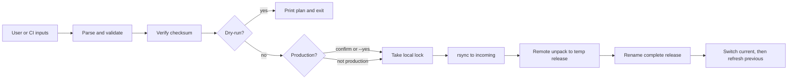

# 09 - Deployment Scripts

## Learning Goal

Write a Bash deployment script that promotes one validated artifact to one explicit environment with preflight checks, dry-run mode, production confirmation, safe SSH/rsync usage, rollback-aware release layout, timestamped logging, cleanup traps, and CI-friendly inputs.

This lesson's runnable worked answer is scoped to a Linux CI runner or WSL Bash. It expects GNU/Linux tools such as `sha256sum`, `flock`, `mktemp`, `rsync`, `ssh`, `tar`, and `readlink`. Do not assume stock Windows PowerShell or stock macOS Bash can run it unchanged.

## What Deployment Scripts Do

A deployment script is orchestration glue. It should not build the application, invent an environment, or decide what "latest" means. Its job is to take explicit, validated inputs and perform a small set of controlled side effects.

In this lesson, the inputs are:

- `--env staging|production`
- `--version VERSION`
- `--artifact FILE`
- `--sha256 FILE`
- `--host HOST`
- `--remote-dir ABSOLUTE_DIR`
- `--dry-run`
- `--yes`

The remote host is a Unix/Linux host with Bash and standard deployment tools. The side effects are:

- upload one immutable artifact with `rsync`
- create one versioned release directory
- switch `current` to the completed release
- preserve `previous` for rollback
- clean temporary incoming files

Bash is useful here because it is common on CI runners and servers. It is also risky because mutation is easy. A production deployment script should be intentionally boring: explicit inputs, loud validation, no secret logging, safe cleanup, and a clear point where the script changes from checking to mutating.

## Platform Notes

### Linux CI Runner or WSL Bash

Run the worked answer from a Linux environment such as `ubuntu-latest` in CI or WSL on Windows:

```bash
chmod +x deploy-release.sh
./deploy-release.sh --env staging --version 2026.06.29-1 \
  --artifact dist/myapp-2026.06.29-1.tar.gz \
  --sha256 dist/myapp-2026.06.29-1.tar.gz.sha256 \
  --host deploy@example.com \
  --remote-dir /opt/myapp \
  --dry-run
```

### Windows PowerShell

Stock Windows PowerShell is not the runtime for this script. Use PowerShell to launch WSL, Git Bash, or a Linux CI job:

```powershell
wsl bash ./deploy-release.sh --env staging --version 2026.06.29-1 `
  --artifact dist/myapp-2026.06.29-1.tar.gz `
  --sha256 dist/myapp-2026.06.29-1.tar.gz.sha256 `
  --host deploy@example.com `
  --remote-dir /opt/myapp `
  --dry-run
```

PowerShell quoting, paths, SSH configuration, and available commands differ from GNU/Linux Bash. Keep the deployment logic inside Bash on Linux, WSL, Git Bash, or CI.

### macOS Apple Silicon

Modern macOS Terminal opens `zsh` by default. You can launch Bash with `bash ./deploy-release.sh`, but stock macOS tools are not the same as GNU/Linux tools. On Apple Silicon, Homebrew installs under `/opt/homebrew`; GNU tools may need Homebrew packages or, more predictably, a Linux CI runner.

For this lesson, prefer validating the script on Linux or WSL. If you adapt it for macOS, verify every command and option instead of assuming GNU behavior.

## Safety Gates

- Require `--env staging|production`; do not infer production from branch names, hostnames, or directories.
- Deploy an immutable versioned artifact, never a mutable `latest.tar.gz`.
- Verify the SHA-256 checksum before upload or any other mutation.
- Make `--dry-run` mean no local or remote mutation: no temp directories, no lock files, no remote preflight writes, no uploads.
- Require production confirmation unless `--yes` is provided for CI.
- Log with timestamps, but never log tokens, passwords, private keys, signed URLs, or secret environment values.
- Use `ssh -o BatchMode=yes` so automation fails instead of prompting.
- Preserve normal SSH host-key verification; do not use `StrictHostKeyChecking=no`.
- Use `rsync` for upload, with arguments separated from shell syntax.
- Use `mktemp -d` and `trap` for cleanup when mutation begins.
- Use `flock -n` to prevent two local deployments from the same machine racing. Local `flock` is not a distributed lock; CI concurrency, a remote lock, or an orchestrator is needed if deployments can start from multiple machines.
- Switch `current` only after the release directory is complete. Do not claim this is fully atomic unless your filesystem and implementation use platform-specific rename semantics that guarantee it.
- Keep `previous` pointing at the old `current` target so rollback is possible. In the worked answer, `previous` is refreshed only after `current` has been switched successfully.
- In cloud deployments, check the active account, subscription, project, tenant, and region before calling cloud CLIs.

Rollback-aware layout:

```text
/opt/myapp/
  releases/
    2026.06.29-1/
    2026.06.29-2/
  current -> releases/2026.06.29-2
  previous -> releases/2026.06.29-1
```

## Deployment Flow



## Safe Remote Commands

Do not build a remote shell string by interpolating local variables:

```bash
ssh "$host" "mkdir -p $remote_dir/releases/$version && tar -xzf $artifact"
```

That treats the contents of `remote_dir`, `version`, and `artifact` as shell syntax. Instead, pass values as positional parameters to a remote Bash script:

```bash
ssh -o BatchMode=yes -- "$host" bash -s -- "$remote_dir" "$version" <<'REMOTE'
set -Eeuo pipefail
remote_dir=$1
version=$2
mkdir -p -- "$remote_dir/releases/$version"
REMOTE
```

The quoted heredoc delimiter, `<<'REMOTE'`, means the local shell does not expand variables inside the remote script body. The values after `bash -s --` are passed as arguments; the remote script reads them as `$1`, `$2`, and so on. You still validate them, but they are data rather than executable source text.

## Exercise

Create `deploy-release.sh`.

Requirements:

- Use `set -Eeuo pipefail`.
- Accept `--env`, `--version`, `--artifact`, `--sha256`, `--host`, `--remote-dir`, `--dry-run`, and `--yes`.
- Allow only `--env staging` or `--env production`.
- Require every non-flag option.
- Validate the version, host, absolute remote directory, readable artifact file, and `.tar.gz` or `.tgz` artifact extension.
- Require Linux/WSL commands: `sha256sum`, `ssh`, `rsync`, `flock`, and `mktemp`.
- Use `mktemp -d` for temporary checksum work and `trap` for cleanup.
- Verify the checksum before mutation.
- In dry-run mode, print planned steps and exit before creating temp directories, lock files, uploads, or remote writes.
- Require confirmation for production unless `--yes` is provided.
- Use `flock -n` for local serialization.
- Use `ssh -o BatchMode=yes` and preserve normal host-key verification.
- Upload with `rsync` to `.incoming/$version`.
- Run remote validation before upload, and label any remote writability probe as a write check because it creates and removes a test directory.
- On the remote host, unpack into a temporary release path, rename it to the final release path after unpack completes, switch `current`, refresh `previous`, and clean `.incoming`.
- Pass remote values with `ssh -- "$host" bash -s -- "$remote_dir" "$version" ... <<'REMOTE'`.
- Do not print secrets.

## Worked Answer

```bash
#!/usr/bin/env bash
set -Eeuo pipefail

env=""
version=""
artifact=""
sha256_file=""
host=""
remote_dir=""
dry_run=false
yes=false
tmpdir=""

usage() {
  cat <<'USAGE'
Usage:
  deploy-release.sh --env staging|production --version VERSION \
    --artifact FILE --sha256 FILE --host HOST --remote-dir DIR \
    [--dry-run] [--yes]
USAGE
}

die() {
  printf 'ERROR: %s\n' "$*" >&2
  exit 1
}

log() {
  printf '[%s] %s\n' "$(date '+%Y-%m-%dT%H:%M:%S%z')" "$*"
}

quote_cmd() {
  printf '%q ' "$@"
  printf '\n'
}

plan() {
  printf 'DRY-RUN: '
  quote_cmd "$@"
}

cleanup() {
  if [[ -n "$tmpdir" && -d "$tmpdir" ]]; then
    rm -rf -- "$tmpdir"
  fi
}
trap cleanup EXIT INT TERM

while (($#)); do
  case "$1" in
    --env)
      (($# >= 2)) || die "--env requires a value"
      env=$2
      shift 2
      ;;
    --version)
      (($# >= 2)) || die "--version requires a value"
      version=$2
      shift 2
      ;;
    --artifact)
      (($# >= 2)) || die "--artifact requires a value"
      artifact=$2
      shift 2
      ;;
    --sha256)
      (($# >= 2)) || die "--sha256 requires a value"
      sha256_file=$2
      shift 2
      ;;
    --host)
      (($# >= 2)) || die "--host requires a value"
      host=$2
      shift 2
      ;;
    --remote-dir)
      (($# >= 2)) || die "--remote-dir requires a value"
      remote_dir=$2
      shift 2
      ;;
    --dry-run)
      dry_run=true
      shift
      ;;
    --yes)
      yes=true
      shift
      ;;
    -h|--help)
      usage
      exit 0
      ;;
    *)
      die "unknown argument: $1"
      ;;
  esac
done

[[ "$env" == "staging" || "$env" == "production" ]] || die "--env must be staging or production"
[[ -n "$version" ]] || die "--version is required"
[[ -n "$artifact" ]] || die "--artifact is required"
[[ -n "$sha256_file" ]] || die "--sha256 is required"
[[ -n "$host" ]] || die "--host is required"
[[ -n "$remote_dir" ]] || die "--remote-dir is required"

[[ "$version" =~ ^[A-Za-z0-9._-]+$ ]] || die "--version may contain only letters, numbers, dot, underscore, and dash"
[[ "$host" =~ ^[A-Za-z0-9._@-]+$ ]] || die "--host contains unsupported characters"
[[ "$remote_dir" =~ ^/[A-Za-z0-9._/-]+$ ]] || die "--remote-dir must be an absolute path using letters, numbers, dot, underscore, dash, and slash"
[[ -f "$artifact" && -r "$artifact" ]] || die "artifact is not a readable file: $artifact"
[[ "$artifact" == *.tar.gz || "$artifact" == *.tgz ]] || die "artifact must end in .tar.gz or .tgz"
[[ -f "$sha256_file" && -r "$sha256_file" ]] || die "sha256 file is not readable: $sha256_file"

for command_name in date sha256sum ssh rsync flock mktemp; do
  command -v "$command_name" >/dev/null 2>&1 || die "missing required command: $command_name"
done

artifact_name=$(basename -- "$artifact")
artifact_dir=$(cd -- "$(dirname -- "$artifact")" && pwd -P)
artifact_abs="$artifact_dir/$artifact_name"
[[ "$artifact_name" =~ ^[A-Za-z0-9._-]+$ ]] || die "artifact filename contains unsupported characters"

read -r expected_sha256 _ < "$sha256_file" || die "could not read sha256 file"
[[ "$expected_sha256" =~ ^[A-Fa-f0-9]{64}$ ]] || die "sha256 file must start with a 64-character checksum"

remote_upload="$remote_dir/.incoming/$version/$artifact_name"

log "validated inputs env=$env version=$version artifact=$artifact_abs host=$host remote_dir=$remote_dir"

if "$dry_run"; then
  log "dry-run mode: no local or remote state will be changed"
  plan sha256sum --check "temporary checksum file for $artifact_name"
  plan ssh -o BatchMode=yes -- "$host" "remote validation and write check"
  plan rsync -a -- "$artifact_abs" "$host:$remote_upload"
  printf 'DRY-RUN: remote script would unpack %q, complete %q, switch current, refresh previous under %q, and clean incoming files\n' \
    "$artifact_name" "releases/$version" "$remote_dir"
  exit 0
fi

tmpdir=$(mktemp -d)
checksum_input="$tmpdir/artifact.sha256"
printf '%s  %s\n' "$expected_sha256" "$artifact_name" > "$checksum_input"

(
  cd "$artifact_dir"
  sha256sum --check "$checksum_input"
) || die "artifact checksum mismatch"

log "verified artifact checksum"

if [[ "$env" == "production" && "$yes" != true ]]; then
  printf 'Deploy version %s to PRODUCTION on %s:%s? Type "deploy %s" to continue: ' \
    "$version" "$host" "$remote_dir" "$version"
  read -r answer
  [[ "$answer" == "deploy $version" ]] || die "production deployment cancelled"
fi

lock_file="${TMPDIR:-/tmp}/deploy-release.lock"
exec 9>"$lock_file"
flock -n 9 || die "another local deployment is already running"

log "checking remote host and writable release directory"
ssh -o BatchMode=yes -- "$host" bash -s -- "$remote_dir" "$version" <<'REMOTE_PREFLIGHT'
set -Eeuo pipefail
remote_dir=$1
version=$2

[[ "$remote_dir" == /* ]] || {
  printf 'remote_dir must be absolute\n' >&2
  exit 1
}
[[ "$version" =~ ^[A-Za-z0-9._-]+$ ]] || {
  printf 'invalid remote version\n' >&2
  exit 1
}

for command_name in bash mkdir rmdir ln tar mv rm readlink; do
  command -v "$command_name" >/dev/null 2>&1 || {
    printf 'missing remote command: %s\n' "$command_name" >&2
    exit 1
  }
done

release_dir="$remote_dir/releases/$version"
[[ ! -e "$release_dir" ]] || {
  printf 'release already exists: %s\n' "$release_dir" >&2
  exit 1
}

write_check="$remote_dir/.write-check.$$"
mkdir -- "$write_check"
rmdir -- "$write_check"
REMOTE_PREFLIGHT

log "creating remote incoming directory"
ssh -o BatchMode=yes -- "$host" bash -s -- "$remote_dir" "$version" <<'REMOTE_INCOMING'
set -Eeuo pipefail
remote_dir=$1
version=$2
release_dir="$remote_dir/releases/$version"

[[ ! -e "$release_dir" ]] || {
  printf 'release already exists: %s\n' "$release_dir" >&2
  exit 1
}

mkdir -p -- "$remote_dir/.incoming/$version"
REMOTE_INCOMING

log "uploading artifact"
rsync -a -- "$artifact_abs" "$host:$remote_upload"

log "activating release"
ssh -o BatchMode=yes -- "$host" bash -s -- "$remote_dir" "$version" "$artifact_name" <<'REMOTE_DEPLOY'
set -Eeuo pipefail

remote_dir=$1
version=$2
artifact_name=$3

incoming="$remote_dir/.incoming/$version/$artifact_name"
release_dir="$remote_dir/releases/$version"
tmp_release="$remote_dir/releases/.tmp-$version-$$"
current_link="$remote_dir/current"
previous_link="$remote_dir/previous"
next_current="$remote_dir/.current-$version-$$"
next_previous="$remote_dir/.previous-$version-$$"

[[ "$version" =~ ^[A-Za-z0-9._-]+$ ]] || {
  printf 'invalid remote version\n' >&2
  exit 1
}
[[ -f "$incoming" ]] || {
  printf 'uploaded artifact missing\n' >&2
  exit 1
}
[[ ! -e "$release_dir" ]] || {
  printf 'release already exists: %s\n' "$release_dir" >&2
  exit 1
}

rm -rf -- "$tmp_release"
mkdir -p -- "$remote_dir/releases"
mkdir -p -- "$tmp_release"

tar -xzf "$incoming" -C "$tmp_release"
mv -- "$tmp_release" "$release_dir"

old_current=""
if [[ -L "$current_link" ]]; then
  old_current=$(readlink -- "$current_link")
fi

ln -sfn -- "releases/$version" "$next_current"
mv -Tf -- "$next_current" "$current_link"

if [[ -n "$old_current" ]]; then
  ln -sfn -- "$old_current" "$next_previous"
  mv -Tf -- "$next_previous" "$previous_link"
fi
rm -rf -- "$remote_dir/.incoming/$version"
REMOTE_DEPLOY

log "deployment complete: env=$env version=$version host=$host"
```

The release switch happens only after the artifact has been unpacked and renamed into the final release directory. The script captures the old `current` target, switches `current` to the new release, and then refreshes `previous` from the old target. The symlink update pattern is common and practical, but strict atomicity depends on filesystem and platform-specific rename behavior; use a deployment tool or a carefully tested rename pattern when that guarantee matters.

## GitHub Actions Handoff

This is one CI handoff pattern, not a GitHub-only design. The script still owns the deployment checks.

```yaml
name: Deploy

on:
  workflow_dispatch:
    inputs:
      environment:
        type: choice
        required: true
        options: [staging, production]
      version:
        type: string
        required: true

concurrency:
  group: deploy-${{ inputs.environment }}
  cancel-in-progress: false

jobs:
  deploy:
    runs-on: ubuntu-latest
    environment: ${{ inputs.environment }}
    env:
      DEPLOY_HOST: ${{ secrets.DEPLOY_HOST }}
      REMOTE_DIR: /opt/myapp
    steps:
      - uses: actions/checkout@v4
      - name: Deploy release
        shell: bash
        run: |
          ./deploy-release.sh \
            --env "$ENVIRONMENT" \
            --version "$VERSION" \
            --artifact "dist/myapp-$VERSION.tar.gz" \
            --sha256 "dist/myapp-$VERSION.tar.gz.sha256" \
            --host "$DEPLOY_HOST" \
            --remote-dir "$REMOTE_DIR" \
            --yes
        env:
          ENVIRONMENT: ${{ inputs.environment }}
          VERSION: ${{ inputs.version }}
```

Use GitHub environments for approval gates and environment-scoped secrets. Use `concurrency` to reduce CI-side races, while remembering that CI concurrency does not protect deployments started from a laptop or another automation system.

## Common Mistakes

- Missing an explicit `--env` and letting the script guess.
- Letting `--dry-run` create temp directories, lock files, remote directories, or test uploads.
- Deploying mutable names such as `latest.tar.gz`.
- Logging secrets, enabling `set -x`, or printing signed URLs.
- Disabling SSH host-key checks with `StrictHostKeyChecking=no`.
- Building interpolated remote shell strings instead of passing positional arguments.
- Updating `current` before the release directory is complete, or changing `previous` before the new `current` switch succeeds.
- Assuming symlink updates are always fully atomic on every platform.
- Assuming local `flock` is a distributed lock.
- Assuming macOS has GNU tools or GNU-compatible command options.
- Calling cloud CLIs without checking the active account, subscription, project, tenant, and region.

## Next Step

Return to the [advanced Bash README](README.md) and continue with the next lesson.

## Sources Used

- [GNU Bash manual: The Set Builtin](https://www.gnu.org/software/bash/manual/html_node/The-Set-Builtin.html)
- [GNU Bash manual: Bourne Shell Builtins, `trap`](https://www.gnu.org/software/bash/manual/html_node/Bourne-Shell-Builtins.html)
- [OpenSSH `ssh(1)` manual page](https://man.openbsd.org/ssh)
- [OpenSSH `ssh_config(5)` manual page, including `BatchMode` and `StrictHostKeyChecking`](https://man.openbsd.org/ssh_config)
- [`rsync(1)` Linux manual page](https://man7.org/linux/man-pages/man1/rsync.1.html)
- [`flock(1)` Linux manual page](https://man7.org/linux/man-pages/man1/flock.1.html)
- [`sha256sum(1)` Linux manual page](https://man7.org/linux/man-pages/man1/sha256sum.1.html)
- [GNU Coreutils manual: `readlink`](https://www.gnu.org/software/coreutils/manual/html_node/readlink-invocation.html)
- [GitHub Actions workflow syntax](https://docs.github.com/actions/using-workflows/workflow-syntax-for-github-actions)
- [GitHub Actions secrets documentation](https://docs.github.com/actions/security-guides/using-secrets-in-github-actions)
- [Apple Terminal User Guide: default shell is zsh](https://support.apple.com/guide/terminal/change-the-default-shell-trml113/mac)
- [Homebrew installation documentation](https://docs.brew.sh/Installation)
