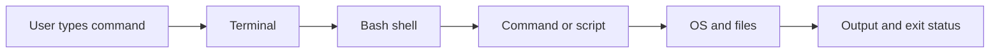

# 01 - Setup and Shell Basics

## Learning Goal

Define what a shell and Bash are; open the right terminal on Windows, macOS, or Linux; verify that Bash is running; run simple commands; and understand the prompt, current directory, command shape, paths, quoting, exit status, and safe basic `.sh` script execution.

## What a Shell Is

A terminal is the app or window where you type. A shell is the program inside that terminal that reads your command, interprets it, asks the operating system to do work, and prints output.

Bash is one shell. You can use it interactively, one command at a time, or you can put commands in a text file and run them as a script.



When examples show a prompt symbol such as `$`, do not type the prompt symbol. Type only the command.

Example prompt plus command:

```text
$ pwd
```

What you type:

```bash
pwd
```

## Bash, PowerShell, and zsh

Bash, PowerShell, and zsh are all shells, but they do not use exactly the same syntax.

- Bash is the shell used in this course.
- PowerShell is common on Windows. Use it only for the Windows setup commands that are clearly labeled PowerShell.
- zsh is the normal default shell in macOS Terminal. For this lesson, you can start Bash by typing `bash`.

After you have launched Bash, lesson commands are shown in `bash` code fences.

## Open Bash on Windows WSL/Git Bash/macOS/Linux

### Windows with WSL

WSL runs a Linux environment on Windows. It is usually the closest Windows option to a Linux Bash environment.

If WSL is not installed, open PowerShell as Administrator and run this PowerShell command:

```powershell
wsl --install
```

Restart if Windows asks you to. Then open PowerShell and launch WSL in your Linux home directory with this PowerShell command:

```powershell
wsl ~
```

After WSL opens, you are inside a Linux shell. Verify Bash:

```bash
bash --version
```

### Windows with Git Bash

If you are using Git Bash instead of WSL, install Git for Windows if needed, then open Git Bash from the Start menu.

Verify Bash:

```bash
bash --version
```

Git Bash is useful for learning many Bash basics. WSL runs a Linux environment on Windows, so it matches Linux-focused Bash lessons more closely.

### macOS

Open Terminal. On modern macOS, Terminal normally starts zsh. Type `bash` to start Bash; your prompt may change.

```bash
bash
bash --version
```

This works on Apple Silicon Macs too. Do not worry if the version, prompt, or path shown on your machine differs from examples.

### Linux

Open your terminal application and verify Bash:

```bash
bash --version
```

## Verify What You Are Running

Run these commands in Bash:

```bash
bash --version
echo "$0"
echo "$SHELL"
```

What to notice:

- `bash --version` confirms that Bash is installed and shows its version.
- `echo "$0"` often shows the current shell or shell process name.
- `echo "$SHELL"` prints your login shell setting. It can show zsh or another shell even when you started a nested Bash session.

Expected output shape:

```text
GNU bash, version ...
bash
/bin/bash
```

Your exact output may differ.

## Prompt and Current Directory

The prompt is the text Bash shows when it is ready for your next command. Prompts vary. They may include your user name, computer name, current directory, or a simple symbol such as `$`.

Do not type prompt symbols from examples.

Bash always has a current directory. Many commands use the current directory unless you give another path.

```bash
pwd
ls
cd .
pwd
cd ..
pwd
cd ~
pwd
```

What they do:

- `pwd` prints the current directory.
- `ls` lists files and directories.
- `cd .` stays in the current directory.
- `cd ..` moves to the parent directory.
- `cd ~` moves to your home directory.

`cd` usually succeeds quietly. Run `pwd` after `cd` when you want to see where you are.

## Command Structure

Most shell commands have this shape:

```text
command options arguments
```

Try these examples:

```bash
ls
ls -l
echo "Hello from Bash"
mkdir bash-practice
```

In these commands:

- `ls` is a command.
- `-l` is an option that changes how `ls` behaves.
- `"Hello from Bash"` is an argument passed to `echo`.
- `bash-practice` is an argument passed to `mkdir`.

Options often start with `-` or `--`. Arguments are the things the command works with, such as text, filenames, or directory names.

## Paths

A path tells Bash where something is.

Start with relative paths. A relative path is read from your current directory:

- `notes.txt` means a file named `notes.txt` in the current directory.
- `bash-practice/notes.txt` means `notes.txt` inside `bash-practice`.
- `.` means the current directory.
- `..` means the parent directory.

Examples:

```bash
mkdir -p bash-practice
echo "Path practice" > bash-practice/notes.txt
cat bash-practice/notes.txt
cd bash-practice
cat notes.txt
cd ..
```

An absolute path starts from the top of a filesystem rather than from your current directory. You will see absolute paths later, but beginners should first get comfortable with relative paths.

## Quoting

Bash splits unquoted text on spaces.

This creates one directory:

```bash
mkdir "practice notes"
```

This creates two directories:

```bash
mkdir practice notes
```

Double quotes keep spaced text together and still allow variables to expand:

```bash
echo "My shell setting is $SHELL"
```

Single quotes are mostly literal:

```bash
echo '$SHELL'
```

Expected output:

```text
$SHELL
```

Use quotes around text or paths that contain spaces.

## Exit Status Basics

Every command finishes with an exit status. `0` means success. A nonzero number means failure.

`$?` stores the exit status of the most recent command:

```bash
pwd
echo $?
ls missing-file
echo $?
```

The `pwd` command should print `0` afterward. The missing file example should print an error, then a nonzero status afterward.

## Create and Read a File

Create a practice directory, move into it, write a file, and display it:

```bash
mkdir -p bash-practice
cd bash-practice
echo "I am learning Bash." > notes.txt
echo "Commands are small tools." >> notes.txt
cat notes.txt
```

Expected output:

```text
I am learning Bash.
Commands are small tools.
```

The `>` operator replaces a file with new output. The `>>` operator appends output to the end of a file. These redirection operators are preview concepts here; you will practice them more later.

## Run a `.sh` Script Safely

A shell script is a text file containing shell commands.

Safety first: before running a `.sh` file, inspect it. Do not blindly run unknown downloaded scripts. Look for commands that delete, overwrite, install, upload, or change system settings.

Create a small script:

```bash
cat > where-am-i.sh <<'EOF'
#!/usr/bin/env bash
echo "Current directory:"
pwd
echo "Current user:"
whoami
EOF
```

The `cat <<'EOF' ... EOF` pattern is called a heredoc. It is a convenient way to write several lines into a file. This is only a preview; you do not need to master heredocs yet.

Inspect the script before running it:

```bash
cat where-am-i.sh
```

Run it with Bash:

```bash
bash where-am-i.sh
```

Expected output shape:

```text
Current directory:
...
Current user:
...
```

The first line, `#!/usr/bin/env bash`, is a shebang. It tells Unix-like systems which interpreter should run the script when the script is executed directly.

Running a script as `bash where-am-i.sh` does not require executable permission. Later, you may see direct execution:

```bash
chmod +x where-am-i.sh
./where-am-i.sh
```

For now, inspect scripts first and run this lesson script with `bash where-am-i.sh`.

## Common Mistakes

- Typing the prompt symbol from an example. If an example shows `$ pwd`, type `pwd`.
- Running Bash lesson commands in PowerShell by accident. PowerShell has different syntax. PowerShell-only commands in this lesson are labeled.
- Forgetting that macOS Terminal may start zsh. Type `bash` first when following this Bash lesson.
- Trusting `echo "$SHELL"` as the current shell. It can show your login shell, not a nested shell you started afterward.
- Forgetting quotes around spaced names, such as `cat "my notes.txt"`.
- Expecting `cd` to print your new location. Use `pwd`.
- Mixing platform-specific paths into Bash examples. Practice with relative paths like `bash-practice/notes.txt`.
- Using `>` when you meant `>>`. `>` replaces; `>>` appends.
- Running a downloaded `.sh` file without reading it first.

## Exercise

Use Bash to do the following:

1. Open Bash for your operating system.
2. Verify Bash with `bash --version`, `echo "$0"`, and `echo "$SHELL"`.
3. Go to your home directory.
4. Create or reuse a directory named `bash-practice`.
5. Move into `bash-practice`.
6. Create `notes.txt` with two lines and display it.
7. Run one successful command, then `echo $?`.
8. Run one failing command, then `echo $?`.
9. Create `where-am-i.sh`.
10. Inspect `where-am-i.sh`.
11. Run it with `bash where-am-i.sh`.

Your script should print:

- A label for the current directory.
- The current directory.
- A label for the current user.
- The current user.

## Worked Answer

Verify Bash:

```bash
bash --version
echo "$0"
echo "$SHELL"
```

Create and display `notes.txt`:

```bash
cd ~
mkdir -p bash-practice
cd bash-practice
echo "I am practicing Bash commands." > notes.txt
echo "I can create files and run scripts." >> notes.txt
cat notes.txt
```

Expected output:

```text
I am practicing Bash commands.
I can create files and run scripts.
```

Check success and failure statuses:

```bash
pwd
echo $?
ls missing-file
echo $?
```

Expected output shape:

```text
...
0
ls: cannot access 'missing-file': No such file or directory
nonzero-number
```

The exact error wording may differ by system. The important idea is that success gives `0` and failure gives a nonzero number.

Create the script:

```bash
cat > where-am-i.sh <<'EOF'
#!/usr/bin/env bash
echo "Current directory:"
pwd
echo "Current user:"
whoami
EOF
```

Inspect it:

```bash
cat where-am-i.sh
```

Run it:

```bash
bash where-am-i.sh
```

Expected output shape:

```text
Current directory:
...
Current user:
...
```

If your output shows a different directory or user name, that is expected.

## Sources Used

- GNU Bash Reference Manual: https://www.gnu.org/software/bash/manual/bash.html
- Microsoft WSL install documentation: https://learn.microsoft.com/en-us/windows/wsl/install
- Microsoft WSL basic commands: https://learn.microsoft.com/en-us/windows/wsl/basic-commands
- Apple Terminal open or quit documentation: https://support.apple.com/guide/terminal/open-or-quit-terminal-apd5265185d-f365-44cb-8b09-71a064a42125/mac
- Apple Terminal default shell documentation: https://support.apple.com/guide/terminal/change-the-default-shell-trml113/mac
- Apple Terminal shell scripts documentation: https://support.apple.com/guide/terminal/intro-to-shell-scripts-apd53500956-7c5b-496b-a362-2845f2aab4bc/mac
- Apple Terminal executable script documentation: https://support.apple.com/guide/terminal/make-a-file-executable-apdd100908f-06b3-4e63-8a87-32e71241bab4/mac
- Git for Windows: https://gitforwindows.org/
