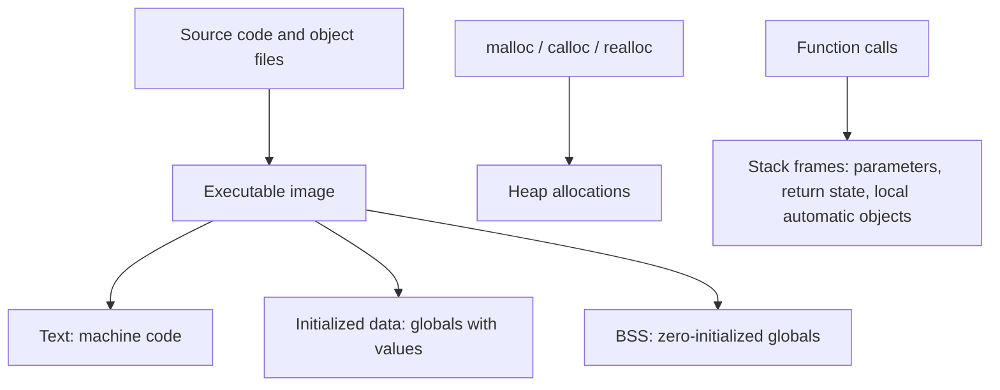

# 01 - Memory Layout

## Learning Goal

Understand the practical memory layout of a C program: where code, globals, stack objects, heap allocations, and struct fields usually live, what the C language actually guarantees, and how to inspect layout without depending on unstable addresses.

## Why It Matters

C gives you direct control over bytes, object lifetimes, pointers, and allocation. That power is also where many C bugs begin:

- Reading an object after its lifetime ended.
- Assuming two different machines use the same pointer size, alignment, or padding.
- Serializing a `struct` by copying raw bytes instead of writing a portable format.
- Returning a pointer to a stack object.
- Forgetting to release heap memory.

Memory layout knowledge helps you debug crashes, reason about performance, and write portable systems code. The important habit is to separate what C guarantees from what a compiler, operating system, and CPU happen to do today.

## Platform Notes

Use a scratch directory for this lesson.

On Windows 10/11, use one of these options:

```powershell
cl /std:c17 /W4 /Zi memory_layout.c
.\memory_layout.exe
```

The `cl` command works from a Visual Studio Developer PowerShell where MSVC is on `PATH`.

If you use a GCC-like or Clang-like toolchain on Windows, use:

```powershell
cc -std=c17 -Wall -Wextra -pedantic memory_layout.c -o memory_layout.exe
.\memory_layout.exe
```

On macOS Apple Silicon, install the Xcode Command Line Tools if `cc` is missing. Then run:

```bash
cc -std=c17 -Wall -Wextra -pedantic memory_layout.c -o memory_layout
./memory_layout
```

Do not compare exact addresses between Windows and macOS. Address Space Layout Randomization, compiler choices, optimization level, and architecture all affect address values.

## The Usual Process Memory Map

A running C program commonly has regions like these:



This diagram is a useful model, not a portable contract. The C standard defines objects, storage duration, lifetimes, sizes, alignment requirements, and pointer rules. It does not require every implementation to expose regions named "stack" and "heap" in the same way.

## Storage Duration

C object lifetime is tied to storage duration:

| Storage duration | Common location model | Example |
| --- | --- | --- |
| Static | data or BSS region | file-scope globals, `static` locals |
| Automatic | stack frame model | ordinary block-scope locals |
| Allocated | heap model | objects returned by `malloc` |
| Thread | thread-local storage | `_Thread_local` objects |

Static objects exist for the whole program run. Automatic objects exist while execution is inside their block. Allocated objects exist from successful allocation until `free`.

This is invalid because `local` stops existing when the function returns:

```c
int *bad_pointer(void) {
    int local = 42;
    return &local;
}
```

This is valid because the caller owns the allocated object until it calls `free`:

```c
#include <stdlib.h>

int *make_number(void) {
    int *value = malloc(sizeof *value);
    if (value != NULL) {
        *value = 42;
    }
    return value;
}
```

## Sizes, Alignment, And Padding

`sizeof` reports the size of an object or type in bytes. `_Alignof` reports the alignment requirement of a complete object type in C11 and later.

Structs can contain padding bytes between members and at the end. Padding lets each member satisfy its alignment requirement and lets arrays of the struct keep every element correctly aligned.

```c
#include <stdio.h>
#include <stddef.h>

struct Packet {
    char tag;
    int id;
    double value;
};

int main(void) {
    printf("sizeof(struct Packet) = %zu\n", sizeof(struct Packet));
    printf("_Alignof(struct Packet) = %zu\n", _Alignof(struct Packet));
    printf("offset tag = %zu\n", offsetof(struct Packet, tag));
    printf("offset id = %zu\n", offsetof(struct Packet, id));
    printf("offset value = %zu\n", offsetof(struct Packet, value));
    return 0;
}
```

On many 64-bit systems this struct is larger than `1 + sizeof(int) + sizeof(double)` because padding appears after `tag` and possibly at the end. Do not write code that assumes one exact layout unless you control and verify the ABI, compiler options, and target.

## Example: Inspect A Small Program

Create `memory_layout.c`:

```c
#include <stdio.h>
#include <stdlib.h>
#include <stddef.h>

static int global_initialized = 7;
static int global_zero;

struct Reading {
    char code;
    int count;
    double average;
};

static void print_layout(void) {
    int automatic_value = 10;
    int *heap_value = malloc(sizeof *heap_value);

    if (heap_value == NULL) {
        fprintf(stderr, "allocation failed\n");
        return;
    }

    *heap_value = 20;

    printf("object addresses from this run:\n");
    printf("  function print_layout: %p\n", (void *)&print_layout);
    printf("  global_initialized:    %p\n", (void *)&global_initialized);
    printf("  global_zero:           %p\n", (void *)&global_zero);
    printf("  automatic_value:       %p\n", (void *)&automatic_value);
    printf("  heap_value object:     %p\n", (void *)heap_value);

    printf("\nstruct Reading layout:\n");
    printf("  sizeof(struct Reading):   %zu\n", sizeof(struct Reading));
    printf("  _Alignof(struct Reading): %zu\n", _Alignof(struct Reading));
    printf("  offset code:              %zu\n", offsetof(struct Reading, code));
    printf("  offset count:             %zu\n", offsetof(struct Reading, count));
    printf("  offset average:           %zu\n", offsetof(struct Reading, average));

    free(heap_value);
}

int main(void) {
    print_layout();
    return 0;
}
```

Compile and run it using the platform commands above. Run it more than once. Some addresses may change between runs; that is normal.

What to notice:

- Static objects have stable lifetime for the whole program.
- `automatic_value` is valid only while `print_layout` is running.
- `heap_value` points to an allocated object that remains valid until `free(heap_value)`.
- Struct member offsets are discovered with `offsetof`, not guessed.
- Exact addresses are useful for debugging a run, not for portable program logic.

## Common Mistakes

- Treating "stack grows down" or "heap grows up" as portable C rules.
- Returning pointers to automatic local variables.
- Forgetting that `sizeof pointer` is the pointer size, not the allocated object size.
- Assuming a `struct` has no padding.
- Saving raw struct bytes to a file and expecting another compiler, OS, or CPU to read them correctly.
- Using `%p` without casting the pointer argument to `void *`.
- Dereferencing memory after `free`.
- Using addresses printed in one run as if they are meaningful in another run.

## Exercise

Create `layout_report.c`.

Requirements:

- Define two structs with the same fields in different orders:
  - `struct BadOrder { char tag; double value; int count; };`
  - `struct BetterOrder { double value; int count; char tag; };`
- Print `sizeof`, `_Alignof`, and each member offset for both structs.
- Allocate one `struct BetterOrder` with `malloc`.
- Initialize all of its fields.
- Print the heap object's address and field values.
- Free the allocation before the program exits.
- If allocation fails, print an error to `stderr` and exit nonzero.

## Worked Answer

```c
#include <stdio.h>
#include <stdlib.h>
#include <stddef.h>

struct BadOrder {
    char tag;
    double value;
    int count;
};

struct BetterOrder {
    double value;
    int count;
    char tag;
};

static void print_bad_order(void) {
    printf("struct BadOrder\n");
    printf("  sizeof:   %zu\n", sizeof(struct BadOrder));
    printf("  alignof:  %zu\n", _Alignof(struct BadOrder));
    printf("  tag:      %zu\n", offsetof(struct BadOrder, tag));
    printf("  value:    %zu\n", offsetof(struct BadOrder, value));
    printf("  count:    %zu\n", offsetof(struct BadOrder, count));
}

static void print_better_order(void) {
    printf("struct BetterOrder\n");
    printf("  sizeof:   %zu\n", sizeof(struct BetterOrder));
    printf("  alignof:  %zu\n", _Alignof(struct BetterOrder));
    printf("  value:    %zu\n", offsetof(struct BetterOrder, value));
    printf("  count:    %zu\n", offsetof(struct BetterOrder, count));
    printf("  tag:      %zu\n", offsetof(struct BetterOrder, tag));
}

int main(void) {
    struct BetterOrder *reading = malloc(sizeof *reading);

    if (reading == NULL) {
        fprintf(stderr, "allocation failed\n");
        return 1;
    }

    reading->value = 98.5;
    reading->count = 12;
    reading->tag = 'A';

    print_bad_order();
    putchar('\n');
    print_better_order();

    printf("\nheap object:\n");
    printf("  address: %p\n", (void *)reading);
    printf("  value:   %.1f\n", reading->value);
    printf("  count:   %d\n", reading->count);
    printf("  tag:     %c\n", reading->tag);

    free(reading);
    return 0;
}
```

Compile it:

```powershell
cc -std=c17 -Wall -Wextra -pedantic layout_report.c -o layout_report.exe
.\layout_report.exe
```

```bash
cc -std=c17 -Wall -Wextra -pedantic layout_report.c -o layout_report
./layout_report
```

If you are using MSVC Developer PowerShell:

```powershell
cl /std:c17 /W4 /Zi layout_report.c
.\layout_report.exe
```

Expected results vary by implementation, but `struct BetterOrder` is often smaller or equal in size because the largest-alignment member comes first. The lesson is not "always sort fields by size." The lesson is to measure layout, understand padding, and avoid relying on raw struct bytes as a portable data format.

## Next Step

Continue with `02_undefined_behavior.md`. Memory layout teaches you where objects may live; undefined behavior teaches you what happens when C code breaks the language rules around those objects.

## Sources Used

- ISO/IEC WG14 N1570 draft, "Storage durations of objects", "Alignment of objects", `sizeof`, and structure layout rules: https://www.open-std.org/jtc1/sc22/wg14/www/docs/n1570.pdf
- Microsoft Learn, MSVC `cl` compiler options: https://learn.microsoft.com/cpp/build/reference/compiler-options
- Microsoft Learn, `/std` language standard option: https://learn.microsoft.com/cpp/build/reference/std-specify-language-standard-version
- Apple Developer, Xcode Command Line Tools: https://developer.apple.com/xcode/resources/
- GNU GCC manual, warning options: https://gcc.gnu.org/onlinedocs/gcc/Warning-Options.html
- GNU C Library manual, dynamic allocation: https://www.gnu.org/software/libc/manual/html_node/Memory-Allocation.html
