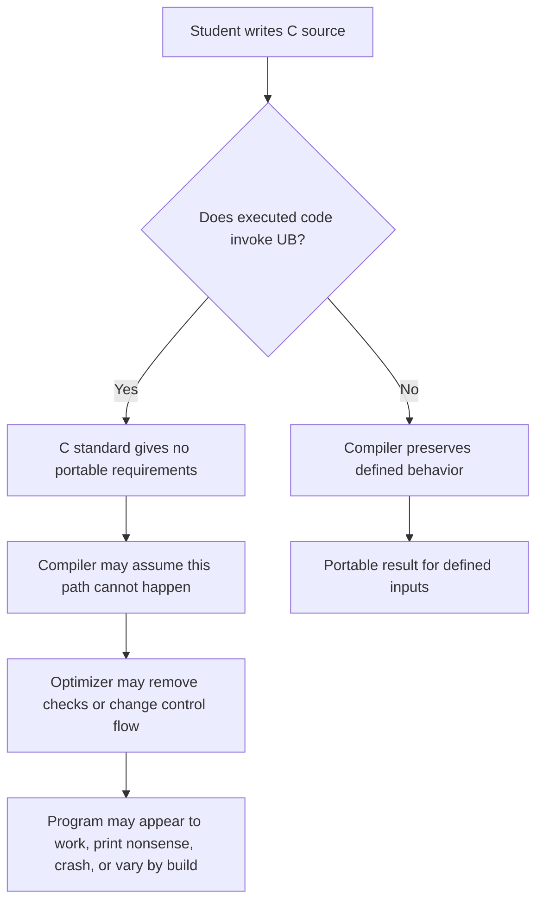

# 02 - Undefined Behavior

## Learning Goal

Understand what C means by undefined behavior, recognize common undefined behavior patterns, and rewrite risky code into defined code.

## Why It Matters

Undefined behavior is one of the main reasons C bugs can feel confusing. A program may appear to work during testing, then fail after you enable optimization, change compilers, move platforms, or pass a slightly different input.

That is not just a portability problem. Many security and correctness bugs begin as undefined behavior: reading outside an array, dereferencing a null pointer, using an uninitialized value, or overflowing a signed integer. Once a program breaks C's rules, the C standard gives no portable requirement for what happens next.

The practical habit is to separate three ideas:

| Behavior category | Meaning | Example shape |
| --- | --- | --- |
| Undefined behavior | The standard imposes no requirements after the program does this. | Signed integer overflow, out-of-bounds array access, null pointer dereference. |
| Implementation-defined behavior | The implementation must choose and document the behavior. | The number of bits in a `char`, or how some implementation-specific choices are represented. |
| Unspecified behavior | The standard allows two or more possibilities and does not require the implementation to document which one happens in a given case. | Order of evaluation for many operands and function arguments. |

Undefined behavior is the dangerous one in this lesson because the optimizer is allowed to assume it does not happen in a valid C program.

## Platform Notes

Use a scratch directory for this lesson.

On Windows 10/11, if you are using a Visual Studio Developer PowerShell with MSVC on `PATH`, you can build the fixed worked answer with:

```powershell
cl /std:c17 /W4 /Zi ub_lab.c
.\ub_lab.exe
```

If you use a GCC-like or Clang-like toolchain on Windows, use:

```powershell
cc -std=c17 -Wall -Wextra -Wpedantic ub_lab.c -o ub_lab.exe
.\ub_lab.exe
```

UndefinedBehaviorSanitizer requires a Clang/GCC-style toolchain with the UBSan runtime. Do not use MSVC `cl` as the UBSan path. With Clang on Windows PowerShell:

```powershell
clang -std=c17 -Wall -Wextra -Wpedantic -g -fsanitize=undefined .\ub_lab.c -o .\ub_lab.exe
$env:UBSAN_OPTIONS='print_stacktrace=1'
.\ub_lab.exe
```

On macOS Apple Silicon, install the Xcode Command Line Tools if `clang` or `cc` is missing. Then run:

```bash
clang -std=c17 -Wall -Wextra -Wpedantic ub_lab.c -o ub_lab
./ub_lab
```

For UBSan on macOS:

```bash
clang -std=c17 -Wall -Wextra -Wpedantic -g -fsanitize=undefined ./ub_lab.c -o ./ub_lab
UBSAN_OPTIONS=print_stacktrace=1 ./ub_lab
```

Do not expect identical warning or sanitizer text across compilers. Treat warnings and sanitizer reports as bugs to investigate, not as formatting you should memorize.

## The Rule And The Optimizer

C is specified in terms of behavior for programs that follow the language rules. When a program has undefined behavior, the standard does not require a portable result, a diagnostic, a crash, or any particular recovery.

Optimizers use that rule. They can transform code under the assumption that undefined behavior does not occur. That can make checks disappear when the check happens after the invalid operation.

This is invalid as a signed overflow check because `a + b` happens before the test:

```text
int sum = a + b;              // UB if the mathematical result is outside int range
if (b > 0 && sum < a) {
    puts("overflow");
}
```

If signed overflow occurred, the program already has undefined behavior. The later check is too late. A compiler optimizing valid C may assume the overflow path cannot happen and transform the code accordingly.

Check the range before doing signed arithmetic:

```c
#include <limits.h>
#include <stdbool.h>

static bool checked_add_int(int a, int b, int *out) {
    if (out == NULL) {
        return false;
    }

    if ((b > 0 && a > INT_MAX - b) ||
        (b < 0 && a < INT_MIN - b)) {
        return false;
    }

    *out = a + b;
    return true;
}
```

Unsigned integer arithmetic is different. Unsigned overflow is defined modulo arithmetic. For example, adding `1u` to `UINT_MAX` produces `0u` for `unsigned int`. That wraparound can still be a logic bug, but it is not undefined behavior. Signed integer overflow is undefined behavior.

## Common Undefined Behavior Patterns

These snippets are intentionally invalid teaching examples. Do not copy them into production code.

Signed integer overflow:

```text
int high = INT_MAX;
int broken = high + 1;        // UB
```

Out-of-bounds access:

```text
int items[3] = {10, 20, 30};
printf("%d\n", items[3]);     // UB: valid indexes are 0, 1, and 2
```

Null pointer dereference:

```text
int *value = NULL;
printf("%d\n", *value);       // UB
```

Unsequenced modification:

```text
int i = 1;
int x = i++ + i++;            // UB: i is modified twice without sequencing
```

Invalid shifts:

```text
int x = 1;
int a = x << -1;              // UB: negative shift count
int b = x << 100;             // UB if 100 is greater than or equal to int width
```

Uninitialized reads:

```text
int total;
printf("%d\n", total);        // UB: automatic local was never initialized
```

## How To Think About It

Undefined behavior is not a strange output value. It is the absence of a portable requirement after the program breaks a rule.



Use these habits when writing C:

- Validate indexes before reading or writing arrays.
- Check possibly-null pointers before dereferencing them.
- Initialize variables before reading them.
- Avoid multiple side effects on the same scalar object in one expression.
- Check integer ranges before signed arithmetic.
- Treat compiler warnings and sanitizer reports as bugs.

## Detection Tools

Warnings catch many mistakes before the program runs:

```powershell
cc -std=c17 -Wall -Wextra -Wpedantic ub_lab.c -o ub_lab.exe
```

```bash
cc -std=c17 -Wall -Wextra -Wpedantic ub_lab.c -o ub_lab
```

UBSan catches many runtime undefined behavior cases on executed paths:

```powershell
clang -std=c17 -Wall -Wextra -Wpedantic -g -fsanitize=undefined .\ub_lab.c -o .\ub_lab.exe
$env:UBSAN_OPTIONS='print_stacktrace=1'
.\ub_lab.exe
```

```bash
clang -std=c17 -Wall -Wextra -Wpedantic -g -fsanitize=undefined ./ub_lab.c -o ./ub_lab
UBSAN_OPTIONS=print_stacktrace=1 ./ub_lab
```

Sanitizers are not proof that a program has no undefined behavior. They instrument many checks, but they only check code paths that actually run, and no sanitizer catches every possible C rule violation. Also, a warning for unsequenced modification may come from compiler diagnostics rather than from UBSan.

## Exercise

Create `ub_lab.c` with these broken functions:

- `add_scores`: performs signed addition before checking for overflow.
- `print_item`: reads an item without checking whether the pointer is null or the index is in bounds.
- `next_twice`: modifies the same local variable twice in one expression.
- `starting_total`: reads an uninitialized local variable.

Use this starting point:

```c
#include <stdio.h>
#include <stddef.h>
#include <limits.h>

int add_scores(int a, int b) {
    int sum = a + b;

    if (b > 0 && sum < a) {
        printf("overflow detected too late\n");
    }

    return sum;
}

void print_item(const int *items, size_t len, size_t index) {
    (void)len;
    printf("item[%zu] = %d\n", index, items[index]);
}

int next_twice(int start) {
    int value = start;
    return value++ + value++;
}

int starting_total(void) {
    int total;
    return total + 10;
}

int main(void) {
    int items[] = {10, 20, 30};

    printf("add_scores: %d\n", add_scores(INT_MAX, 1));
    print_item(items, 3, 3);
    printf("next_twice: %d\n", next_twice(5));
    printf("starting_total: %d\n", starting_total());

    return 0;
}
```

Then:

1. Compile and run normally.
2. Compile with `-Wall -Wextra -Wpedantic` or MSVC `/W4` and read the warnings.
3. If you have a Clang/GCC-style toolchain with UBSan, compile and run with `-fsanitize=undefined -g`.
4. Rewrite each function to defined behavior.
5. Add comments explaining what was undefined behavior and how the fix prevents it.

## Worked Answer

```c
#include <stdio.h>
#include <stddef.h>
#include <limits.h>
#include <stdbool.h>

static bool add_scores(int a, int b, int *out) {
    if (out == NULL) {
        return false;
    }

    /*
       The broken version added first and checked later. That is too late:
       signed overflow during a + b would already be undefined behavior.
    */
    if ((b > 0 && a > INT_MAX - b) ||
        (b < 0 && a < INT_MIN - b)) {
        return false;
    }

    *out = a + b;
    return true;
}

static void print_item(const int *items, size_t len, size_t index) {
    /*
       The broken version indexed without validating the pointer or bounds.
       This version only reads when the pointer is non-null and index < len.
    */
    if (items == NULL) {
        printf("no items available\n");
        return;
    }

    if (index >= len) {
        printf("index %zu is out of range for length %zu\n", index, len);
        return;
    }

    printf("item[%zu] = %d\n", index, items[index]);
}

static int next_twice(int start) {
    /*
       The broken version used value++ + value++, which modifies value twice
       without sequencing. Separate statements define the order.
    */
    int value = start;
    int first = value;
    value++;
    int second = value;
    value++;

    return first + second;
}

static int starting_total(void) {
    /*
       The broken version read an uninitialized automatic local.
       Initialize before reading.
    */
    int total = 0;
    return total + 10;
}

int main(void) {
    int items[] = {10, 20, 30};
    int sum = 0;

    if (add_scores(40, 2, &sum)) {
        printf("40 + 2 = %d\n", sum);
    } else {
        printf("40 + 2 could not be represented as int\n");
    }

    if (add_scores(INT_MAX, 1, &sum)) {
        printf("INT_MAX + 1 = %d\n", sum);
    } else {
        printf("INT_MAX + 1 could not be represented as int\n");
    }

    print_item(items, 3, 1);
    print_item(items, 3, 3);
    print_item(NULL, 0, 0);

    printf("next_twice(5) = %d\n", next_twice(5));
    printf("starting_total() = %d\n", starting_total());

    return 0;
}
```

Compile it with warnings:

```powershell
cc -std=c17 -Wall -Wextra -Wpedantic ub_lab.c -o ub_lab.exe
.\ub_lab.exe
```

```bash
cc -std=c17 -Wall -Wextra -Wpedantic ub_lab.c -o ub_lab
./ub_lab
```

If you are using MSVC Developer PowerShell:

```powershell
cl /std:c17 /W4 /Zi ub_lab.c
.\ub_lab.exe
```

With the fixed version, the signed overflow case reports failure before addition, the out-of-bounds and null pointer cases print clear messages, `next_twice(5)` returns `11` by adding `5 + 6`, and `starting_total()` returns `10`.

## Common Mistakes

- Checking for signed overflow after doing the overflowing operation.
- Assuming unsigned wraparound and signed overflow follow the same rule.
- Treating one successful test run as evidence that undefined behavior is harmless.
- Ignoring warnings because the program still produced output.
- Believing UBSan checks every C rule on every possible input.
- Fixing an array bug by changing the test data instead of validating the index.

## Next Step

Continue with `03_function_pointers.md`. Undefined behavior teaches you why breaking C's rules can erase portability; function pointers show how C can store and call behavior through typed pointer values.

## Sources Used

- ISO/IEC WG14 N1570 draft, definitions of undefined, implementation-defined, and unspecified behavior, plus signed integer overflow and evaluation rules: https://www.open-std.org/jtc1/sc22/wg14/www/docs/n1570.pdf
- cppreference, behavior overview: https://en.cppreference.com/c/language/behavior
- cppreference, order of evaluation: https://en.cppreference.com/c/language/eval_order
- cppreference, arithmetic operators: https://en.cppreference.com/c/language/operator_arithmetic
- Clang, UndefinedBehaviorSanitizer documentation: https://clang.llvm.org/docs/UndefinedBehaviorSanitizer.html
- GCC manual, instrumentation options: https://gcc.gnu.org/onlinedocs/gcc/Instrumentation-Options.html
- SEI CERT C, INT32-C: https://cmu-sei.github.io/secure-coding-standards/sei-cert-c-coding-standard/rules/integers-int/int32-c/
- Microsoft Learn, `/fsanitize` options: https://learn.microsoft.com/en-us/cpp/build/reference/fsanitize
