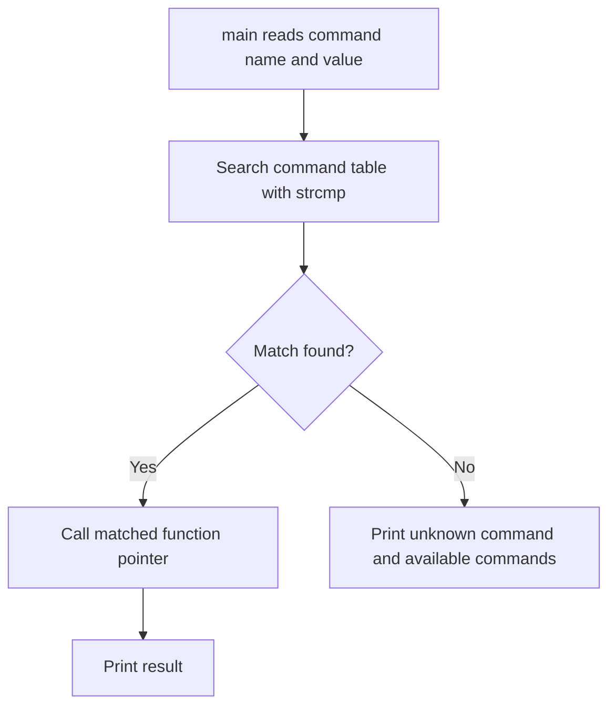

# 03 - Function Pointers

## Learning Goal

Declare, assign, pass, call, and safely reason about C function pointers. By the end of this lesson, you should be able to use a function pointer as a callback and explain why the pointed-to function's signature must match.

## Why It Matters

Function pointers let C programs select behavior dynamically without hard-coding every branch into one large function. You will see them in callbacks, dispatch tables, menu commands, sorting and searching comparators, and state-machine handlers.

A function pointer stores a callable reference to a function with a matching signature. The signature includes the return type and the parameter types. If the pointer says "function taking two `int` values and returning `int`", the function you store in it must match that shape.

## Platform Notes

Use a scratch directory for this lesson and create files there.

On Windows 10/11, if you are using a Visual Studio Developer PowerShell with MSVC on `PATH`, compile and run the exercise with:

```powershell
cl /std:c17 /W4 /Zi function_pointers.c
.\function_pointers.exe
```

On macOS Apple Silicon, install the Xcode Command Line Tools if `clang` or `cc` is missing:

```bash
xcode-select --install
```

Then compile and run with:

```bash
clang -Wall -Wextra -std=c17 ./function_pointers.c -o ./function_pointers
./function_pointers
```

Warnings are part of the lesson. If your compiler warns about an incompatible function pointer type, treat that as a bug in the program.

## The Core Syntax

This declares a function pointer:

```c
int (*operation)(int, int);
```

Read it inside out:

- `operation` is the name.
- `*operation` means `operation` is a pointer.
- `(*operation)(int, int)` means the pointer points to a function that takes two `int` arguments.
- The leading `int` means that function returns `int`.

The parentheses around `*operation` are essential. Without them, this means something else:

```text
int *operation(int, int);
```

That declares `operation` as a function taking two `int` values and returning `int *`. It is a function returning a pointer, not a pointer to a function.

## First Complete Example

Create `operations.c`:

```c
#include <stdio.h>

static int add(int left, int right) {
    return left + right;
}

static int multiply(int left, int right) {
    return left * right;
}

int main(void) {
    int (*operation)(int, int) = add;

    printf("%d\n", operation(3, 4));

    operation = multiply;
    printf("%d\n", operation(3, 4));

    return 0;
}
```

Expected output:

```text
7
12
```

The variable `operation` first points to `add`, so `operation(3, 4)` calls `add(3, 4)`. After reassignment, the same call expression calls `multiply(3, 4)`.

You may also see this written as:

```c
operation = &add;
```

Both `operation = add;` and `operation = &add;` are valid. C11/N1570 `6.3.2.1p4` says that, except in specific contexts such as the unary `&` operator, a function designator converts to a pointer to that function. In learner examples, prefer `operation = add;` because it keeps the assignment visually close to array-to-pointer style and avoids implying that `&` is required.

## Reading Declarations

Function pointer declarations become easier when you start at the identifier and work outward.

```c
int (*operation)(int, int);
```

Inside out: `operation` is a pointer to a function taking `(int, int)` and returning `int`.

Contrast that with:

```text
int *operation(int, int);
```

Inside out: `operation` is a function taking `(int, int)` and returning `int *`.

When the declaration gets in the way of readability, use a typedef:

```c
typedef int (*binary_operation)(int, int);
```

Now you can write:

```c
binary_operation operation = add;
```

The typedef does not create a new kind of function. It gives the function pointer type a readable name.

## Passing A Function Pointer As A Callback

A callback is a function passed to another function so the receiving function can call it later or call it as part of its work.

```c
#include <stdio.h>

static int add(int left, int right) {
    return left + right;
}

static int multiply(int left, int right) {
    return left * right;
}

static int apply(int left, int right, int (*operation)(int, int)) {
    return operation(left, right);
}

int main(void) {
    printf("%d\n", apply(3, 4, add));
    printf("%d\n", apply(3, 4, multiply));

    return 0;
}
```

The `apply` function does not know whether it is adding or multiplying. It only knows that `operation` points to a function that accepts two `int` values and returns an `int`.

The same example using a typedef is often easier to scan:

```c
typedef int (*binary_operation)(int, int);

static int apply(int left, int right, binary_operation operation) {
    return operation(left, right);
}
```

## Dispatch Flow

The exercise at the end of this lesson uses a command table. Each command name is stored beside a function pointer with the same `int command(int value)` shape.



## Standard Library Example: qsort

The C standard library function `qsort` uses a function pointer callback to compare array elements:

```c
#include <stdio.h>
#include <stdlib.h>

static int compare_ints(const void *left, const void *right) {
    const int left_value = *(const int *)left;
    const int right_value = *(const int *)right;

    if (left_value < right_value) {
        return -1;
    }

    if (left_value > right_value) {
        return 1;
    }

    return 0;
}

int main(void) {
    int values[] = {42, -3, 19, 19, 0};
    const size_t count = sizeof values / sizeof values[0];

    qsort(values, count, sizeof values[0], compare_ints);

    for (size_t i = 0; i < count; i++) {
        printf("%d\n", values[i]);
    }

    return 0;
}
```

The comparator signature is:

```c
int compare_ints(const void *left, const void *right)
```

`qsort` passes pointers to the elements being compared. Because the standard library must sort arrays of many element types, the comparator receives `const void *` pointers. Inside this comparator, each pointer is cast back to `const int *` and then dereferenced.

Avoid this shortcut:

```text
return left_value - right_value;
```

If the subtraction overflows a signed `int`, the behavior is undefined. Use explicit comparisons and return a negative, zero, or positive value.

Also note that C `qsort` does not guarantee stable ordering for equal elements. If two elements compare as equal, their final relative order is unspecified.

## Safety Rules

- The function pointer type must match the target function type.
- Avoid casts between incompatible function pointer types. C allows conversion between function pointer types and back, but calling through an incompatible converted type has undefined behavior.
- Do not convert function pointers to `void *` in ISO C. The standard `void *` conversion rule is for object pointers, not function pointers.
- Check a possibly-null function pointer before calling it.
- Prefer prototypes with explicit parameter types so the compiler can check argument counts and types.

These rules matter because a function call through a pointer is still a normal C function call. The call expression supplies arguments, the function receives parameters, and the types must agree.

## Common Mistakes

- Missing parentheses and writing a function returning a pointer instead of a pointer to a function.
- Assigning a function with the wrong return type or parameter list.
- Calling a null function pointer.
- Writing a `qsort` comparator as subtraction and accidentally invoking signed overflow.
- Mutating elements inside a `qsort` comparator.
- Assuming `qsort` is stable when equal elements may be reordered.

## Exercise

Build `function_pointers.c` as an interactive stdin command dispatcher.

Define four functions matching this shape:

```c
int command(int value);
```

The functions should be:

- `double_value`: returns the input multiplied by `2`.
- `square_value`: returns the input multiplied by itself.
- `negate_value`: returns the negative of the input.
- `increment_value`: returns the input plus `1`.

Define these types:

```c
typedef int (*command_fn)(int);

typedef struct {
    const char *name;
    command_fn run;
} Command;
```

Store the commands in an array. Ask for a command name and an integer value, find the command with `strcmp`, call the selected function through the pointer, and print the result.

If the command is unknown, print a helpful error and the available commands. Do not call a null function pointer.

Valid command example:

```text
Command: square
Value: 7
Result: 49
```

Invalid command example:

```text
Command: triple
Value: 7
Unknown command: triple
Available commands: double, square, negate, increment
```

## Worked Answer

```c
#include <stdio.h>
#include <string.h>

typedef int (*command_fn)(int);

typedef struct {
    const char *name;
    command_fn run;
} Command;

static int double_value(int value) {
    return value * 2;
}

static int square_value(int value) {
    return value * value;
}

static int negate_value(int value) {
    return -value;
}

static int increment_value(int value) {
    return value + 1;
}

static void print_available_commands(const Command commands[], size_t count) {
    printf("Available commands: ");

    for (size_t i = 0; i < count; i++) {
        printf("%s", commands[i].name);

        if (i + 1 < count) {
            printf(", ");
        }
    }

    printf("\n");
}

int main(void) {
    const Command commands[] = {
        {"double", double_value},
        {"square", square_value},
        {"negate", negate_value},
        {"increment", increment_value}
    };
    const size_t command_count = sizeof commands / sizeof commands[0];

    char name[32];
    int value = 0;
    command_fn selected = NULL;

    printf("Command: ");
    if (scanf("%31s", name) != 1) {
        printf("Could not read command.\n");
        return 1;
    }

    printf("Value: ");
    if (scanf("%d", &value) != 1) {
        printf("Could not read integer value.\n");
        return 1;
    }

    for (size_t i = 0; i < command_count; i++) {
        if (strcmp(name, commands[i].name) == 0) {
            selected = commands[i].run;
            break;
        }
    }

    if (selected == NULL) {
        printf("Unknown command: %s\n", name);
        print_available_commands(commands, command_count);
        return 1;
    }

    printf("Result: %d\n", selected(value));

    return 0;
}
```

Each command function can live in the same table because each one has the same return type and parameter list: `int function_name(int value)`. The table stores each function through the shared `command_fn` pointer type, and the call site can safely call the selected function with one `int` argument.

Compile and run:

```powershell
cl /std:c17 /W4 /Zi function_pointers.c
.\function_pointers.exe
```

```bash
clang -Wall -Wextra -std=c17 ./function_pointers.c -o ./function_pointers
./function_pointers
```

## Next Step

Continue with `04_data_structures_in_c.md`. Function pointers are often stored inside structs and arrays, so the next lesson gives you more places to use dispatch tables and callback-style designs.

## Sources Used

- ISO/IEC WG14 N1570 official draft PDF, especially function designator conversion in `6.3.2.1p4`, function pointer conversion limits in `6.3.2.3p8`, function call rules in `6.5.2.2`, and `qsort` in `7.22.5.2`: https://www.open-std.org/jtc1/sc22/wg14/www/docs/n1570.pdf
- GNU C Manual, function pointers: https://www.gnu.org/software/c-intro-and-ref/manual/html_node/Function-Pointers.html
- cppreference, pointer and function pointer syntax: https://en.cppreference.com/w/c/language/pointer
