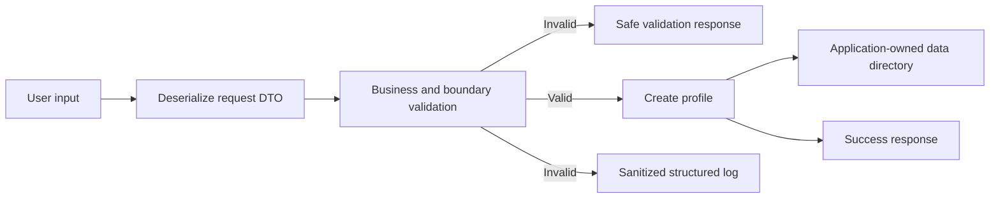

# 11 - Defensive Input Validation

## Learning Goal

Treat data that crosses into an application as untrusted. Validate it at the boundary, keep request models separate from domain records, write files only below an application-owned directory, and return useful errors without exposing implementation details.

By the end of this lesson, you can build a small ASP.NET Core Minimal API that validates a profile request, stores a record safely, and logs rejected input without recording the input itself.

## Validation Is A Boundary Responsibility

Parsing, validation, and authorization are different jobs:

- **Parsing** turns input into a usable shape. JSON deserialization confirms that a request resembles the expected JSON structure; it does not prove that the values meet the application's rules.
- **Validation** checks business and boundary rules such as required fields, allowed ranges, file extensions, and path containment.
- **Authorization** decides whether the caller is allowed to perform an action. A valid request can still be forbidden.

Invalid external input is an expected outcome. Return a validation response for it instead of throwing an exception for ordinary control flow. Unexpected I/O errors, unavailable dependencies, and broken invariants are faults: log enough context to investigate them, then return a generic server error.

This lesson uses a `CreateProfileRequest` DTO at the HTTP boundary. It deliberately does not deserialize the request directly into a persistence or domain entity.



The log path records a stable event name, the API boundary, the rule that failed, and the trace identifier. It does not copy the request body, filename, token, password, or connection string into a log entry.

## Scenario: Create A Profile Safely

Create the project with a supported .NET SDK. These commands have identical syntax in Windows PowerShell and macOS Apple Silicon `zsh`:

```shell
dotnet new web -n DefensiveValidation
cd DefensiveValidation
dotnet add package Microsoft.Extensions.Options.DataAnnotations
dotnet run
```

The app accepts this JSON shape:

```json
{
  "displayName": "Ari",
  "age": 26,
  "avatarFileName": "ari.png"
}
```

`CreateProfileRequest` is an input DTO. `ProfileRecord` is the record stored by the application. Keeping them separate prevents a caller from setting server-owned fields such as an identifier or storage location.

### Configure An Application-Owned Directory

Add this section to `appsettings.json`:

```json
{
  "ProfileStorage": {
    "AvatarFolder": "avatars"
  }
}
```

The value is a folder name beneath the application's relative `data` directory. The app validates that it is a simple folder name, then normalizes it with `Path.GetFullPath`. The resulting `data/avatars` path works on Windows and macOS because .NET's path APIs use the current platform's path rules.

For a temporary environment-specific override, use the shell syntax for the current platform:

```powershell
$env:ProfileStorage__AvatarFolder = "avatars"
dotnet run
```

```bash
export ProfileStorage__AvatarFolder="avatars"
dotnet run
```

Avoid using a caller-supplied full path or trusting a client-provided filename. An uploaded file also needs size limits, content inspection, and malware scanning where appropriate; filename validation alone is not a file-upload security solution.

## Complete Minimal API Example

Replace `Program.cs` with the following code. It uses explicit request validation, typed options validated at startup, a containment check for the avatar filename, structured logging without raw values, and `ProblemDetails` for errors.

```csharp
using System.ComponentModel.DataAnnotations;
using System.Text.Json;
using Microsoft.AspNetCore.Http;
using Microsoft.Extensions.Options;

var builder = WebApplication.CreateBuilder(args);

builder.Services.AddProblemDetails();
builder.Services
    .AddOptions<ProfileStorageOptions>()
    .Bind(builder.Configuration.GetSection(ProfileStorageOptions.SectionName))
    .ValidateDataAnnotations()
    .Validate(
        options => IsSimpleFolderName(options.AvatarFolder),
        "ProfileStorage:AvatarFolder must be a single relative folder name.")
    .ValidateOnStart();

var app = builder.Build();
app.UseExceptionHandler();

var storageOptions = app.Services.GetRequiredService<IOptions<ProfileStorageOptions>>().Value;
var dataRoot = Path.GetFullPath("data");
var avatarRoot = Path.GetFullPath(Path.Combine(dataRoot, storageOptions.AvatarFolder));

if (!IsWithinDirectory(dataRoot, avatarRoot))
{
    throw new InvalidOperationException("The configured profile storage directory is outside data.");
}

Directory.CreateDirectory(avatarRoot);

app.MapPost("/profiles", async (
    CreateProfileRequest request,
    HttpContext context,
    ILogger<Program> logger,
    CancellationToken cancellationToken) =>
{
    var errors = ValidateRequest(request, avatarRoot);
    if (errors.Count > 0)
    {
        logger.LogInformation(
            "ProfileInputRejected. Boundary: {Boundary}. Rule: {Rule}. TraceId: {TraceId}",
            "Api",
            errors.Keys.First(),
            context.TraceIdentifier);

        return Results.ValidationProblem(errors);
    }

    var avatarPath = ResolveAvatarPath(avatarRoot, request.AvatarFileName);
    var profile = new ProfileRecord(
        Guid.NewGuid(),
        request.DisplayName.Trim(),
        request.Age,
        Path.GetFileName(avatarPath));

    var profilePath = Path.Combine(avatarRoot, $"{profile.Id}.json");
    var json = JsonSerializer.Serialize(profile);
    await File.WriteAllTextAsync(profilePath, json, cancellationToken);

    return Results.Created($"/profiles/{profile.Id}", profile);
});

app.Run();

static Dictionary<string, string[]> ValidateRequest(
    CreateProfileRequest request,
    string avatarRoot)
{
    var errors = new Dictionary<string, string[]>();

    if (string.IsNullOrWhiteSpace(request.DisplayName))
    {
        errors[nameof(request.DisplayName)] = new[] { "DisplayName is required." };
    }
    else if (request.DisplayName.Trim().Length > 80)
    {
        errors[nameof(request.DisplayName)] = new[] { "DisplayName must be 80 characters or fewer." };
    }

    if (request.Age is < 13 or > 120)
    {
        errors[nameof(request.Age)] = new[] { "Age must be between 13 and 120." };
    }

    if (!IsAllowedAvatarFileName(request.AvatarFileName, avatarRoot))
    {
        errors[nameof(request.AvatarFileName)] = new[] { "AvatarFileName must be a PNG or JPG file name without path segments." };
    }

    return errors;
}

static bool IsAllowedAvatarFileName(string? fileName, string avatarRoot)
{
    if (string.IsNullOrWhiteSpace(fileName) || fileName.Length > 120)
    {
        return false;
    }

    try
    {
        var path = ResolveAvatarPath(avatarRoot, fileName);
        var extension = Path.GetExtension(path);
        return extension.Equals(".png", StringComparison.OrdinalIgnoreCase)
            || extension.Equals(".jpg", StringComparison.OrdinalIgnoreCase)
            || extension.Equals(".jpeg", StringComparison.OrdinalIgnoreCase);
    }
    catch (ArgumentException)
    {
        return false;
    }
}

static string ResolveAvatarPath(string avatarRoot, string? fileName)
{
    if (string.IsNullOrWhiteSpace(fileName)
        || fileName.IndexOfAny(new[] { '/', '\\' }) >= 0
        || fileName.Contains("..", StringComparison.Ordinal))
    {
        throw new ArgumentException("The avatar file name is invalid.", nameof(fileName));
    }

    var candidate = Path.GetFullPath(Path.Combine(avatarRoot, fileName));
    if (!IsWithinDirectory(avatarRoot, candidate))
    {
        throw new ArgumentException("The avatar file name is outside the allowed directory.", nameof(fileName));
    }

    return candidate;
}

static bool IsSimpleFolderName(string? folderName) =>
    !string.IsNullOrWhiteSpace(folderName)
    && !string.Equals(folderName, ".", StringComparison.Ordinal)
    && folderName.IndexOfAny(new[] { '/', '\\' }) < 0
    && !folderName.Contains("..", StringComparison.Ordinal)
    && !Path.IsPathRooted(folderName);

static bool IsWithinDirectory(string root, string candidate)
{
    var normalizedRoot = Path.TrimEndingDirectorySeparator(Path.GetFullPath(root))
        + Path.DirectorySeparatorChar;
    var comparison = OperatingSystem.IsWindows()
        ? StringComparison.OrdinalIgnoreCase
        : StringComparison.Ordinal;

    return candidate.StartsWith(normalizedRoot, comparison);
}

public sealed class CreateProfileRequest
{
    public string DisplayName { get; init; } = string.Empty;
    public int Age { get; init; }
    public string AvatarFileName { get; init; } = string.Empty;
}

public sealed record ProfileRecord(Guid Id, string DisplayName, int Age, string AvatarFileName);

public sealed class ProfileStorageOptions
{
    public const string SectionName = "ProfileStorage";

    [Required]
    public string AvatarFolder { get; init; } = "avatars";
}
```

`AddProblemDetails` registers a standard error-response service. `UseExceptionHandler` uses it for unhandled errors outside the Development environment, so callers receive a generic problem response rather than a stack trace or an internal path. The application still needs centralized monitoring so unexpected exceptions reach operators.

The containment check normalizes both paths before comparing them. A string-prefix check on unnormalized input is not enough: a path such as `data/avatars/../private` can look like it starts in the allowed folder before it is resolved.

## Try The Endpoint

Start the application with `dotnet run`, then use the URL printed by the server. Substitute the HTTPS port shown on your machine.

Windows PowerShell:

```powershell
curl.exe -k -X POST "https://localhost:7001/profiles" `
  -H "Content-Type: application/json" `
  -d "{\"displayName\":\"Ari\",\"age\":26,\"avatarFileName\":\"ari.png\"}"
```

macOS Apple Silicon `zsh`:

```bash
curl -k -X POST "https://localhost:7001/profiles" \
  -H 'Content-Type: application/json' \
  -d '{"displayName":"Ari","age":26,"avatarFileName":"ari.png"}'
```

The result is `201 Created` with a server-generated identifier. The record is written below `data/avatars` using that identifier, not the client-supplied filename.

An invalid request receives a `400 Bad Request` validation response:

```json
{
  "errors": {
    "AvatarFileName": [
      "AvatarFileName must be a PNG or JPG file name without path segments."
    ]
  }
}
```

For example, a filename such as `../secrets.txt` is rejected. The client does not receive the resolved path, and the log does not contain the filename.

## Other Boundaries

The same mindset applies beyond HTTP requests:

- **Console input:** use `TryParse`, then validate the parsed value against the business rule. Ask again or return a readable validation message instead of catching parse exceptions for normal input.
- **File input:** treat names, sizes, encodings, and contents as untrusted. Resolve a path beneath an application-owned root and check containment after normalization. Do not trust a client-provided filename.
- **Configuration:** bind to typed options and call `ValidateOnStart` so a bad deployment configuration fails before the app begins serving requests.
- **Serialization:** deserialize into a narrow DTO. Successful deserialization only proves the data has a shape the serializer can read; it does not validate the values or authorize the caller.

## Common Mistakes

- Deserializing directly into an entity that contains server-owned fields such as IDs, roles, or storage locations.
- Treating JSON deserialization as proof that input meets business rules.
- Using exceptions for every expected validation failure instead of returning a validation result.
- Comparing unnormalized paths, or checking only whether a raw string starts with `data/avatars`.
- Logging complete request bodies, passwords, tokens, connection strings, uploaded content, or raw invalid values.
- Returning exception messages, stack traces, physical paths, or database details to an API caller.
- Assuming validation replaces authorization, rate limiting, antivirus scanning, or content inspection.

## Exercise

Extend the sample with a `POST /profiles` endpoint that meets these rules:

1. Accept `DisplayName`, `Age`, and `AvatarFileName` in a request DTO.
2. Reject blank names, names longer than 80 characters, ages outside 13 through 120, and unsupported avatar extensions.
3. Resolve the avatar filename below a relative application-owned `data/avatars` directory and reject traversal attempts.
4. Return `Results.ValidationProblem` for ordinary invalid input; do not throw for it.
5. Bind `ProfileStorageOptions` from configuration and validate the configured folder at startup.
6. Log a stable rule name and the trace identifier for rejected input without logging the request body or raw filename.
7. Configure problem details and exception handling so unexpected failures produce a generic `500` response.

## Worked Answer

The complete `Program.cs` above is one worked answer. Test both a valid request and a traversal attempt. The latter must produce a validation response, never create a file outside `data/avatars`, and never reveal a resolved path to the caller.

For a real application, move validation and storage into focused services, add authorization before persistence, and select an upload-scanning strategy appropriate to the threat model. Keep the boundary contract narrow even as the implementation grows.

## Sources

- [ASP.NET Core minimal API validation](https://learn.microsoft.com/en-us/aspnet/core/fundamentals/minimal-apis/validation?view=aspnetcore-10.0)
- [ASP.NET Core error handling and Problem Details](https://learn.microsoft.com/en-us/aspnet/core/fundamentals/error-handling?view=aspnetcore-10.0)
- [.NET options validation](https://learn.microsoft.com/en-us/dotnet/core/extensions/options-validation)
- [.NET logging](https://learn.microsoft.com/en-us/dotnet/core/extensions/logging)
- [Exception best practices](https://learn.microsoft.com/en-us/dotnet/standard/exceptions/best-practices-for-exceptions)
- [ASP.NET Core file-upload security considerations](https://learn.microsoft.com/en-us/aspnet/core/mvc/models/file-uploads?view=aspnetcore-10.0#security-considerations)
- [System.Text.Json serialization and deserialization](https://learn.microsoft.com/en-us/dotnet/standard/serialization/system-text-json/overview)
