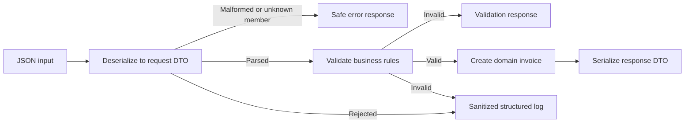

# 12 - Serialization And Structured Data

## Learning Goal

Accept JSON as untrusted input, deserialize it into a narrow request DTO, validate
its business rules, and serialize a deliberate response contract with
`System.Text.Json`. By the end, you should be able to tell the difference between
JSON that *parses* and data that is actually valid for your application.

## What JSON Parsing Does And Does Not Prove

JSON is a transport format, not a trusted domain model. Successful deserialization
only means the payload matches enough of the expected JSON shape to construct a
DTO. It does not prove that a customer name is meaningful, an invoice has line
items, an amount is positive, or a caller was authorized to create an invoice.

Keep the external and internal models separate:

- A **request DTO** describes only what a caller may send.
- Validation applies business rules to that DTO.
- A **domain model** represents data the application has accepted.
- A **response DTO** describes only what the application deliberately returns.

This prevents an incoming property from accidentally changing an internal field
just because the names happen to match.

```text
// Do not deserialize untrusted JSON directly into a persistence or domain entity.
var invoice = JsonSerializer.Deserialize<InvoiceEntity>(requestBody);
```

## Data Flow

The parser, validation step, and serializer each have a different job. The log
records only safe metadata about rejected input; it is not a copy of the payload.



## Portable Setup

The following .NET CLI commands have identical syntax in Windows PowerShell and
macOS Apple Silicon `zsh`. Use a supported .NET SDK that can target .NET 8 or
later; this lesson uses the strict unknown-member option introduced in .NET 8.

```shell
dotnet new console -n StructuredData
cd StructuredData
```

Replace `Program.cs` with the worked answer below, then run it:

```shell
dotnet run
```

The example has no native dependencies, paths, environment variables, or network
requests, so the same project commands work on both platforms.

## Choose A Contract Deliberately

`JsonSerializerOptions` are part of an API contract. Create and reuse a single
instance rather than recreating options for each request.

```csharp
using System.Text.Json;
using System.Text.Json.Serialization;

var jsonOptions = new JsonSerializerOptions
{
    PropertyNamingPolicy = JsonNamingPolicy.CamelCase,
    PropertyNameCaseInsensitive = false,
    UnmappedMemberHandling = JsonUnmappedMemberHandling.Disallow,
    WriteIndented = true
};
```

This example deliberately accepts only camel-case property names and rejects
unknown properties. That strict policy is useful when a client typo should not be
silently ignored. It is a product decision: a public API may instead choose to
ignore unknown fields for forward compatibility. Document and test whichever
policy you choose.

Nullability annotations help the compiler reason about your own code, but they do
not make untrusted JSON valid. A nullable `string?` or `List<T>?` can still be
missing or null after deserialization, so validate it explicitly.

## Dates, Amounts, And Contract Evolution

Use `DateTimeOffset` for a timestamp-like due date so the offset remains part of
the value. `System.Text.Json` uses ISO 8601 date-and-time text by default. Use
`decimal` for monetary amounts; routing money through `double` can introduce
binary floating-point rounding surprises.

The `PurchaseOrderNumber` property in the request DTO below is optional. Older
clients that omit it continue to work after the property is added. That is an
additive contract change. Renaming or removing a property is different: give
clients a migration period and version the contract deliberately rather than
expecting deserialization alone to solve API versioning.

## Complete Worked Answer

This complete console program processes three inputs:

- A valid older payload that omits the newer optional purchase-order field.
- Valid JSON that fails business validation.
- Malformed JSON.

It never writes the raw JSON, customer name, or stack trace to its log output.

```csharp
using System.Text.Json;
using System.Text.Json.Serialization;

var samples = new Dictionary<string, string>
{
    ["valid older payload"] = """
        {
          "customerName": "Northwind Traders",
          "dueAt": "2026-07-15T17:00:00+00:00",
          "lines": [
            { "description": "Consulting", "amount": 1250.00 },
            { "description": "Support", "amount": 150.00 }
          ]
        }
        """,
    ["business-invalid payload"] = """
        {
          "customerName": "",
          "dueAt": "2026-07-15T17:00:00+00:00",
          "lines": [{ "description": "Consulting", "amount": -1.00 }]
        }
        """,
    ["malformed payload"] = """
        { "customerName": "Northwind Traders", "lines": [ }
        """
};

foreach (var (label, json) in samples)
{
    Console.WriteLine($"--- {label} ---");
    InvoiceProcessor.Process(json);
}

internal static class InvoiceProcessor
{
    private static readonly JsonSerializerOptions JsonOptions = new()
    {
        PropertyNamingPolicy = JsonNamingPolicy.CamelCase,
        PropertyNameCaseInsensitive = false,
        UnmappedMemberHandling = JsonUnmappedMemberHandling.Disallow,
        WriteIndented = true
    };

    public static void Process(string json)
    {
        var traceId = Guid.NewGuid().ToString("N");
        CreateInvoiceRequest? request;

        try
        {
            request = JsonSerializer.Deserialize<CreateInvoiceRequest>(json, JsonOptions);
        }
        catch (JsonException)
        {
            Log("InvoiceJsonRejected", "MalformedJson", traceId);
            WriteProblem("malformed_json", "The JSON payload is not a valid invoice request.", traceId);
            return;
        }

        if (request is null)
        {
            Log("InvoiceJsonRejected", "EmptyDocument", traceId);
            WriteProblem("invalid_request", "The request must contain a JSON object.", traceId);
            return;
        }

        var errors = Validate(request);
        if (errors.Count > 0)
        {
            Log("InvoiceValidationRejected", errors.Keys.First(), traceId);
            Console.WriteLine(JsonSerializer.Serialize(new ValidationProblem(errors, traceId), JsonOptions));
            return;
        }

        var invoice = new Invoice(
            Guid.NewGuid(),
            request.CustomerName!.Trim(),
            request.DueAt!.Value,
            request.Lines!.Select(line => new InvoiceLine(line.Description!.Trim(), line.Amount!.Value)).ToList(),
            request.PurchaseOrderNumber?.Trim());

        var total = invoice.Lines.Sum(line => line.Amount);
        var response = new InvoiceSummary(
            invoice.Id,
            invoice.CustomerName,
            invoice.DueAt,
            total,
            invoice.PurchaseOrderNumber);

        Console.WriteLine(JsonSerializer.Serialize(response, JsonOptions));
    }

    private static Dictionary<string, string[]> Validate(CreateInvoiceRequest request)
    {
        var errors = new Dictionary<string, string[]>(StringComparer.Ordinal);

        if (string.IsNullOrWhiteSpace(request.CustomerName) || request.CustomerName.Length > 120)
        {
            errors["customerName"] = ["Customer name is required and must be 120 characters or fewer."];
        }

        if (request.DueAt is null)
        {
            errors["dueAt"] = ["Due date is required and must include an offset."];
        }

        if (request.Lines is null || request.Lines.Count is < 1 or > 25)
        {
            errors["lines"] = ["Provide between 1 and 25 invoice lines."];
        }
        else
        {
            for (var index = 0; index < request.Lines.Count; index++)
            {
                var line = request.Lines[index];
                if (string.IsNullOrWhiteSpace(line.Description) || line.Description.Length > 200)
                {
                    errors[$"lines[{index}].description"] = ["Description is required and must be 200 characters or fewer."];
                }

                if (line.Amount is null || line.Amount <= 0)
                {
                    errors[$"lines[{index}].amount"] = ["Amount must be a positive decimal value."];
                }
            }
        }

        if (request.PurchaseOrderNumber is { Length: > 40 })
        {
            errors["purchaseOrderNumber"] = ["Purchase order number must be 40 characters or fewer."];
        }

        return errors;
    }

    private static void WriteProblem(string category, string message, string traceId)
    {
        Console.WriteLine(JsonSerializer.Serialize(new SafeProblem(category, message, traceId), JsonOptions));
    }

    private static void Log(string eventName, string category, string traceId)
    {
        Console.Error.WriteLine(
            "Event={EventName} Category={Category} TraceId={TraceId}",
            eventName,
            category,
            traceId);
    }
}

internal sealed record CreateInvoiceRequest(
    string? CustomerName,
    DateTimeOffset? DueAt,
    List<InvoiceLineRequest>? Lines,
    string? PurchaseOrderNumber);

internal sealed record InvoiceLineRequest(string? Description, decimal? Amount);

internal sealed record Invoice(
    Guid Id,
    string CustomerName,
    DateTimeOffset DueAt,
    List<InvoiceLine> Lines,
    string? PurchaseOrderNumber);

internal sealed record InvoiceLine(string Description, decimal Amount);

internal sealed record InvoiceSummary(
    Guid InvoiceId,
    string CustomerName,
    DateTimeOffset DueAt,
    decimal Total,
    string? PurchaseOrderNumber);

internal sealed record ValidationProblem(Dictionary<string, string[]> Errors, string TraceId)
{
    public string Type => "validation_error";
}

internal sealed record SafeProblem(string Type, string Message, string TraceId);
```

Typical output includes a serialized invoice summary for the first sample, a
`validation_error` response for the second, and a `malformed_json` response for
the third. Each rejected request also produces a small diagnostic line on standard
error with an event name, category, and trace ID, but no raw payload.

## Handle Boundary Failures Safely

Malformed JSON and valid JSON that fails business validation are expected boundary
outcomes. Return a clear, safe error response and use a stable event name plus a
trace identifier for diagnostics. Do not include the raw request body, access
tokens, credentials, connection strings, or a stack trace in either logs or
client-facing messages.

Unexpected failures, such as a database outage after validation, are different.
At an application boundary, log safe context for those failures and return a
generic server error instead of exposing internal implementation details.

## Common Mistakes

- Treating successful deserialization as proof that input satisfies business rules.
- Binding a request directly to a domain or persistence entity.
- Recreating or mutating `JsonSerializerOptions` for every request.
- Letting unknown JSON properties pass silently without deciding that policy.
- Using `double` for monetary values or `DateTime` when an offset matters.
- Logging raw JSON, exception details, tokens, or customer data to diagnose an
  invalid request.
- Removing or renaming serialized properties without a documented migration plan.

## Exercise

Build a console program that accepts a `CreateInvoiceRequest` JSON document and
prints either an `InvoiceSummary` or a safe error response.

1. Use DTOs that are separate from the internal invoice record.
2. Reuse one `JsonSerializerOptions` instance with camel-case names, case-sensitive
   matching, and rejection of unknown members.
3. Validate a nonblank customer name, one to 25 lines, positive `decimal` amounts,
   and a required `DateTimeOffset` due date.
4. Catch `JsonException` at the parsing boundary and return a safe malformed-JSON
   response.
5. Log only an event name, error category, and trace ID for rejected input.
6. Add an optional `PurchaseOrderNumber` property, then demonstrate that an older
   payload without it still succeeds.

The worked answer above is one solution. Extend it by adding a new optional
response property without changing the existing property names, then add a sample
payload that uses the new property.

## Sources

- [System.Text.Json overview](https://learn.microsoft.com/en-us/dotnet/standard/serialization/system-text-json/overview)
- [How to serialize and deserialize JSON](https://learn.microsoft.com/en-us/dotnet/standard/serialization/system-text-json/how-to)
- [Customize JSON properties](https://learn.microsoft.com/en-us/dotnet/standard/serialization/system-text-json/customize-properties)
- [Handle unmapped members](https://learn.microsoft.com/en-us/dotnet/standard/serialization/system-text-json/handle-overflow)
- [Required properties and nullable reference types](https://learn.microsoft.com/en-us/dotnet/standard/serialization/system-text-json/required-properties)
- [Date and time support in System.Text.Json](https://learn.microsoft.com/en-us/dotnet/standard/datetime/system-text-json-support)
- [.NET logging](https://learn.microsoft.com/en-us/dotnet/core/extensions/logging)
- [Exception best practices](https://learn.microsoft.com/en-us/dotnet/standard/exceptions/best-practices-for-exceptions)
