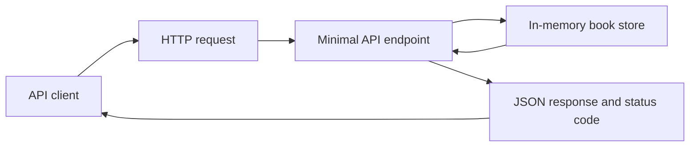

# 10 - Building APIs with ASP.NET Core

## Learning Goal

Build a small HTTP API with ASP.NET Core Minimal APIs, return useful HTTP status codes, exchange JSON request and response data, and test the API locally with `curl` or an `.http` file.

By the end of this lesson, you should be able to:

- Explain what an API endpoint is.
- Use `MapGet`, `MapPost`, `MapPut`, and `MapDelete` to handle common HTTP verbs.
- Write route templates such as `/books/{id}`.
- Bind Minimal API parameters from route values, query strings, JSON request bodies, and services.
- Use request and response DTOs with records or classes.
- Return `200 OK`, `201 Created`, `204 No Content`, `400 Bad Request`, and `404 Not Found`.
- Use `TypedResults` to make endpoint responses explicit.
- Validate request data in endpoint code and return `400` for invalid input.
- Run an ASP.NET Core API locally with `dotnet run`.
- Understand where Minimal APIs fit compared with controller-based APIs.
- Describe what ASP.NET Core's built-in OpenAPI support provides and what still requires a separate package.

## Why APIs Matter

A web API lets another program talk to your application over HTTP. A browser, mobile app, background job, test script, or another service can send a request such as:

```text
GET /books/1
```

The API chooses an endpoint to handle that request and sends back a response. For a JSON API, the response often contains:

- A status code that tells the caller what happened.
- A JSON body when the caller needs data.
- Headers such as `Location` when a new resource was created.



ASP.NET Core supports two main ways to build HTTP APIs:

- Minimal APIs, where endpoints are mapped directly in code with methods such as `MapGet`.
- Controller-based APIs, where controller classes derive from `ControllerBase` and actions handle requests.

This lesson uses Minimal APIs because they are a direct path for learning routing, binding, JSON, and status codes without adding controller structure first. Controllers are still useful in many codebases, especially when a team prefers attributes, controller conventions, or a larger MVC-style organization.

## Create A Minimal API Project

Use the empty ASP.NET Core template so the starting point is small. These `dotnet` and `cd` commands have the same syntax in Windows PowerShell and macOS `zsh` on Apple Silicon:

```shell
dotnet new web -o BookShelfApi
cd BookShelfApi
```

Replace `Program.cs` with this first version:

```csharp
var builder = WebApplication.CreateBuilder(args);
var app = builder.Build();

app.MapGet("/", () => "BookShelf API is running.");

app.Run();
```

Run the app:

```shell
dotnet run
```

The output shows the local address, often something like `http://localhost:5000` or `https://localhost:7000`. Use the address printed by your machine.

Test the first endpoint:

```powershell
curl.exe http://localhost:5000/
```

macOS `zsh`:

```bash
curl http://localhost:5000/
```

Expected response body:

```text
BookShelf API is running.
```

The endpoint is the combination of:

- HTTP verb: `GET`
- Route template: `/`
- Handler: `() => "BookShelf API is running."`

## HTTP Verbs And Routes

HTTP APIs usually use verbs to express what kind of operation the caller wants:

- `GET` reads data.
- `POST` creates data or starts a command.
- `PUT` replaces or updates data at a known route.
- `DELETE` removes data.

Minimal APIs map those verbs with methods on `WebApplication`:

```csharp
app.MapGet("/books", () => books);
app.MapPost("/books", (CreateBookRequest request) => CreateBook(request));
app.MapPut("/books/{id}/read", (int id) => MarkBookAsRead(id));
app.MapDelete("/books/{id}", (int id) => DeleteBook(id));
```

Routes can include literal segments and route parameters:

```text
/books
/books/{id}
/books/{id}/read
```

For `/books/{id}`, a request to `/books/42` binds `42` to the handler parameter named `id`.

Route constraints can help routing choose the right endpoint:

```csharp
app.MapGet("/books/{id:int}", (int id) => TypedResults.Ok(id));
```

Do not treat route constraints as your main validation strategy. A constraint such as `{id:int}` helps the route match integer IDs. Business validation still belongs in your endpoint or service code. For example, a missing title in a JSON body should return `400 Bad Request` with a clear message.

## JSON DTOs

A DTO, or data transfer object, describes the shape of data entering or leaving the API. Records are a concise fit for small immutable request and response shapes:

```csharp
public sealed record Book(int Id, string Title, string Author, bool IsRead);

public sealed record CreateBookRequest(string Title, string Author);
```

When a client sends this JSON body:

```json
{
  "title": "The Left Hand of Darkness",
  "author": "Ursula K. Le Guin"
}
```

ASP.NET Core can bind it to `CreateBookRequest`:

```csharp
app.MapPost("/books", (CreateBookRequest request) =>
{
    // request.Title and request.Author came from the JSON body.
});
```

Use separate request DTOs when the client should not set every property. In this API, the client sends `Title` and `Author`, but the server assigns `Id` and starts `IsRead` as `false`.

## Binding In Minimal APIs

Parameter binding is how ASP.NET Core fills handler parameters from the HTTP request or application services.

This endpoint shows common binding sources:

```csharp
app.MapGet("/books/{id:int}", (
    int id,
    bool? includeNotes,
    BookStore store) =>
{
    // id comes from the route.
    // includeNotes comes from the query string, such as ?includeNotes=true.
    // store comes from dependency injection.
});
```

Common Minimal API binding sources include:

- Route values, such as `id` from `/books/{id:int}`.
- Query strings, such as `unreadOnly` from `/books?unreadOnly=true`.
- JSON request bodies, such as `CreateBookRequest` in a `POST`.
- Services registered in dependency injection.

`GET`, `HEAD`, `OPTIONS`, and `DELETE` do not implicitly bind complex parameters from the request body. For beginner and intermediate APIs, keep bodies on `POST` and `PUT` unless you have a specific reason to do otherwise.

## A Small In-Memory Book API

This version keeps data in memory. That means the data resets when the app stops, but the API behavior is easy to see without a database or Entity Framework Core.

Replace `Program.cs` with this complete program:

```csharp
using System.Collections.Concurrent;
using Microsoft.AspNetCore.Http.HttpResults;

var builder = WebApplication.CreateBuilder(args);
var app = builder.Build();

ConcurrentDictionary<int, Book> books = new();
int nextId = 0;

app.MapGet("/", () => "BookShelf API is running.");

app.MapGet("/books", Ok<IEnumerable<Book>> (bool? unreadOnly) =>
{
    IEnumerable<Book> result = books.Values.OrderBy(book => book.Id);

    if (unreadOnly == true)
    {
        result = result.Where(book => !book.IsRead);
    }

    return TypedResults.Ok(result);
});

app.MapGet("/books/{id:int}", Results<Ok<Book>, NotFound> (int id) =>
{
    return books.TryGetValue(id, out Book? book)
        ? TypedResults.Ok(book)
        : TypedResults.NotFound();
});

app.MapPost("/books", Results<Created<Book>, BadRequest<string>> (CreateBookRequest request) =>
{
    if (string.IsNullOrWhiteSpace(request.Title))
    {
        return TypedResults.BadRequest("Title is required.");
    }

    if (string.IsNullOrWhiteSpace(request.Author))
    {
        return TypedResults.BadRequest("Author is required.");
    }

    int id = Interlocked.Increment(ref nextId);
    Book book = new(id, request.Title.Trim(), request.Author.Trim(), IsRead: false);
    books[id] = book;

    return TypedResults.Created($"/books/{book.Id}", book);
});

app.MapPut("/books/{id:int}/read", Results<NoContent, NotFound> (int id) =>
{
    if (!books.TryGetValue(id, out Book? book))
    {
        return TypedResults.NotFound();
    }

    books[id] = book with { IsRead = true };
    return TypedResults.NoContent();
});

app.MapDelete("/books/{id:int}", Results<NoContent, NotFound> (int id) =>
{
    return books.TryRemove(id, out _)
        ? TypedResults.NoContent()
        : TypedResults.NotFound();
});

app.Run();

public sealed record Book(int Id, string Title, string Author, bool IsRead);

public sealed record CreateBookRequest(string Title, string Author);
```

Run it:

```shell
dotnet run
```

Create a book:

Windows PowerShell:

```powershell
curl.exe -i -X POST http://localhost:5000/books `
  -H "Content-Type: application/json" `
  -d "{\"title\":\"Kindred\",\"author\":\"Octavia E. Butler\"}"
```

macOS `zsh`:

```bash
curl -i -X POST http://localhost:5000/books \
  -H 'Content-Type: application/json' \
  -d '{"title":"Kindred","author":"Octavia E. Butler"}'
```

Possible response:

```text
HTTP/1.1 201 Created
Location: /books/1
Content-Type: application/json; charset=utf-8

{"id":1,"title":"Kindred","author":"Octavia E. Butler","isRead":false}
```

Read all books:

Windows PowerShell:

```powershell
curl.exe http://localhost:5000/books
```

macOS `zsh`:

```bash
curl http://localhost:5000/books
```

Possible response:

```json
[
  {
    "id": 1,
    "title": "Kindred",
    "author": "Octavia E. Butler",
    "isRead": false
  }
]
```

Read one book:

Windows PowerShell:

```powershell
curl.exe -i http://localhost:5000/books/1
```

macOS `zsh`:

```bash
curl -i http://localhost:5000/books/1
```

Mark a book as read:

Windows PowerShell:

```powershell
curl.exe -i -X PUT http://localhost:5000/books/1/read
```

macOS `zsh`:

```bash
curl -i -X PUT http://localhost:5000/books/1/read
```

Expected status:

```text
HTTP/1.1 204 No Content
```

Delete a book:

Windows PowerShell:

```powershell
curl.exe -i -X DELETE http://localhost:5000/books/1
```

macOS `zsh`:

```bash
curl -i -X DELETE http://localhost:5000/books/1
```

Expected status:

```text
HTTP/1.1 204 No Content
```

Ask for a missing book:

Windows PowerShell:

```powershell
curl.exe -i http://localhost:5000/books/999
```

macOS `zsh`:

```bash
curl -i http://localhost:5000/books/999
```

Expected status:

```text
HTTP/1.1 404 Not Found
```

Send invalid input:

Windows PowerShell:

```powershell
curl.exe -i -X POST http://localhost:5000/books `
  -H "Content-Type: application/json" `
  -d "{\"title\":\"\",\"author\":\"Octavia E. Butler\"}"
```

macOS `zsh`:

```bash
curl -i -X POST http://localhost:5000/books \
  -H 'Content-Type: application/json' \
  -d '{"title":"","author":"Octavia E. Butler"}'
```

Expected status and body:

```text
HTTP/1.1 400 Bad Request

Title is required.
```

## Using An .http File

Many editors, including Visual Studio and Visual Studio Code with the REST Client extension, can send requests from an `.http` file.

Create `BookShelfApi.http` next to the project file:

```http
@host = http://localhost:5000

GET {{host}}/books

###

POST {{host}}/books
Content-Type: application/json

{
  "title": "Kindred",
  "author": "Octavia E. Butler"
}

###

GET {{host}}/books/1

###

PUT {{host}}/books/1/read

###

DELETE {{host}}/books/1
```

If your app prints a different local address, update the `@host` value.

## Status Codes And Typed Results

Status codes are part of the API contract. They let clients react correctly without parsing a custom message first.

Use these codes in small CRUD-style APIs:

- `200 OK`: the request succeeded and the response has data.
- `201 Created`: a new resource was created. Include a `Location` header when possible.
- `204 No Content`: the request succeeded and there is no response body.
- `400 Bad Request`: the request body or query value is invalid.
- `404 Not Found`: the requested resource does not exist.

`TypedResults` creates response objects with specific status codes:

```csharp
return TypedResults.Ok(book);
return TypedResults.Created($"/books/{book.Id}", book);
return TypedResults.NoContent();
return TypedResults.BadRequest("Title is required.");
return TypedResults.NotFound();
```

When an endpoint can return more than one response type, use `Results<T1, T2>` or another `Results<...>` union return type:

```csharp
app.MapGet("/books/{id:int}", Results<Ok<Book>, NotFound> (int id) =>
{
    return books.TryGetValue(id, out Book? book)
        ? TypedResults.Ok(book)
        : TypedResults.NotFound();
});
```

That explicit return type helps readers see the endpoint contract. It also gives ASP.NET Core better metadata for tools such as OpenAPI document generation.

## OpenAPI In ASP.NET Core

OpenAPI is a standard way to describe an HTTP API: paths, verbs, parameters, request bodies, response shapes, and status codes.

Starting with .NET 9, ASP.NET Core includes built-in OpenAPI document support through the `Microsoft.AspNetCore.OpenApi` package. If your project does not already reference that package, add it first:

```shell
dotnet add package Microsoft.AspNetCore.OpenApi
```

A typical setup adds OpenAPI services and maps the OpenAPI document endpoint in development:

```csharp
builder.Services.AddOpenApi();

var app = builder.Build();

if (app.Environment.IsDevelopment())
{
    app.MapOpenApi();
}
```

The generated document is usually available at:

```text
/openapi/v1.json
```

Interactive browser UIs such as Swagger UI or Scalar are not included by default in ASP.NET Core's built-in OpenAPI document support. Add and configure a separate package when your project needs an interactive UI.

For this lesson, OpenAPI is helpful but optional. Focus first on correct endpoints, request binding, validation, and status codes.

## Common Mistakes

- Returning `200 OK` for every outcome. Use `201`, `204`, `400`, and `404` when those statuses describe the result better.
- Returning a body with `204 No Content`. A `204` response means the server has no response body to send.
- Using route constraints as validation. `{id:int}` helps routing, but invalid JSON or missing required fields should be checked in code and return `400`.
- Letting clients choose server-owned fields such as `Id` when creating a resource.
- Forgetting the `Content-Type: application/json` header when sending JSON with `curl`.
- Binding a complex object from a `GET` body instead of using route values or query strings.
- Storing production data in an in-memory collection. In-memory storage is fine for this lesson, but real APIs usually need persistent storage.
- Assuming Swagger UI is automatically available. Built-in OpenAPI document generation and interactive API UIs are related but separate pieces.
- Ignoring the local URL printed by `dotnet run`. The port can vary by project, launch profile, and machine.

## Practical Exercise

Build `ReadingListApi`, an in-memory Minimal API for books you plan to read.

Requirements:

1. Create an ASP.NET Core empty web project with `dotnet new web -o ReadingListApi`.
2. Define a `Book` DTO with `Id`, `Title`, `Author`, and `IsRead`.
3. Define a request DTO for creating a book. The client should send `Title` and `Author`, not `Id`.
4. Store books in memory.
5. Add `GET /books` to return all books with `200 OK`.
6. Add `GET /books/{id}` to return one book with `200 OK` or `404 Not Found`.
7. Add `POST /books` to create a book with `201 Created`.
8. Return `400 Bad Request` from `POST /books` when `Title` or `Author` is blank.
9. Add `PUT /books/{id}/read` to mark a book as read and return `204 No Content` or `404 Not Found`.
10. Add `DELETE /books/{id}` to remove a book and return `204 No Content` or `404 Not Found`.
11. Run the API with `dotnet run`.
12. Test the endpoints with `curl` or an `.http` file.

Sample create request:

```http
POST http://localhost:5000/books
Content-Type: application/json

{
  "title": "A Psalm for the Wild-Built",
  "author": "Becky Chambers"
}
```

Expected successful create response:

```text
201 Created
Location: /books/1
```

Expected JSON body:

```json
{
  "id": 1,
  "title": "A Psalm for the Wild-Built",
  "author": "Becky Chambers",
  "isRead": false
}
```

Expected missing-resource response:

```text
404 Not Found
```

Expected successful update or delete response:

```text
204 No Content
```

## Worked Answer

Create and enter the project. These commands have the same syntax in Windows PowerShell and macOS `zsh` on Apple Silicon:

```shell
dotnet new web -o ReadingListApi
cd ReadingListApi
```

Replace `Program.cs` with this complete program:

```csharp
using System.Collections.Concurrent;
using Microsoft.AspNetCore.Http.HttpResults;

var builder = WebApplication.CreateBuilder(args);
var app = builder.Build();

ConcurrentDictionary<int, Book> books = new();
int nextId = 0;

app.MapGet("/books", Ok<IEnumerable<Book>> () =>
{
    IEnumerable<Book> result = books.Values.OrderBy(book => book.Id);
    return TypedResults.Ok(result);
});

app.MapGet("/books/{id:int}", Results<Ok<Book>, NotFound> (int id) =>
{
    return books.TryGetValue(id, out Book? book)
        ? TypedResults.Ok(book)
        : TypedResults.NotFound();
});

app.MapPost("/books", Results<Created<Book>, BadRequest<string>> (CreateBookRequest request) =>
{
    if (string.IsNullOrWhiteSpace(request.Title))
    {
        return TypedResults.BadRequest("Title is required.");
    }

    if (string.IsNullOrWhiteSpace(request.Author))
    {
        return TypedResults.BadRequest("Author is required.");
    }

    int id = Interlocked.Increment(ref nextId);
    Book book = new(id, request.Title.Trim(), request.Author.Trim(), IsRead: false);
    books[id] = book;

    return TypedResults.Created($"/books/{book.Id}", book);
});

app.MapPut("/books/{id:int}/read", Results<NoContent, NotFound> (int id) =>
{
    if (!books.TryGetValue(id, out Book? book))
    {
        return TypedResults.NotFound();
    }

    books[id] = book with { IsRead = true };
    return TypedResults.NoContent();
});

app.MapDelete("/books/{id:int}", Results<NoContent, NotFound> (int id) =>
{
    return books.TryRemove(id, out _)
        ? TypedResults.NoContent()
        : TypedResults.NotFound();
});

app.Run();

public sealed record Book(int Id, string Title, string Author, bool IsRead);

public sealed record CreateBookRequest(string Title, string Author);
```

Run the API:

```shell
dotnet run
```

Use the local address printed by `dotnet run`. The following examples use `http://localhost:5000`.

Create a book:

Windows PowerShell:

```powershell
curl.exe -i -X POST http://localhost:5000/books `
  -H "Content-Type: application/json" `
  -d "{\"title\":\"A Psalm for the Wild-Built\",\"author\":\"Becky Chambers\"}"
```

macOS `zsh`:

```bash
curl -i -X POST http://localhost:5000/books \
  -H 'Content-Type: application/json' \
  -d '{"title":"A Psalm for the Wild-Built","author":"Becky Chambers"}'
```

Possible response:

```text
HTTP/1.1 201 Created
Location: /books/1
Content-Type: application/json; charset=utf-8

{"id":1,"title":"A Psalm for the Wild-Built","author":"Becky Chambers","isRead":false}
```

List books:

Windows PowerShell:

```powershell
curl.exe -i http://localhost:5000/books
```

macOS `zsh`:

```bash
curl -i http://localhost:5000/books
```

Possible response:

```text
HTTP/1.1 200 OK
Content-Type: application/json; charset=utf-8

[{"id":1,"title":"A Psalm for the Wild-Built","author":"Becky Chambers","isRead":false}]
```

Get one book:

Windows PowerShell:

```powershell
curl.exe -i http://localhost:5000/books/1
```

macOS `zsh`:

```bash
curl -i http://localhost:5000/books/1
```

Possible response:

```text
HTTP/1.1 200 OK
Content-Type: application/json; charset=utf-8

{"id":1,"title":"A Psalm for the Wild-Built","author":"Becky Chambers","isRead":false}
```

Mark it as read:

Windows PowerShell:

```powershell
curl.exe -i -X PUT http://localhost:5000/books/1/read
```

macOS `zsh`:

```bash
curl -i -X PUT http://localhost:5000/books/1/read
```

Expected response:

```text
HTTP/1.1 204 No Content
```

Delete it:

Windows PowerShell:

```powershell
curl.exe -i -X DELETE http://localhost:5000/books/1
```

macOS `zsh`:

```bash
curl -i -X DELETE http://localhost:5000/books/1
```

Expected response:

```text
HTTP/1.1 204 No Content
```

Try to get the deleted book:

Windows PowerShell:

```powershell
curl.exe -i http://localhost:5000/books/1
```

macOS `zsh`:

```bash
curl -i http://localhost:5000/books/1
```

Expected response:

```text
HTTP/1.1 404 Not Found
```

Try invalid input:

Windows PowerShell:

```powershell
curl.exe -i -X POST http://localhost:5000/books `
  -H "Content-Type: application/json" `
  -d "{\"title\":\"\",\"author\":\"Becky Chambers\"}"
```

macOS `zsh`:

```bash
curl -i -X POST http://localhost:5000/books \
  -H 'Content-Type: application/json' \
  -d '{"title":"","author":"Becky Chambers"}'
```

Expected response:

```text
HTTP/1.1 400 Bad Request

Title is required.
```

Teaching notes:

- `ConcurrentDictionary<int, Book>` stores the in-memory books for this lesson. It is not a database.
- `Interlocked.Increment` gives each new book a simple unique ID while the app is running.
- `GET /books` returns `Ok<IEnumerable<Book>>`, so successful list requests return `200 OK` and JSON.
- `GET /books/{id:int}` binds `id` from the route and returns either `Ok<Book>` or `NotFound`.
- `POST /books` binds `CreateBookRequest` from the JSON body, validates the fields, and returns `BadRequest<string>` for invalid input.
- `Created($"/books/{book.Id}", book)` returns `201 Created`, a `Location` header, and the created book as JSON.
- `PUT /books/{id:int}/read` updates server state and returns `204 No Content` when the book exists.
- `DELETE /books/{id:int}` returns `204 No Content` after removing a book and `404 Not Found` when there is nothing to remove.
- Stopping and restarting the app clears the in-memory collection.

## Sources

- Microsoft Learn: [APIs overview](https://learn.microsoft.com/en-us/aspnet/core/fundamentals/apis)
- Microsoft Learn: [Tutorial: Create a Minimal API with ASP.NET Core](https://learn.microsoft.com/en-us/aspnet/core/tutorials/min-web-api)
- Microsoft Learn: [Minimal APIs quick reference](https://learn.microsoft.com/en-us/aspnet/core/fundamentals/minimal-apis)
- Microsoft Learn: [Route handlers in Minimal API apps](https://learn.microsoft.com/en-us/aspnet/core/fundamentals/minimal-apis/route-handlers)
- Microsoft Learn: [Parameter binding in Minimal API applications](https://learn.microsoft.com/en-us/aspnet/core/fundamentals/minimal-apis/parameter-binding)
- Microsoft Learn: [Create responses in Minimal API applications](https://learn.microsoft.com/en-us/aspnet/core/fundamentals/minimal-apis/responses)
- Microsoft Learn: [Generate OpenAPI documents](https://learn.microsoft.com/en-us/aspnet/core/fundamentals/openapi/aspnetcore-openapi)
- Microsoft Learn: [Overview of OpenAPI support in ASP.NET Core API apps](https://learn.microsoft.com/en-us/aspnet/core/fundamentals/openapi/overview)
- Microsoft Learn: [Create web APIs with ASP.NET Core](https://learn.microsoft.com/en-us/aspnet/core/web-api)
