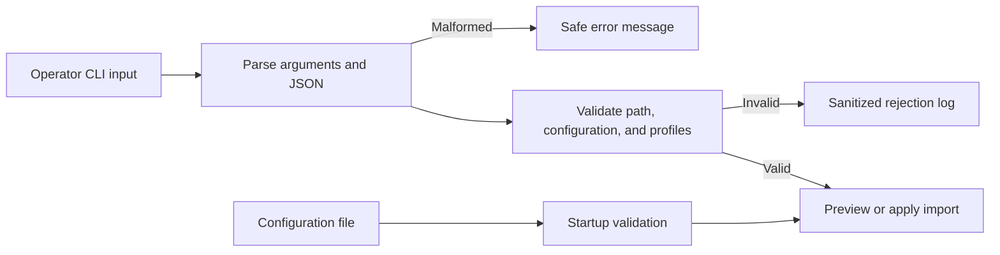

# 11 - Defensive Input Validation

## Learning Goal

Build a small Python CLI that treats command-line arguments, files, JSON, and configuration as untrusted boundaries. You will parse each input, validate the rules that make it acceptable for this program, and return safe errors without logging the rejected profile data.

The worked answer uses only the Python standard library, so it runs on Windows PowerShell and macOS Apple Silicon (`arm64`) with `zsh` once Python is installed.

## One Scenario, Four Boundaries

Imagine a profile-import tool. An operator chooses a JSON file and either previews or applies the import. The tool must decide whether it can safely use:

- The CLI arguments, such as `--mode` and `--file`.
- The selected file path and its bytes.
- The JSON profile data inside the file.
- A local configuration file that sets the maximum number of profiles.

These related words mean different things:

| Step | Question it answers | Example |
| --- | --- | --- |
| Parsing | Can this input be interpreted? | Is the file valid JSON? |
| Validation | Is this value allowed for this operation? | Is a profile age between 13 and 120? |
| Authorization | May this caller perform the action? | May this signed-in operator apply an import? |
| Exception handling | Did an unexpected operation fail? | Did the disk fail while the application was reading a valid file? |

Validating a `role` field does not establish who sent the request or what they are allowed to do. Authorization needs an identity and a policy; it is a separate concern.



The log branch carries only stable metadata such as the boundary and failed rule. It never receives the full profile, the file contents, or a secret.

## Validate at Each Boundary

### 1. Parse CLI arguments, then validate their meaning

`argparse` converts command-line text into Python values and can constrain simple choices. It cannot know every business rule. For example, the tool still needs to verify that the selected file is inside the application-owned import directory.

```python
parser.add_argument("--mode", choices=("preview", "apply"), default="preview")
parser.add_argument("--file", required=True, help="JSON file below data/imports")
```

An unknown mode is an expected invalid-input result. Do not raise an exception merely to represent it.

### 2. Contain file paths and limit file reads

A client-provided path can include `..` segments or point at another part of the machine. Resolve both the application-owned root and the candidate, then use the path-aware `relative_to()` check. A string-prefix check is not safe: `data/imports-old` starts with `data/imports` but is not inside it.

```python
from pathlib import Path

root = Path("data/imports").resolve()
candidate = (root / user_file_name).resolve()

try:
    candidate.relative_to(root)
except ValueError:
    raise ValidationError("file must be inside data/imports")
```

Check the suffix and size before reading, then specify `encoding="utf-8"`. The application should still treat a successfully read file as untrusted data.

### 3. Parse JSON, then validate a narrow profile shape

`json.loads()` can establish JSON syntax, but it does not prove that a document has the fields, ranges, or allowed values your application needs. The worked answer accepts exactly `name`, `age`, and `role`, then maps validated data to a `Profile` dataclass.

```python
raw_profile = {"name": "Ari", "age": 29, "role": "member"}

if not isinstance(raw_profile["age"], int) or isinstance(raw_profile["age"], bool):
    raise ValidationError("age must be an integer")
if not 13 <= raw_profile["age"] <= 120:
    raise ValidationError("age must be between 13 and 120")
```

Expected malformed JSON and invalid fields should result in a safe user-facing message. Unexpected I/O errors, such as a failing drive while reading the file, remain exceptions that the program can report generically and log safely.

### 4. Validate configuration at startup

Configuration is input too. The example reads `data/profile_import_config.json` before processing a profile file and requires a positive integer `max_imports`. Failing early tells an operator that the deployment is invalid before any import is attempted.

Configuration loaded from environment variables needs shell-specific syntax. This lesson deliberately uses a project-relative JSON configuration file, so no environment-variable setup is required.

## Run the Worked Answer

Create a folder with the following structure. The program creates the `data/imports` directory if it does not already exist.

```text
profile-import/
  profile_import.py
  data/
    profile_import_config.json
    imports/
      profiles.json
```

Use the same file contents on both platforms.

`data/profile_import_config.json`:

```json
{"max_imports": 25}
```

`data/imports/profiles.json`:

```json
[
  {"name": "Ari Chen", "age": 29, "role": "member"},
  {"name": "Morgan Patel", "age": 41, "role": "admin"}
]
```

On Windows PowerShell:

```powershell
py profile_import.py --file profiles.json --mode preview
```

On macOS Apple Silicon with `zsh`:

```bash
python3 profile_import.py --file profiles.json --mode preview
```

Expected output:

```text
Preview accepted 2 profile(s).
```

The `--file` value is intentionally a file name relative to `data/imports`, not an arbitrary path. For example, `--file ../profile_import_config.json` is rejected before the file is read.

## Complete Worked Answer

Save this as `profile_import.py` at the project root.

```python
from __future__ import annotations

import argparse
import json
import logging
import sys
from dataclasses import dataclass
from pathlib import Path
from typing import Any

MAX_FILE_BYTES = 128 * 1024
ALLOWED_ROLES = {"member", "admin", "viewer"}
PROFILE_FIELDS = {"name", "age", "role"}

PROJECT_ROOT = Path(__file__).resolve().parent
IMPORT_ROOT = PROJECT_ROOT / "data" / "imports"
CONFIG_PATH = PROJECT_ROOT / "data" / "profile_import_config.json"

logger = logging.getLogger("profile_import")


class ValidationError(ValueError):
    """Represents expected invalid external input with safe diagnostic metadata."""

    def __init__(self, message: str, *, boundary: str, rule: str) -> None:
        super().__init__(message)
        self.boundary = boundary
        self.rule = rule


@dataclass(frozen=True)
class ImportConfig:
    max_imports: int


@dataclass(frozen=True)
class Profile:
    name: str
    age: int
    role: str


def configure_logging() -> None:
    logging.basicConfig(level=logging.INFO, format="%(levelname)s %(message)s")


def log_rejection(boundary: str, rule: str) -> None:
    # Do not add the rejected file path, profile, JSON, or configuration values here.
    logger.warning("input_rejected boundary=%s rule=%s", boundary, rule)


def parse_args() -> argparse.Namespace:
    parser = argparse.ArgumentParser(description="Safely preview or apply a profile import.")
    parser.add_argument("--file", required=True, help="JSON file name below data/imports")
    parser.add_argument("--mode", choices=("preview", "apply"), default="preview")
    return parser.parse_args()


def load_config() -> ImportConfig:
    try:
        text = CONFIG_PATH.read_text(encoding="utf-8")
        data = json.loads(text)
    except FileNotFoundError as error:
        raise ValidationError(
            "configuration file is missing", boundary="configuration", rule="missing_file"
        ) from error
    except json.JSONDecodeError as error:
        raise ValidationError(
            "configuration file is not valid JSON", boundary="configuration", rule="malformed_json"
        ) from error
    except OSError as error:
        raise RuntimeError("could not read configuration") from error

    if not isinstance(data, dict) or set(data) != {"max_imports"}:
        raise ValidationError(
            "configuration must contain only max_imports",
            boundary="configuration",
            rule="unexpected_fields",
        )

    max_imports = data["max_imports"]
    if not isinstance(max_imports, int) or isinstance(max_imports, bool) or max_imports < 1:
        raise ValidationError(
            "configuration max_imports must be a positive integer",
            boundary="configuration",
            rule="invalid_max_imports",
        )

    return ImportConfig(max_imports=max_imports)


def resolve_import_file(file_name: str) -> Path:
    if not file_name.endswith(".json"):
        raise ValidationError(
            "import file must use the .json extension", boundary="file", rule="extension"
        )

    root = IMPORT_ROOT.resolve()
    candidate = (root / file_name).resolve()
    try:
        candidate.relative_to(root)
    except ValueError as error:
        raise ValidationError(
            "import file must be below data/imports", boundary="file", rule="path_containment"
        ) from error

    try:
        if candidate.stat().st_size > MAX_FILE_BYTES:
            raise ValidationError(
                "import file exceeds the size limit", boundary="file", rule="size_limit"
            )
    except FileNotFoundError as error:
        raise ValidationError(
            "import file does not exist", boundary="file", rule="missing_file"
        ) from error
    except OSError as error:
        raise RuntimeError("could not inspect import file") from error

    return candidate


def validate_profile(value: Any) -> Profile:
    if not isinstance(value, dict) or set(value) != PROFILE_FIELDS:
        raise ValidationError(
            "each profile must contain only name, age, and role",
            boundary="profile",
            rule="unexpected_fields",
        )

    name = value["name"]
    age = value["age"]
    role = value["role"]

    if not isinstance(name, str) or not 1 <= len(name.strip()) <= 80:
        raise ValidationError(
            "name must contain 1 to 80 non-whitespace characters", boundary="profile", rule="name"
        )
    if not isinstance(age, int) or isinstance(age, bool) or not 13 <= age <= 120:
        raise ValidationError(
            "age must be an integer from 13 to 120", boundary="profile", rule="age"
        )
    if not isinstance(role, str) or role not in ALLOWED_ROLES:
        raise ValidationError(
            "role must be member, admin, or viewer", boundary="profile", rule="role"
        )

    return Profile(name=name.strip(), age=age, role=role)


def load_profiles(path: Path, config: ImportConfig) -> list[Profile]:
    try:
        raw = path.read_text(encoding="utf-8")
    except UnicodeDecodeError as error:
        raise ValidationError(
            "import file must be UTF-8 text", boundary="file", rule="utf8_encoding"
        ) from error
    except OSError as error:
        raise RuntimeError("could not read import file") from error

    try:
        data = json.loads(raw)
    except json.JSONDecodeError as error:
        raise ValidationError(
            "import file is not valid JSON", boundary="json", rule="malformed_json"
        ) from error

    if not isinstance(data, list) or not data:
        raise ValidationError(
            "import must be a non-empty JSON array", boundary="json", rule="non_empty_array"
        )
    if len(data) > config.max_imports:
        raise ValidationError(
            "import exceeds configured maximum", boundary="profile", rule="max_imports"
        )

    return [validate_profile(item) for item in data]


def run(mode: str, profiles: list[Profile]) -> None:
    # This sample has no identity system. A real apply operation must authorize the caller here.
    if mode == "preview":
        print(f"Preview accepted {len(profiles)} profile(s).")
        return

    print(f"Apply accepted {len(profiles)} profile(s).")


def main() -> int:
    configure_logging()
    IMPORT_ROOT.mkdir(parents=True, exist_ok=True)
    args = parse_args()

    try:
        config = load_config()
        import_path = resolve_import_file(args.file)
        profiles = load_profiles(import_path, config)
    except ValidationError as error:
        log_rejection(error.boundary, error.rule)
        print(f"Input rejected: {error}", file=sys.stderr)
        return 2
    except RuntimeError:
        logger.exception("profile_import_failed category=io")
        print("Import could not be completed. Contact an operator if the problem continues.", file=sys.stderr)
        return 1

    run(args.mode, profiles)
    return 0


if __name__ == "__main__":
    raise SystemExit(main())
```

The program logs only a stable event name, boundary, and category for rejected input. It does not interpolate untrusted values into the log message, and it does not print internal paths or tracebacks to the user.

Try these expected failure cases:

| Input | Result |
| --- | --- |
| A malformed JSON file | `Input rejected: import file is not valid JSON` and exit code `2`. |
| A profile with `"age": 9` | `Input rejected: age must be an integer from 13 to 120` and exit code `2`. |
| `--file ../profile_import_config.json` | `Input rejected: import file must be below data/imports` and exit code `2`. |

## API Validation Is the Same Boundary Idea

An HTTP API should deserialize into a narrow request model, validate the model and business rules, and return a safe `400`-class response for expected bad input. Frameworks such as FastAPI and Pydantic can help declare request shapes, but their validation is not authorization and it does not make file paths, permissions, or downstream dependencies safe by itself.

Keep unexpected failures in centralized error handling. Return a generic server error to clients and use structured logs with safe metadata so operators can investigate without copying request bodies, passwords, tokens, connection strings, or uploaded contents into logs.

## Common Mistakes

- Treating successful `json.loads()` as proof that the values meet business rules.
- Checking a resolved path with `str(candidate).startswith(str(root))` instead of a path-aware containment check.
- Trusting file names, file extensions, or client-provided roles as authorization evidence.
- Reading unlimited file content before checking its size.
- Logging the raw JSON, rejected profile, token, or full internal path to diagnose an input error.
- Catching `Exception` broadly and turning every programming or I/O failure into a validation message.
- Deserializing directly into a privileged domain object whose fields clients should not control.

## Exercise

Extend the tool so an operator can supply an optional `--max-file-bytes` value.

1. Parse it as an integer and allow only values from `1_024` through `1_048_576`.
2. Use the validated value instead of `MAX_FILE_BYTES` when inspecting the selected import file.
3. Keep an omitted option using the existing default.
4. For an invalid value, print a safe message and exit with code `2` without reading the import file.
5. Log the rejection as safe metadata only; do not log the operator-provided value.

## Worked Answer For the Exercise

Change `parse_args()` to validate the range while parsing:

```python
def file_size_limit(value: str) -> int:
    try:
        limit = int(value)
    except ValueError as error:
        raise argparse.ArgumentTypeError("max file bytes must be an integer") from error

    if not 1_024 <= limit <= 1_048_576:
        raise argparse.ArgumentTypeError("max file bytes must be from 1024 to 1048576")
    return limit


def parse_args() -> argparse.Namespace:
    parser = argparse.ArgumentParser(description="Safely preview or apply a profile import.")
    parser.add_argument("--file", required=True, help="JSON file name below data/imports")
    parser.add_argument("--mode", choices=("preview", "apply"), default="preview")
    parser.add_argument("--max-file-bytes", type=file_size_limit, default=MAX_FILE_BYTES)
    return parser.parse_args()
```

Then change `resolve_import_file` to accept `max_file_bytes: int`, compare the file size to that argument, and call it as `resolve_import_file(args.file, args.max_file_bytes)`. `argparse` prints a safe usage error and exits with code `2` before the tool opens the input file.

## Sources

- [Python argparse](https://docs.python.org/3/library/argparse.html)
- [Python pathlib](https://docs.python.org/3/library/pathlib.html)
- [Python json](https://docs.python.org/3/library/json.html)
- [Python logging](https://docs.python.org/3/library/logging.html)
- [Python dataclasses](https://docs.python.org/3/library/dataclasses.html)
- [Python security considerations](https://docs.python.org/3/library/security_warnings.html)
- [FastAPI request-body validation](https://fastapi.tiangolo.com/tutorial/body/)
- [Pydantic models](https://docs.pydantic.dev/latest/concepts/models/)
