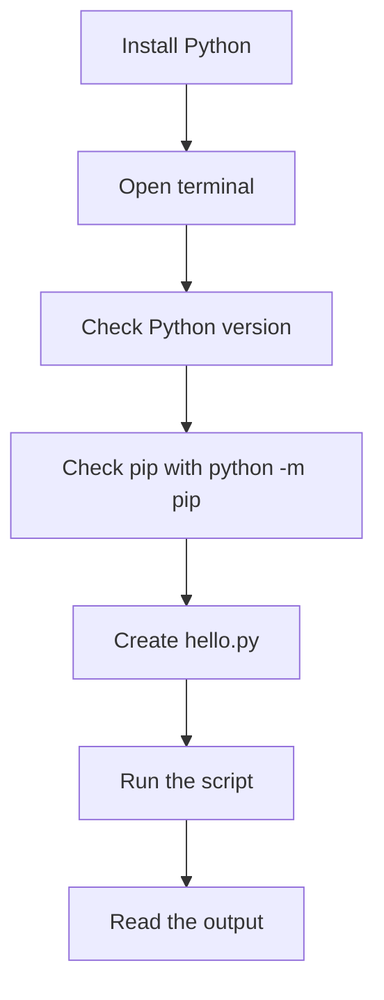

# 01 - Setup and Install

## Learning Goal

Install Python, confirm your terminal can run it, verify `pip` without installing third-party packages, and create and run your first Python script.

## Why It Matters

Every later Python lesson assumes your computer can run Python from a terminal. This lesson is about building that confidence before adding package managers, virtual environments, editors, or larger projects. If you can check the Python version, check `pip`, run a script, and read the output, you have the foundation needed for the rest of the beginner path.

## Setup Flow



## Install Python

On Windows, install Python from the Python downloads page or the Microsoft Store. The current beginner-friendly path in the official documentation is the Python Install Manager, which makes the global `python` command available from PowerShell after installation.

On macOS, use the official macOS installer from python.org as the primary beginner path. Current python.org macOS installers are `universal2` installers for supported Apple Silicon and Intel Macs, so the same installer family is intended for modern `arm64` and Intel systems. Homebrew is also a valid option if you already use Homebrew, but this course assumes the official installer because it is the simplest shared path for beginners.

After installing, close and reopen your terminal so it can see any command changes made by the installer.

## Check Python and pip

Open PowerShell on Windows or Terminal with `zsh` on macOS.

Windows PowerShell:

```powershell
python --version
python -m pip --version
```

macOS zsh:

```bash
python3 --version
python3 -m pip --version
```

The Python command should print a version such as `Python 3.14.6`. Your exact version may be different.

The `pip` command should print a line that includes a `pip` version and the Python installation it belongs to. In this lesson, do not install any packages yet. The goal is only to confirm that `pip` is connected to your Python installation.

Using `python -m pip` or `python3 -m pip` matters because it asks that specific Python interpreter to run its own copy of `pip`. That avoids confusion later if more than one Python version is installed.

## Create Your First Script

Create a folder for this course if you do not already have one:

Windows PowerShell:

```powershell
mkdir python-basics
cd python-basics
```

macOS zsh:

```bash
mkdir python-basics
cd python-basics
```

Use your editor to create a file named `hello.py` inside that folder. Avoid shell redirection for this first file; an editor makes it easier to see and fix small typing mistakes.

Put this code in `hello.py`:

```python
import platform
import sys

print("Hello, Python!")
print("Python version:", sys.version.split()[0])
print("Machine:", platform.machine())
```

Run the script from the folder that contains `hello.py`.

Windows PowerShell:

```powershell
python hello.py
```

macOS zsh:

```bash
python3 hello.py
```

Expected output shape:

```text
Hello, Python!
Python version: 3.14.6
Machine: AMD64
```

Your Python version may differ. Your machine value may also differ, such as `arm64` on many Apple Silicon Macs or `AMD64` on many Windows PCs.

## What the Script Does

The `import platform` line loads Python's platform module, which can report information about the computer running the program.

The `import sys` line loads Python's system module, which includes information about the current Python interpreter.

`sys.version.split()[0]` takes the full Python version text and keeps the first part, which is the version number. `platform.machine()` reports the processor architecture string that Python sees. Printing both values helps you confirm not only that Python runs, but also which runtime your terminal is using.

## Common Mistakes

- Running `python3` on Windows when this course's Windows instructions use `python`.
- Running `python` on macOS and getting an old or missing command instead of Python 3. Use `python3` on macOS for these lessons.
- Checking `pip --version` by itself and not knowing which Python installation it belongs to. Use `python -m pip --version` on Windows or `python3 -m pip --version` on macOS.
- Creating `hello.py` in one folder and running the command from another folder. Run `python hello.py` or `python3 hello.py` from the folder that contains the file.
- Naming the file `hello.py.txt` by accident. The filename should end with `.py`.
- Expecting the machine value to match someone else's output exactly. Values such as `arm64` and `AMD64` depend on the computer and Python build.

## Troubleshooting

If Windows PowerShell says `python` is not recognized, close and reopen PowerShell first. If it still fails, check that Python was installed from the Python downloads page or Microsoft Store. You can also run this diagnostic command to see installed runtimes known to the Python Install Manager:

```powershell
py list
```

Use `py list` for listing or selecting installed runtimes, especially later if you work with multiple Python versions. For normal beginner commands in this course, use `python` on Windows.

If macOS says `python3` is not found, close and reopen Terminal first. If it still fails, rerun the official python.org installer and then open a new terminal. As a diagnostic only, you may check whether the installer placed Python at a common location:

```bash
/usr/local/bin/python3 --version
```

Do not worry about virtual environment activation yet. Virtual environments are important for real projects, and Python's documentation recommends them for project isolation, but this first lesson only needs a working interpreter, working `pip` check, and one script.

## Practice

1. Install Python for your operating system.
2. Run the Python version command for your platform and record the output.
3. Run the `pip` version command for your platform and record the output.
4. Create `python-basics/hello.py` with the script from this lesson.
5. Run the script and record its output.
6. In two or three sentences, explain what each output line tells you.

## Worked Answer

Your recorded commands should look like one of these platform pairs.

Windows PowerShell:

```powershell
python --version
python -m pip --version
python hello.py
```

macOS zsh:

```bash
python3 --version
python3 -m pip --version
python3 hello.py
```

Your `hello.py` file should contain:

```python
import platform
import sys

print("Hello, Python!")
print("Python version:", sys.version.split()[0])
print("Machine:", platform.machine())
```

A complete answer might say:

```text
Python version command:
Python 3.14.6

pip version command:
pip X.Y from ... (python 3.14)

Script output:
Hello, Python!
Python version: 3.14.6
Machine: arm64
```

The exact version line is allowed to vary because Python releases change over time and different machines may have different supported versions installed. The `pip` output should show that `pip` is attached to the same Python family you just checked. The script output confirms that Python can run a file, read interpreter information from `sys`, and read machine information from `platform`; the machine value may be `arm64`, `AMD64`, or another architecture string.

## Sources Used

- [Using Python on Windows](https://docs.python.org/3/using/windows.html)
- [Using Python on macOS](https://docs.python.org/3/using/mac.html)
- [Using the Python Interpreter](https://docs.python.org/3/tutorial/interpreter.html)
- [venv - Creation of virtual environments](https://docs.python.org/3/library/venv.html)
- [Tool recommendations - Python Packaging User Guide](https://packaging.python.org/en/latest/guides/tool-recommendations/)
- [Python Releases for macOS](https://www.python.org/downloads/macos/)
- [Python Releases for Windows](https://www.python.org/downloads/windows/)
