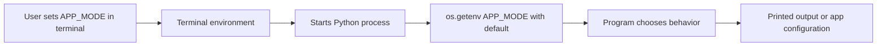

# 01 - Foundations

## Learning Goal

Understand what environment variables are, how a terminal passes them to a program, and how Python reads them for configuration.

## What Is an Environment Variable?

An environment variable is a name/value pair available in a process environment. The name identifies the setting, and the value is text. Environment variable values are strings, even when they look like numbers, booleans, URLs, or file paths.

Common examples include:

- `PATH`: locations the shell searches for programs.
- `HOME`: a user's home folder on macOS and many Unix-like systems.
- `USERPROFILE`: a user's profile folder on Windows.
- `APP_MODE`: a custom application mode, such as `development` or `production`.
- `API_BASE_URL`: a custom URL that tells an app which service to call.

Environment variables are useful because they configure behavior without changing source code. The same Python file can run in development mode on your laptop and production mode in another environment by reading a different variable value.

## Core Flow

The usual flow is:

1. The user sets an environment variable in a shell.
2. The user starts a program from that shell.
3. The program inherits the shell's environment.
4. Python reads the variable with `os.getenv()` or `os.environ`.
5. The program changes behavior based on the value.



## First Example

Create a file named `env_demo.py` in the current project folder:

```python
import os

app_mode = os.getenv("APP_MODE", "development")
print(f"App mode: {app_mode}")
```

This program has one input: the `APP_MODE` environment variable. The call `os.getenv("APP_MODE", "development")` asks Python to read `APP_MODE` from the process environment. If `APP_MODE` is missing, Python uses the fallback value `"development"`. The final line prints the value the program will use.

## Run It

PowerShell:

```powershell
$env:APP_MODE = "production"
python .\env_demo.py
```

macOS Terminal with `zsh`:

```zsh
export APP_MODE=production
python3 ./env_demo.py
```

In `zsh`, you can also set a variable for one command only:

```zsh
APP_MODE=production python3 ./env_demo.py
```

Expected output:

```text
App mode: production
```

The one-command `NAME=value command` syntax is POSIX shell syntax. It is not PowerShell syntax. In PowerShell, use `$env:APP_MODE = "production"` before running the Python command.

Optional cleanup after the example:

PowerShell:

```powershell
$env:APP_MODE = $null
```

macOS Terminal with `zsh`:

```zsh
unset APP_MODE
```

## Missing Variables

Run the same script without setting `APP_MODE`, or after clearing it with the cleanup command above.

PowerShell:

```powershell
python .\env_demo.py
```

macOS Terminal with `zsh`:

```zsh
python3 ./env_demo.py
```

Expected output:

```text
App mode: development
```

The output is `development` because the script supplied a default value to `os.getenv()`.

Sometimes a variable is required and the program should fail if it is missing. Use `os.environ["NAME"]` for that pattern:

```python
import os

api_key = os.environ["DEMO_API_KEY"]
```

`os.environ["DEMO_API_KEY"]` raises an error if `DEMO_API_KEY` is missing. By contrast, `os.getenv("DEMO_API_KEY")` returns `None` when the variable is missing unless you provide a default, such as `os.getenv("DEMO_API_KEY", "demo")`.

## Environment Variables Are Not Regular Python Variables

An environment variable is set outside Python, usually in the shell or operating system environment. A Python variable is created inside Python code.

When you start Python from a terminal, Python receives a copy of that terminal's environment at process start. If you change a shell environment variable after Python is already running, the running Python process does not automatically reread it.

Python can also change `os.environ`:

```python
import os

os.environ["APP_MODE"] = "testing"
```

That change affects the current Python process and child processes started by it. It does not permanently change the operating system's global settings or update every other terminal window.

## Session vs Persistent Variables

A session environment variable lasts for the current terminal session. The examples in this lesson use session-only variables so you can experiment without changing your computer's long-term settings.

A persistent environment variable is configured in an operating system setting or a shell startup file so future terminal sessions receive it. Persistent variables are useful, but they are easier to misuse. This lesson avoids permanent user or system variable changes and avoids editing `PATH`.

## Safe Use

Environment variables are a good fit for application configuration, such as:

- App mode.
- Port numbers.
- Service URLs.
- Feature flags.

They are also often used to pass secrets into programs at runtime, but environment variables are not automatically secure. Do not commit `.env` files or secret values to a repository. Do not print secret values in logs, terminal output, screenshots, or error messages. Treat secrets as sensitive even when they arrive through environment variables.

## Common Mistakes

- Using `$APP_MODE` in PowerShell instead of `$env:APP_MODE`.
- Forgetting `export` in `zsh`, which means child programs such as Python may not receive the variable.
- Expecting a variable set in one terminal to appear in another terminal that is already open.
- Assuming environment variable values have Python types. They are strings until your program converts them.
- Hardcoding local paths or secrets in source code instead of using configuration.
- Confusing `PATH` edits with application configuration. Avoid editing `PATH` while learning basic app environment variables.
- Forgetting to quote values with spaces, such as `"Weather Tool"`.

## Practice

Create `env_demo.py` so it reads three settings:

- `APP_NAME`, default `"Env Demo"`.
- `APP_MODE`, default `"development"`.
- `MAX_RETRIES`, default `"3"`, converted to an integer.

Print a short configuration summary. Run the script once with defaults and once with custom values.

Run with defaults:

PowerShell:

```powershell
python .\env_demo.py
```

macOS Terminal with `zsh`:

```zsh
python3 ./env_demo.py
```

Run with custom values:

PowerShell:

```powershell
$env:APP_NAME = "Weather Tool"
$env:APP_MODE = "production"
$env:MAX_RETRIES = "5"
python .\env_demo.py
```

macOS Terminal with `zsh`:

```zsh
export APP_NAME="Weather Tool"
export APP_MODE=production
export MAX_RETRIES=5
python3 ./env_demo.py
```

Optional cleanup:

PowerShell:

```powershell
$env:APP_NAME = $null
$env:APP_MODE = $null
$env:MAX_RETRIES = $null
```

macOS Terminal with `zsh`:

```zsh
unset APP_NAME
unset APP_MODE
unset MAX_RETRIES
```

## Worked Answer

`env_demo.py`:

```python
import os

app_name = os.getenv("APP_NAME", "Env Demo")
app_mode = os.getenv("APP_MODE", "development")
max_retries_text = os.getenv("MAX_RETRIES", "3")
max_retries = int(max_retries_text)

print(f"App name: {app_name}")
print(f"Mode: {app_mode}")
print(f"Max retries: {max_retries}")
```

Default output:

```text
App name: Env Demo
Mode: development
Max retries: 3
```

Custom output:

```text
App name: Weather Tool
Mode: production
Max retries: 5
```

The shell sets the environment variables before Python starts. Python then reads those inherited values as strings. `APP_NAME` and `APP_MODE` can stay as strings, but `MAX_RETRIES` is converted with `int(max_retries_text)` so the program has a number to use later. Defaults are used only when the variables are missing. The variables set in these commands are session-scoped, so they are meant for the current terminal session rather than permanent system configuration.

Optional stretch: set `MAX_RETRIES` to `abc` and run the script again. The program raises a `ValueError` because `int("abc")` is not a valid integer conversion. Later lessons can add validation to handle that kind of input more gracefully.

## Sources Used

- [Python documentation: os](https://docs.python.org/3/library/os.html)
- [Microsoft Learn: about_Environment_Variables](https://learn.microsoft.com/en-us/powershell/module/microsoft.powershell.core/about/about_environment_variables)
- [Apple Terminal User Guide: Use environment variables in Terminal on Mac](https://support.apple.com/guide/terminal/use-environment-variables-apd382cc5fa-4f58-4449-b20a-41c53c006f8f/mac)
- [The Open Group Base Specifications: Environment Variables](https://pubs.opengroup.org/onlinepubs/9699919799.orig/basedefs/V1_chap08.html)
- [The Twelve-Factor App: Config](https://12factor.net/config)
- [OWASP Cheat Sheet Series: Secrets Management Cheat Sheet](https://cheatsheetseries.owasp.org/cheatsheets/Secrets_Management_Cheat_Sheet.html)

## Next Step

Continue to the next lesson to build on these foundations with more environment variable patterns.
