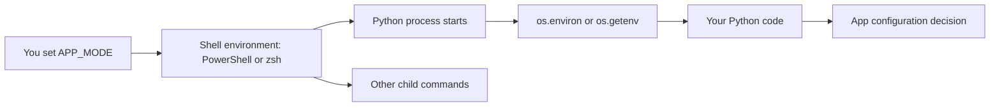

# Environment Variables

Environment variables are named string values available to a process. A shell has an environment, the shell starts Python, and Python receives a copy of that environment. Your Python code can then read values with `os.environ` or `os.getenv`.

Use environment variables for configuration that changes between runs or machines: API keys and tokens, `DEBUG`, `PORT`, `DATABASE_URL`, and tool behavior such as `PATH`. They are not magic global app storage, and they are not a complete production secret-management system by themselves.

## What You Will Learn

- Read and set environment variables in PowerShell and `zsh`.
- Pass values from your shell to Python.
- Handle missing variables clearly.
- Understand session-scoped variables, persistent variables, and child-process inheritance.
- Convert string values into booleans, ports, and other Python types.
- Avoid leaking secrets in source code, terminal history, logs, and screenshots.
- Use `.env` files only as local development helpers, with `.env` ignored by Git.

## Before You Start

You need a shell and Python. On Windows, use PowerShell and usually `python` or `py`. On macOS, the default shell is usually `zsh`, and Apple Silicon setups commonly use `python3` unless your local setup differs.

PowerShell checks:

```powershell
Get-Command python, py -ErrorAction SilentlyContinue
python --version
py --version
```

`zsh` checks:

```bash
echo $SHELL
command -v python3
python3 --version
```

## Core Mental Model

Each process has its own environment. Child processes usually inherit a copy from their parent. If you set `$Env:APP_MODE` in PowerShell or `export APP_MODE=dev` in `zsh`, commands started after that can inherit the value. If Python changes `os.environ`, that change affects the running Python process and child processes it starts, but it does not change the already-running parent shell.



## Quick Examples

### PowerShell

Read, set, and remove a session-scoped value:

```powershell
$Env:APP_MODE
$Env:APP_MODE = "development"
python -c "import os; print(os.getenv('APP_MODE', 'not set'))"
Remove-Item Env:\APP_MODE
```

PowerShell does not use the `NAME=value command` prefix syntax that `zsh` uses. For one temporary invocation, set the session value, run the command, and restore or remove it:

```powershell
$oldAppMode = $Env:APP_MODE
try {
    $Env:APP_MODE = "one-run"
    python -c "import os; print(os.getenv('APP_MODE', 'not set'))"
}
finally {
    if ($null -eq $oldAppMode) {
        Remove-Item Env:\APP_MODE -ErrorAction SilentlyContinue
    }
    else {
        $Env:APP_MODE = $oldAppMode
    }
}
```

### zsh

Read, set, pass for one command, and remove a value:

```bash
echo $APP_MODE
export APP_MODE=development
python3 -c "import os; print(os.getenv('APP_MODE', 'not set'))"
APP_MODE=one-run python3 -c "import os; print(os.getenv('APP_MODE', 'not set'))"
unset APP_MODE
```

Quote values that contain spaces:

```bash
export USER_NAME="Ada Lovelace"
```

```powershell
$Env:USER_NAME = "Ada Lovelace"
```

## Python Patterns

Environment variables are strings. Convert them explicitly when your code needs another type.

Optional configuration with a default:

```python
import os

app_mode = os.getenv("APP_MODE", "development")
```

Required configuration with a helpful failure:

```python
import os

try:
    api_token = os.environ["API_TOKEN"]
except KeyError:
    raise SystemExit("Missing required environment variable: API_TOKEN")
```

Boolean and port conversion:

```python
import os

debug = os.getenv("DEBUG", "false").lower() in {"1", "true", "yes", "on"}
port = int(os.getenv("PORT", "8000"))
```

Changing `os.environ` changes the current Python process environment and the environment inherited by child processes started after the change:

```python
import os
import subprocess
import sys

os.environ["APP_MODE"] = "from-python"
subprocess.run([sys.executable, "-c", "import os; print(os.getenv('APP_MODE'))"])
```

On macOS, use `python3` in shell commands unless your setup has a different `python` command. Inside Python code, prefer `sys.executable` when a script needs to start another Python process.

## Secrets and `.env` Files

Do not hardcode secrets in Python files, commit them to Git, paste them into issue comments, or print them in logs. Environment variables can still leak through shell history, process inspection, CI logs, screenshots, and careless debug output.

A `.env` file can be useful for local development, but it is just a convenience file. Keep real secret management in your deployment platform, CI system, or secret manager.

If you use `.env`, ignore the real file and commit an example:

```text
# .gitignore
.env
```

```text
# .env.example
APP_MODE=development
USER_NAME=Your Name
API_TOKEN=replace-with-local-token
PORT=8000
```

Loading `.env` is optional. If you need it, [`python-dotenv`](https://pypi.org/project/python-dotenv/) is a common local-development helper.

## Suggested Learning Order

1. [Foundations](01_foundations.md): Learn what environment variables are and why command-line tools and apps use them.
2. [Core Concepts](02_core_concepts.md): Build the shell-to-process mental model, including inheritance and string values.
3. [Practical Patterns](03_practical_patterns.md): Read variables in Python, choose defaults, and convert values safely.
4. [Common Mistakes](04_common_mistakes.md): Avoid leaking secrets, relying on unset values, and confusing session-scoped changes with persistent settings.
5. [Practice Project](05_practice_project.md): Build a small CLI that reports configuration without exposing secrets.

## Practice Project: `config_report.py`

Build `topics/environment-variables/config_report.py`. It should read:

- `APP_MODE`: optional, default `development`.
- `USER_NAME`: optional, default `friend`.
- `API_TOKEN`: required secret-like value.
- `PORT`: optional, default `8000`, converted to an integer.

The program should print safe configuration details, fail helpfully when `API_TOKEN` is missing, and never print the full token.

Complete worked answer:

```python
import os


def mask_secret(value):
    if len(value) <= 4:
        return "*" * len(value)
    return f"{value[:2]}...{value[-2:]}"


def read_port():
    raw_port = os.getenv("PORT", "8000")
    try:
        return int(raw_port)
    except ValueError:
        raise SystemExit(f"PORT must be an integer, got {raw_port!r}")


def main():
    app_mode = os.getenv("APP_MODE", "development")
    user_name = os.getenv("USER_NAME", "friend")
    api_token = os.getenv("API_TOKEN")

    if not api_token:
        raise SystemExit("Missing required environment variable: API_TOKEN")

    port = read_port()

    print(f"Mode: {app_mode}")
    print(f"User: {user_name}")
    print(f"Port: {port}")
    print(f"API token: {mask_secret(api_token)}")


if __name__ == "__main__":
    main()
```

Run it in PowerShell:

```powershell
$Env:APP_MODE = "development"
$Env:USER_NAME = "Ada"
$Env:API_TOKEN = "abc123secret"
$Env:PORT = "8000"
python topics/environment-variables/config_report.py
Remove-Item Env:\APP_MODE
Remove-Item Env:\USER_NAME
Remove-Item Env:\API_TOKEN
Remove-Item Env:\PORT
```

Run it in `zsh`:

```bash
APP_MODE=development USER_NAME=Ada API_TOKEN=abc123secret PORT=8000 python3 topics/environment-variables/config_report.py
```

Expected success output:

```text
Mode: development
User: Ada
Port: 8000
API token: ab...et
```

Expected missing-token output:

```text
Missing required environment variable: API_TOKEN
```

Cleanup after session-scoped `zsh` exports:

```bash
unset APP_MODE
unset USER_NAME
unset API_TOKEN
unset PORT
```

## Platform Notes

| Topic | PowerShell on Windows | zsh on macOS |
| --- | --- | --- |
| Read a value | `$Env:NAME` | `echo $NAME` |
| Set for current shell session | `$Env:NAME = "value"` | `export NAME=value` |
| Pass to one command | Set, run, then restore or remove with `try`/`finally` | `NAME=value python3 app.py` |
| Remove from current shell session | `Remove-Item Env:\NAME` | `unset NAME` |
| Python command | `python` or `py` | `python3` |
| Values with spaces | Quote: `$Env:NAME = "Ada Lovelace"` | Quote: `export NAME="Ada Lovelace"` |
| `PATH` separator | Semicolon: `;` | Colon: `:` |
| Persistent variables | Avoid for these lessons | Avoid for these lessons |

## References

- [PowerShell about_Environment_Variables](https://learn.microsoft.com/en-us/powershell/module/microsoft.powershell.core/about/about_environment_variables)
- [PowerShell Environment provider](https://learn.microsoft.com/en-us/powershell/module/microsoft.powershell.core/about/about_environment_provider)
- [Python `os` module](https://docs.python.org/3/library/os.html)
- [Python command line and environment](https://docs.python.org/3/using/cmdline.html)
- [Apple Terminal: Change the default shell](https://support.apple.com/guide/terminal/change-the-default-shell-trml113/mac)
- [Apple Terminal: Use environment variables](https://support.apple.com/guide/terminal/use-environment-variables-apd382cc5fa-4f58-4449-b20a-41c53c006f8f/mac)
- [zsh Parameters](https://zsh.sourceforge.io/Doc/Release/Parameters.html)
- [The Twelve-Factor App: Config](https://12factor.net/config)
- [python-dotenv](https://pypi.org/project/python-dotenv/)
- [GitHub Actions secrets](https://docs.github.com/actions/security-guides/using-secrets-in-github-actions)
- [GitHub diagrams in Markdown](https://docs.github.com/en/get-started/writing-on-github/working-with-advanced-formatting/creating-diagrams)
