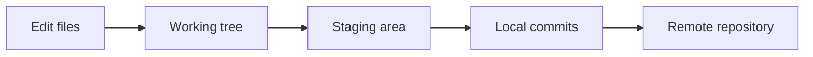

# Git

Git is a distributed version control system for tracking project history. It works locally first: you can record commits, inspect changes, and move between branches without GitHub or any other hosting service. A remote host such as GitHub becomes useful later for backup, sharing, review, and collaboration.

This topic supports every language track in the curriculum. Whether you are writing Python, JavaScript, documentation, or configuration files, Git gives you a repeatable way to save progress, compare versions, and recover from common mistakes.

## What You Will Learn

- Track changes in a project over time.
- Understand the working tree, staging area, local repository, and optional remote repository.
- Create small, meaningful commits.
- Use branches to work on separate ideas.
- Inspect history and differences before changing course.
- Recognize beginner mistakes and recover from them conceptually.

## Mental Model

Git separates your current files from the history you choose to save. Edit files in the working tree, stage selected changes, commit the staged snapshot to local history, and optionally push commits to a remote repository. Build the habit of running `git status` before and after Git commands so you always know where your changes are.

## Prerequisites

- Be comfortable opening a terminal and moving between folders.
- Install Git and confirm it is available with `git --version`.
- Use a text editor you can open from the project folder.
- Practice in a throwaway folder, not inside important work.
- Create a GitHub account only when you reach remote or push practice; Git itself does not require GitHub.

Core Git commands are the same in Windows PowerShell and macOS `zsh`. When a lesson needs shell-specific setup, it should show separate tested examples for PowerShell and `zsh`. On macOS Apple Silicon, avoid assuming Intel-only paths such as `/usr/local`; use the installer or package manager guidance from the tool you choose.

## Suggested Learning Order

1. [Foundations](01_foundations.md) introduces what Git is, why local history matters, and how to check that Git is ready before practicing. Start here if Git and GitHub feel like the same thing.
2. [Core Concepts](02_core_concepts.md) explains the working tree, staging area, commits, branches, and remotes as separate parts of the workflow. This lesson gives the vocabulary used by every later topic.
3. [Practical Patterns](03_practical_patterns.md) focuses on everyday habits such as checking status, staging related changes, committing intentionally, and reading history or diffs before acting.
4. [Common Mistakes](04_common_mistakes.md) names beginner failure modes and how to think about recovery. Use it after the core workflow is familiar so the safety guidance has context.
5. [Practice Project](05_practice_project.md) ties the pieces together in a small repository. The project should eventually include `init`, `status`, `add`, `commit`, `log`, `diff`, branch creation and switching, merge practice, and optional remote push or pull work.

## Safety Notes

- Run `git status` before and after Git commands.
- Practice destructive commands only in throwaway repositories.
- Do not run commands that discard work unless the lesson explains the effect.
- Commit small, related changes so each saved point is easy to understand.
- Keep remote work optional until the local workflow is comfortable.

## References

- [What is Git?](https://git-scm.com/book/en/v2/Getting-Started-What-is-Git%3F)
- [First-Time Git Setup](https://git-scm.com/book/en/v2/Getting-Started-First-Time-Git-Setup)
- [Recording Changes to the Repository](https://git-scm.com/book/en/v2/Git-Basics-Recording-Changes-to-the-Repository)
- [Git Cheat Sheet](https://git-scm.com/cheat-sheet)
- [About Remote Repositories](https://docs.github.com/en/get-started/git-basics/about-remote-repositories)
- [Managing Remote Repositories](https://docs.github.com/en/get-started/git-basics/managing-remote-repositories)
- [Creating Diagrams on GitHub](https://docs.github.com/en/get-started/writing-on-github/working-with-advanced-formatting/creating-diagrams)
