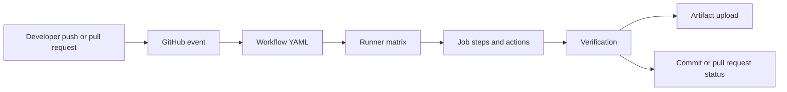

# 06 - GitHub Actions

## Learning Goal

Create a secure continuous-integration (CI) workflow that runs the same lightweight check on GitHub-hosted Linux, Windows, and macOS runners whenever a developer pushes code or opens a pull request.

## What GitHub Actions Runs

A workflow is a YAML file in `.github/workflows/`. An event starts a workflow; a workflow contains jobs; and each job contains ordered steps. A step either runs a command or uses an action, which is reusable workflow code. Each job selects a runner with `runs-on`.

The following flow is the useful mental model. Each matrix job runs in its own fresh runner environment, so files from one job do not automatically appear in another.



GitHub-hosted runner labels and image contents change over time. A `macos-latest` job tests the current macOS image selected by GitHub; do not assume that label always means an Apple Silicon runner. Check GitHub's runner documentation when your project needs a specific architecture or installed tool.

## A Small Cross-Platform Workflow

Create `.github/workflows/ci.yml` with this workflow:

```yaml
name: CI

on:
  push:
  pull_request:
  workflow_dispatch:

permissions:
  contents: read

jobs:
  verify:
    name: Verify on ${{ matrix.os }}
    runs-on: ${{ matrix.os }}
    strategy:
      fail-fast: false
      matrix:
        os: [ubuntu-latest, windows-latest, macos-latest]

    steps:
      - name: Check out the repository
        uses: actions/checkout@v4

      - name: Set up Python
        uses: actions/setup-python@v5
        with:
          python-version: "3.12"

      - name: Verify Python
        run: python --version

      - name: Write a small report
        run: python -c "from pathlib import Path; import sys; Path('artifacts').mkdir(exist_ok=True); Path('artifacts/python-version.txt').write_text(sys.version, encoding='utf-8')"

      - name: Upload the report
        if: ${{ always() }}
        uses: actions/upload-artifact@v4
        with:
          name: python-version-${{ matrix.os }}
          path: artifacts/python-version.txt
          if-no-files-found: warn
```

The matrix expands `verify` into three jobs. `python --version` and the Python one-liner are intentionally portable, so they work with the default shell on each selected runner. The report is created under a repository-relative `artifacts` directory and uploaded even when an earlier step fails. The `always()` condition makes the upload attempt, while `if-no-files-found: warn` keeps a failed earlier report step from masking the original failure.

The action tags in this example are readable major-version tags. Before using third-party actions or a sensitive production workflow, review the action and pin it more tightly, preferably to a full commit SHA.

## Permissions And Secrets

`GITHUB_TOKEN` is an automatically provided token. Its permissions can be configured at repository, organization, workflow, and job scopes. Start with the smallest permission set. This read-only CI workflow needs only:

```yaml
permissions:
  contents: read
```

Store a deployment token, API key, or password in GitHub repository or organization settings as a secret. Reference it only in the step that needs it, and never print it. The following is deliberately commented out: it shows the shape of a secret-consuming deployment step without running one in this CI lesson.

```yaml
# - name: Deploy
#   env:
#     DEPLOY_TOKEN: ${{ secrets.DEPLOY_TOKEN }}
#   run: python scripts/deploy.py
```

Do not pass secrets to untrusted code. In particular, fork pull requests have important restrictions around secrets; design pull-request workflows so code from a fork cannot use privileged credentials.

## Artifacts Are Not Caches

An artifact is an output retained for people or later workflow jobs to download, such as a test report, package, or generated diagnostic file. The example uploads `artifacts/python-version.txt` as an artifact.

A dependency cache is a performance optimization that can restore reusable dependencies between runs. It is not durable output storage and it is never a place for credentials or other secrets. Add caching only after your workflow is correct without it.

## Common Mistakes

- Misalign YAML indentation, which changes the workflow structure or prevents GitHub from parsing it.
- Expect one job's files to exist in another job. Jobs use isolated environments; pass needed outputs with artifacts or an appropriate workflow mechanism.
- Give `GITHUB_TOKEN` broad write permissions when a read-only check is sufficient.
- Commit credentials, echo secrets, or interpolate secrets into untrusted shell commands.
- Assume fork pull requests receive secrets.
- Treat `latest` action tags as an immutable security boundary; review and pin important actions.
- Put Bash-only syntax in a shared `run` step that also runs on Windows.
- Assume `macos-latest` selects Apple Silicon without checking the current hosted-runner documentation.

## Exercise

Add `.github/workflows/ci.yml` to a small Python repository.

1. Trigger it on `push`, `pull_request`, and `workflow_dispatch`.
2. Run it on Ubuntu, Windows, and macOS hosted runners.
3. Check out the repository and set up Python 3.12.
4. Run a portable Python verification command.
5. Write and upload a project-relative report for every matrix job, including when a prior check fails.
6. Set the workflow permissions to the minimum required value.
7. Add a commented explanation of where a deployment secret would be referenced, without creating, revealing, or printing one.

## Worked Answer

Use the complete `ci.yml` workflow from [A Small Cross-Platform Workflow](#a-small-cross-platform-workflow). After committing and pushing it, open the repository's **Actions** tab. A run should show three `Verify on ...` jobs, one per matrix entry. Each successful job uploads a `python-version-...` artifact.

If a project needs real tests, replace `Verify Python` with its documented test command only after confirming that command and its dependencies work across all selected runner shells. Keep platform-specific commands in clearly separate steps with an explicit shell when they cannot be made portable.

## Sources

- [Understanding GitHub Actions](https://docs.github.com/en/actions/get-started/understanding-github-actions)
- [Workflow syntax for GitHub Actions](https://docs.github.com/en/actions/writing-workflows/workflow-syntax-for-github-actions)
- [GitHub-hosted runners](https://docs.github.com/en/actions/concepts/runners/github-hosted-runners)
- [Choosing the runner for a job](https://docs.github.com/en/actions/writing-workflows/choosing-where-your-workflow-runs/choosing-the-runner-for-a-job)
- [Automatic token authentication and permissions](https://docs.github.com/en/actions/security-for-github-actions/security-guides/automatic-token-authentication)
- [Using secrets in GitHub Actions](https://docs.github.com/en/actions/security-for-github-actions/security-guides/using-secrets-in-github-actions)
- [Storing workflow data as artifacts](https://docs.github.com/en/actions/using-workflows/storing-workflow-data-as-artifacts)
- [Caching dependencies to speed up workflows](https://docs.github.com/en/actions/using-workflows/caching-dependencies-to-speed-up-workflows)
- [Security hardening for GitHub Actions](https://docs.github.com/en/actions/security-for-github-actions/security-guides/security-hardening-your-deployments)
