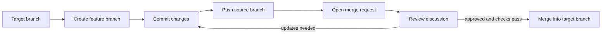

# 01 - Projects And Merge Requests

## Learning Goal

Understand how a GitLab project combines a Git repository with collaboration tools, and practice the everyday merge request flow: create or clone a project, branch, commit, push, open a merge request, review, update, check status, and merge.

## Vocabulary

- **Project**: the GitLab workspace that contains a repository and project features such as merge requests, issues, settings, members, and CI/CD configuration.
- **Repository**: the version-controlled code storage inside a project.
- **Remote**: a named connection from your local repository to the GitLab-hosted repository. The usual default remote name is `origin`.
- **Branch**: a named line of work. A feature branch lets you work separately from the default branch.
- **Commit**: a saved snapshot of changes in the repository history.
- **Merge request** or **MR**: a GitLab review page where you propose merging changes from one branch into another.
- **Source branch**: the branch that contains the proposed changes.
- **Target branch**: the branch that should receive the changes, often the default branch such as `main`.
- **Reviewer**: a person asked to inspect the merge request and leave feedback.
- **Approval**: a review signal that the change is acceptable. Projects can make approvals optional or required.
- **Discussion**: a comment thread on the merge request, often attached to a specific line of code.
- **Pipeline** or **check status**: automated status shown on the merge request when the project has CI/CD configured. In this lesson, treat it as a high-level signal to inspect before merging.

## Projects Are More Than Repositories

A GitLab repository stores code and its Git history. A GitLab project wraps that repository in a collaboration space. The project page can show repository files, branches, commits, merge requests, issues, members, settings, and optional CI/CD configuration.

That distinction matters because most team work is not just "put code somewhere." A teammate needs to understand what changed, discuss it, review it, approve it if the project requires approvals, see whether automated checks passed, and then merge it into the target branch.

## The Basic GitLab Flow

Most beginner work follows this path:

1. Create a project in GitLab or clone an existing project.
2. Create a feature branch from the current target branch.
3. Make a focused change.
4. Commit the change locally.
5. Push the source branch to GitLab.
6. Open a merge request from the source branch into the target branch.
7. Use the MR discussion for review comments and questions.
8. Push more commits to the same source branch when updates are requested.
9. Check approvals and pipeline/check status if the project uses them.
10. Merge the MR when the project rules are satisfied.



## Example: Create A Feature Branch And Open An MR

Start by cloning the GitLab project. Replace `<gitlab-project-url>` with the HTTPS or SSH clone URL from the GitLab project page.

```shell
git clone <gitlab-project-url>
cd <project-folder>
git status
```

Before branching, make sure your local default branch is current. This example uses `main`; if your project uses another default branch, use that name instead.

```shell
git switch main
git pull origin main
git switch -c docs/gitlab-workflow-note
```

Make one small documentation change. File creation syntax differs between PowerShell and macOS `zsh`, so use the block for your shell.

Windows PowerShell:

```powershell
New-Item -ItemType Directory -Force docs
Set-Content -Path docs/gitlab-workflow.md -Value "Merge requests are review conversations before code is merged."
```

macOS Apple Silicon `zsh`:

```bash
mkdir -p docs
printf '%s\n' 'Merge requests are review conversations before code is merged.' > docs/gitlab-workflow.md
```

The Git commands are the same on both platforms:

```shell
git status
git add docs/gitlab-workflow.md
git commit -m "Add GitLab workflow note"
git push -u origin docs/gitlab-workflow-note
```

After the push, GitLab often shows a link or button to create a merge request for the pushed branch. You can also open the project in GitLab and choose **Merge requests** > **New merge request**.

When creating the MR:

- Set the **source branch** to `docs/gitlab-workflow-note`.
- Set the **target branch** to `main`, or to your team's intended integration branch.
- Write a short title that says what changed.
- Write a description that explains why the change exists and what reviewers should inspect.
- Add a reviewer if your team expects one.
- Check the merge request page for discussions, approvals, and pipeline/check status.

## Review Is A Conversation

A merge request is not only a final gate. It is the place where the team can inspect the diff, ask questions, suggest changes, and record the decision to merge.

If a reviewer asks for changes, update the same source branch rather than opening a new MR for the same work:

```shell
git switch docs/gitlab-workflow-note
# edit the file again
git status
git add docs/gitlab-workflow.md
git commit -m "Clarify GitLab MR review note"
git push
```

GitLab updates the existing merge request because the pushed commit is on the same source branch. The reviewer can then continue the discussion, approve the MR if appropriate, and the project can merge it when its rules are satisfied.

If the project has a pipeline configured, the MR can show whether the pipeline is running, passed, failed, or was skipped. Do not treat a failed status as decoration. Open the pipeline or job details, understand the failure, and fix the branch or ask for help before merging.

## Common Mistakes

- **Committing directly to the default branch**: this skips the review path and can put unfinished work where teammates expect stable code.
- **Forgetting to push the branch**: a local branch is invisible to GitLab until you push it to the remote.
- **Choosing the wrong target branch**: always confirm where the change should land before opening or merging the MR.
- **Mixing unrelated changes**: keep one MR focused so reviewers can reason about it.
- **Treating the MR as only a final step**: open it early enough for review, questions, and course correction.
- **Ignoring failed pipeline/check status**: if checks exist and fail, inspect the failure before merging.
- **Opening a new MR for every review fix**: usually, push follow-up commits to the same source branch so the existing MR stays as the conversation history.

## Exercise

You are working in a GitLab project whose default branch is `main`. Create a small documentation change on a feature branch and prepare a merge request plan.

Do the following:

1. Clone a project from `<gitlab-project-url>` and enter the project folder.
2. Create a branch named `docs/add-team-note` from `main`.
3. Create a file named `docs/team-note.md` containing one sentence: `Merge requests help the team review changes before they land.`
4. Commit the file with the message `Add team merge request note`.
5. Push the branch to GitLab.
6. Write the MR source branch, target branch, reviewer role, and what you would check before merging.

## Worked Answer

Clone and branch:

```shell
git clone <gitlab-project-url>
cd <project-folder>
git switch main
git pull origin main
git switch -c docs/add-team-note
```

Create the file.

Windows PowerShell:

```powershell
New-Item -ItemType Directory -Force docs
Set-Content -Path docs/team-note.md -Value "Merge requests help the team review changes before they land."
```

macOS Apple Silicon `zsh`:

```bash
mkdir -p docs
printf '%s\n' 'Merge requests help the team review changes before they land.' > docs/team-note.md
```

Commit and push:

```shell
git status
git add docs/team-note.md
git commit -m "Add team merge request note"
git push -u origin docs/add-team-note
```

The merge request plan:

- Source branch: `docs/add-team-note`.
- Target branch: `main`.
- Reviewer: a teammate or maintainer who can check whether the wording and file location make sense.
- Before merging: confirm the MR diff contains only `docs/team-note.md`, respond to any discussion, get required approval if the project requires it, and inspect the pipeline/check status if the project shows one.

If the reviewer asks for a clearer sentence, stay on the same branch, edit the file, commit again, and push:

```shell
git switch docs/add-team-note
# edit docs/team-note.md
git add docs/team-note.md
git commit -m "Clarify team merge request note"
git push
```

The existing MR updates automatically because the new commit was pushed to its source branch.

## Sources Used

- [GitLab Docs: Create a project](https://docs.gitlab.com/user/project/)
- [GitLab Docs: Manage projects](https://docs.gitlab.com/user/project/working_with_projects/)
- [GitLab Docs: Repository](https://docs.gitlab.com/user/project/repository/)
- [GitLab Docs: Branches](https://docs.gitlab.com/user/project/repository/branches/)
- [GitLab Docs: Commits](https://docs.gitlab.com/user/project/repository/commits/)
- [GitLab Docs: Merge requests](https://docs.gitlab.com/user/project/merge_requests/)
- [GitLab Docs: Merge request reviews](https://docs.gitlab.com/user/project/merge_requests/reviews/)
- [GitLab Docs: Merge request approvals](https://docs.gitlab.com/user/project/merge_requests/approvals/)
- [GitLab Docs: Pipelines](https://docs.gitlab.com/ci/pipelines/)
