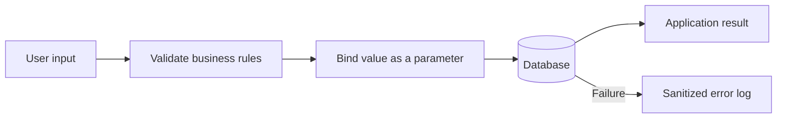

# 06 - SQL Injection And Parameterized Queries

## Learning Goal

Build database queries so untrusted input is always sent as data, never as part of
SQL syntax. Use parameter binding for values, fixed allowlists for the small parts
of a query that cannot be parameterized, and safe validation, errors, and logs.

## Threat Model

An attacker can control data that reaches a query: a search box, URL parameter,
form field, API request, or imported record. If an application builds SQL by
concatenating that data into the statement, the data can add operators, quotes, or
other SQL syntax. The database then receives a different statement from the one the
application intended.

This lesson uses Python's standard-library `sqlite3` module and an in-memory
database, so it runs without a database server or machine-specific path on Windows
PowerShell and macOS Apple Silicon with `zsh`.



Validation and parameter binding have different jobs. Validation decides whether
input is acceptable for the application's business rules. Parameter binding keeps
an accepted value from changing the structure of the SQL statement.

## Why Concatenation Is Unsafe

The following is intentionally non-runnable. Do not adapt it for production code:

```text
sql = "SELECT id, name FROM customers WHERE email = '" + email + "'"
connection.execute(sql)
```

If `email` contains a quote and SQL operators, it can change the `WHERE` clause.
Escaping quotes yourself is not a reliable replacement for parameter binding.

## Parameter Binding In Python

With `sqlite3`, keep the SQL text fixed and pass each value separately. The `?`
placeholder represents a value, and the one-item tuple supplies that value.

```python
import sqlite3


def find_customer_by_email(connection: sqlite3.Connection, email: str):
    statement = "SELECT id, name, email FROM customers WHERE email = ?"
    return connection.execute(statement, (email,)).fetchone()


connection = sqlite3.connect(":memory:")
connection.execute(
    "CREATE TABLE customers (id INTEGER PRIMARY KEY, name TEXT, email TEXT)"
)
connection.execute(
    "INSERT INTO customers (name, email) VALUES (?, ?)",
    ("Ari Chen", "ari@example.test"),
)

customer = find_customer_by_email(connection, "ari@example.test")
print(customer)
```

Run the complete worked answer later in this lesson with the command for your
terminal:

```powershell
py 06_sql_injection_and_parameterized_queries.py
```

```bash
python3 06_sql_injection_and_parameterized_queries.py
```

The placeholder syntax is specific to Python's DB-API and SQLite. Other databases
and drivers can use different placeholders, so use the parameter-binding API in
that driver's documentation instead of copying `?` everywhere.

## Values Are Not SQL Structure

Parameters bind values, not SQL identifiers, keywords, or directions. This cannot
be made safe by passing a column name as a `?` value:

```text
connection.execute("SELECT * FROM customers ORDER BY ?", (sort_by,))
```

Instead, map externally supplied choices to a small, fixed set of SQL fragments
owned by the application:

```python
SORT_COLUMNS = {
    "name": "name",
    "created_at": "created_at",
}


def list_customers(connection: sqlite3.Connection, sort_by: str):
    try:
        column = SORT_COLUMNS[sort_by]
    except KeyError as error:
        raise ValueError("sort_by must be 'name' or 'created_at'") from error

    statement = f"SELECT id, name, email FROM customers ORDER BY {column}"
    return connection.execute(statement).fetchall()
```

The f-string is acceptable here only because `column` comes from the constant
allowlist, not from the request. Do not insert an unverified request value into a
query's table name, column name, operator, or sort direction.

## Defense In Depth

Parameter binding is the primary SQL-injection defense. Combine it with these
practices:

- Validate business rules before querying. For example, reject an empty email or an
  email longer than the application's supported maximum.
- Use a database account with only the permissions needed by the application. A
  read-only lookup service should not have schema-changing privileges.
- Return a generic failure to the user when a database operation fails. Do not send
  SQL text, connection strings, credentials, or provider error details to clients.
- Log enough context to investigate, such as an operation name and an error type,
  but do not log passwords, connection strings, or raw sensitive input.

## Same Idea In Each Track

| Track | Parameter-binding approach |
| --- | --- |
| C# | Create provider parameters on a `DbCommand` (or provider-specific command) and never concatenate values into `CommandText`. |
| Java | Use `PreparedStatement` and bind values with setters such as `setString` and `setInt`. |
| JavaScript | Use the database driver's parameter API. For `node-postgres`, pass a values array with `$1`, `$2`, and similar placeholders. |
| PHP | Use `PDO::prepare()` and pass values to `execute()`. |
| Python | Use the DB-API's placeholder style and a separate parameter sequence or dictionary. |
| Perl | Use DBI `prepare` followed by `execute` with bind values. |
| C | Use the selected database client's parameter API. PostgreSQL libpq provides `PQexecParams`. |

## Common Mistakes

- Concatenating, interpolating, or calling `format` with a value inside SQL text.
- Escaping quotes manually and treating that as equivalent to parameter binding.
- Binding a user value into `ORDER BY ?` and expecting it to become a column name.
- Building an identifier or sort direction from request text instead of an allowlist.
- Logging raw request data, passwords, connection strings, or detailed database
  errors.
- Treating input validation as a substitute for parameter binding. Valid-looking
  input still belongs in a parameter.

## Exercise

Write `find_customer_by_email(connection, email, sort_by)` using Python `sqlite3`.

1. Reject an `email` that is not a string, is empty after trimming, or exceeds 254
   characters.
2. Use a placeholder and a separate parameter tuple to find the customer.
3. Return the selected customer record or `None`.
4. Accept only `name` or `created_at` for `sort_by` through a fixed allowlist.
5. On a database failure, log the operation and error type without logging the
   email or connection details, then raise a generic application error.

## Worked Answer

Save this complete file as
`06_sql_injection_and_parameterized_queries.py` beside this lesson. It creates an
in-memory database, so it leaves no database file or credentials on either
platform.

```python
import logging
import sqlite3


logging.basicConfig(level=logging.INFO, format="%(levelname)s %(message)s")
LOGGER = logging.getLogger(__name__)
MAX_EMAIL_LENGTH = 254
SORT_COLUMNS = {
    "name": "name",
    "created_at": "created_at",
}


class CustomerLookupError(RuntimeError):
    """A database failure safe to report at the application boundary."""


def validate_email(email: str) -> str:
    if not isinstance(email, str):
        raise ValueError("email must be a string")

    normalized = email.strip()
    if not normalized or len(normalized) > MAX_EMAIL_LENGTH:
        raise ValueError("email must be between 1 and 254 characters")
    return normalized


def select_sort_column(sort_by: str) -> str:
    try:
        return SORT_COLUMNS[sort_by]
    except KeyError as error:
        raise ValueError("sort_by must be 'name' or 'created_at'") from error


def find_customer_by_email(
    connection: sqlite3.Connection, email: str, sort_by: str = "name"
):
    normalized_email = validate_email(email)
    sort_column = select_sort_column(sort_by)
    statement = (
        "SELECT id, name, email, created_at "
        "FROM customers "
        "WHERE email = ? "
        f"ORDER BY {sort_column}"
    )

    try:
        return connection.execute(statement, (normalized_email,)).fetchone()
    except sqlite3.DatabaseError as error:
        LOGGER.error(
            "customer lookup failed operation=find_customer_by_email error_type=%s",
            type(error).__name__,
        )
        raise CustomerLookupError("Customer lookup is temporarily unavailable") from error


def create_demo_connection() -> sqlite3.Connection:
    connection = sqlite3.connect(":memory:")
    connection.execute(
        "CREATE TABLE customers ("
        "id INTEGER PRIMARY KEY, "
        "name TEXT NOT NULL, "
        "email TEXT NOT NULL UNIQUE, "
        "created_at TEXT NOT NULL"
        ")"
    )
    connection.executemany(
        "INSERT INTO customers (name, email, created_at) VALUES (?, ?, ?)",
        [
            ("Ari Chen", "ari@example.test", "2025-01-15"),
            ("Sam Rivera", "sam@example.test", "2025-02-10"),
        ],
    )
    return connection


def main() -> None:
    with create_demo_connection() as connection:
        ordinary_lookup = find_customer_by_email(
            connection, "ari@example.test", sort_by="name"
        )
        injection_like_input = "' OR 1=1 --"
        protected_lookup = find_customer_by_email(connection, injection_like_input)

        print("Ordinary lookup:", ordinary_lookup)
        print("Injection-like input is data, not SQL:", protected_lookup)


if __name__ == "__main__":
    main()
```

Expected output is similar to:

```text
Ordinary lookup: (1, 'Ari Chen', 'ari@example.test', '2025-01-15')
Injection-like input is data, not SQL: None
```

The code parameterizes the email value. It uses an f-string only for a column name
chosen from `SORT_COLUMNS`, the fixed allowlist in application code. The log entry
for a database failure includes neither the email nor the connection details.

## Sources

- [OWASP SQL Injection Prevention Cheat Sheet](https://cheatsheetseries.owasp.org/cheatsheets/SQL_Injection_Prevention_Cheat_Sheet.html)
- [Python sqlite3 placeholders](https://docs.python.org/3/library/sqlite3.html#how-to-use-placeholders-to-bind-values-in-sql-queries)
- [Microsoft.Data.SqlClient SqlCommand.Parameters](https://learn.microsoft.com/en-us/dotnet/api/microsoft.data.sqlclient.sqlcommand.parameters?view=sqlclient-dotnet-core-6.0)
- [Java PreparedStatement](https://docs.oracle.com/en/java/javase/21/docs/api/java.sql/java/sql/PreparedStatement.html)
- [PHP PDO::prepare](https://www.php.net/manual/en/pdo.prepare.php)
- [node-postgres parameterized queries](https://node-postgres.com/features/queries)
- [Perl DBI placeholders and bind values](https://metacpan.org/pod/DBI#Placeholders-and-Bind-Values)
- [PostgreSQL PQexecParams](https://www.postgresql.org/docs/current/libpq-exec.html#LIBPQ-PQEXECPARAMS)
