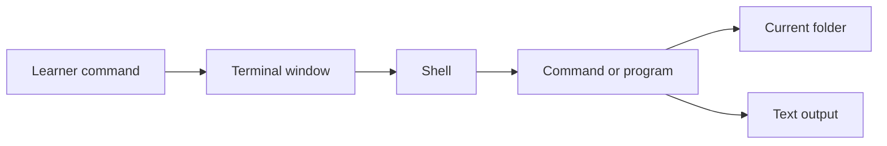

# 01 - Foundations

## Learning Goal

Learn what a terminal and shell are, how to read a prompt, how commands run from the current working directory, and how to safely inspect and navigate project files before running automation commands.

## Why Terminal Foundations Matter

Many programming tools are started from a terminal: test runners, formatters, package managers, Git commands, Python scripts, and project automation. Before you run those tools, you need to know where the command will run and what files are nearby.

This lesson focuses on safe commands: checking your location, listing files, moving through the repository, and running one tiny Python print command. It avoids commands that delete, move, rename, overwrite, install, or reconfigure anything.

## Terminal, Shell, Command

A terminal is the app or window where you type commands and read text output.

A shell is the program that reads your command, interprets the syntax, and starts the requested program. In this course, the Windows target shell is PowerShell. The macOS target shell is `zsh` in the Terminal app.

A command is the instruction you type into the shell. Most commands have three common parts:

- Command name: the program or shell command to run.
- Option, parameter, or flag: extra syntax that changes how the command behaves.
- Argument: the value the command should work with, such as a folder name, file name, or short piece of code.

PowerShell example:

```powershell
Get-ChildItem -Name
```

In this command, `Get-ChildItem` is the command name and `-Name` is a parameter that asks PowerShell to show only item names.

macOS Terminal with `zsh` example:

```bash
ls
```

In this command, `ls` is the command name. With no extra arguments, it lists items in the current folder.



## Read The Prompt

The prompt is the text the shell shows when it is ready for your next command. It often includes a hint about the current folder.

These are illustrative prompts only:

```text
PS project-folder>
project-folder %
$
>
```

Do not type prompt markers such as `PS`, `%`, `$`, or `>`. Type only the command that comes after the prompt.

If a lesson shows this:

```text
PS project-folder> Get-Location
```

You type only this:

```powershell
Get-Location
```

## Your First Safe Commands

The current working directory is the folder where your shell is currently focused. Commands normally run from that folder unless you tell them otherwise.

Check your current working directory before running project commands.

PowerShell:

```powershell
Get-Location
```

macOS Terminal with `zsh`:

```bash
pwd
```

List files before you change anything. Listing files is an inspection command: it shows what is there without deleting, moving, renaming, or overwriting files.

PowerShell:

```powershell
Get-ChildItem
Get-ChildItem -Name
```

macOS Terminal with `zsh`:

```bash
ls
```

Safe habit: inspect first, then decide what command should come next.

## Move Through The Repository

Use project-relative paths when moving around a repository. A relative path starts from where you are now instead of from the top of your computer's file system.

Move into the terminal topic folder from the repository root.

PowerShell:

```powershell
Set-Location .\topics\terminal
```

macOS Terminal with `zsh`:

```bash
cd ./topics/terminal
```

Move back to the repository root from `topics/terminal`. The path segment `..` means parent directory.

PowerShell:

```powershell
Set-Location ..\..
```

macOS Terminal with `zsh`:

```bash
cd ../..
```

If a file or folder name contains spaces, put quotes around that path. For example, PowerShell can use `Set-Location ".\folder with spaces"`, and `zsh` can use `cd "./folder with spaces"`. The practice below avoids spaces so you can focus on navigation first.

## Run One Tiny Program

Automation commands often start programs from the current folder. Before running automation, check your location and inspect the nearby files.

Python may not be installed on every system, so first check whether the command exists.

PowerShell:

```powershell
python --version
```

If `python` is not found, try the Windows Python launcher:

```powershell
py --version
```

Then run one tiny print command with whichever Python command works.

PowerShell:

```powershell
python -c "print('terminal ready')"
```

PowerShell fallback if `python` is not found but `py` works:

```powershell
py -c "print('terminal ready')"
```

macOS Terminal with `zsh`:

```bash
python3 --version
python3 -c "print('terminal ready')"
```

The `-c` option tells Python to run the short code string that follows it.

## Common Mistakes

- Typing the prompt marker, such as `PS`, `%`, `$`, or `>`, as part of the command.
- Running a project command before checking the current working directory.
- Pasting a command written for a different shell without checking the syntax.
- Guessing what files are nearby instead of listing them first.
- Using absolute paths from someone else's computer instead of project-relative paths.
- Treating every error as failure. Read the error text; it often says whether the command was not found, the path was wrong, or the command syntax was invalid.

## Practice

Create a terminal orientation note for yourself. Use only inspection commands, navigation commands, and one Python print command. Do not delete, move, rename, or overwrite files.

In your note, record the commands you used for your platform:

1. Starting folder command.
2. Move command into `topics/terminal`.
3. Location check command after moving into `topics/terminal`.
4. List command for the lesson files.
5. Return command back to the repository root.
6. Final location check command.
7. Python print command.

Your goal is to navigate to `topics/terminal`, confirm where you are, list the lesson files, return to the repository root, and run one tiny Python print command.

## Worked Answer

PowerShell:

```powershell
Get-Location
Set-Location .\topics\terminal
Get-Location
Get-ChildItem -Name
Set-Location ..\..
Get-Location
python -c "print('terminal ready')"
```

If `python` is not found but the Windows Python launcher works, use this sequence instead:

```powershell
Get-Location
Set-Location .\topics\terminal
Get-Location
Get-ChildItem -Name
Set-Location ..\..
Get-Location
py -c "print('terminal ready')"
```

macOS Terminal with `zsh`:

```bash
pwd
cd ./topics/terminal
pwd
ls
cd ../..
pwd
python3 -c "print('terminal ready')"
```

Expected interpretation:

- The first location command tells you where the shell starts.
- The move command changes the current working directory to `topics/terminal`.
- The next location command confirms you are in `topics/terminal` before listing files.
- The list command shows the lesson files in that folder.
- The return command moves two levels up, from `topics/terminal` back to the repository root.
- The final location command confirms you are back at the root before running Python.
- The Python command prints `terminal ready` if the selected Python command is available.

Sample orientation note:

```text
Platform: PowerShell
Starting folder command: Get-Location
Move command: Set-Location .\topics\terminal
Confirm terminal topic location: Get-Location
List command: Get-ChildItem -Name
Return command: Set-Location ..\..
Final location check: Get-Location
Python print command: python -c "print('terminal ready')"

What I checked: I confirmed my starting folder, moved into topics/terminal, confirmed that location, listed the lesson files, returned to the repository root, confirmed the location again, and ran one tiny Python print command.
```

## Sources Used

- [Apple Terminal User Guide: Execute commands and run tools in Terminal on Mac](https://support.apple.com/guide/terminal/execute-commands-and-run-tools-apdb66b5242-0d18-49fc-9c47-a2498b7c91d5/mac)
- [Apple Terminal User Guide: Welcome to Terminal on Mac](https://support.apple.com/guide/terminal/welcome/mac)
- [Microsoft Learn: Get-Location](https://learn.microsoft.com/powershell/module/microsoft.powershell.management/get-location)
- [Microsoft Learn: Set-Location](https://learn.microsoft.com/powershell/module/microsoft.powershell.management/set-location)
- [Microsoft Learn: Get-ChildItem](https://learn.microsoft.com/powershell/module/microsoft.powershell.management/get-childitem)
- [Microsoft Learn: about_Command_Syntax](https://learn.microsoft.com/powershell/module/microsoft.powershell.core/about/about_command_syntax)
- [Python documentation: Command line and environment](https://docs.python.org/3/using/cmdline.html)
- [GitHub Docs: Creating diagrams with Mermaid](https://docs.github.com/get-started/writing-on-github/working-with-advanced-formatting/creating-diagrams)

## Next Step

Continue to `02_core_concepts.md` to learn how terminal commands combine with files, paths, and command output in everyday project work.
