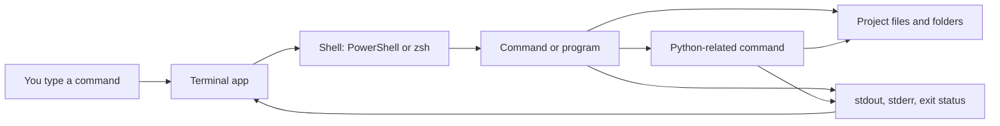

# Terminal

## Overview

A terminal is the app or window where you type commands. A shell is the program inside that terminal that reads those commands, interprets their syntax, starts other programs, and reports results back to you.

This topic supports two learner environments:

- Windows 10/11 using PowerShell.
- macOS on Apple Silicon using Terminal with `zsh`.

When syntax differs, examples should be shown separately for PowerShell and `zsh`. Do not assume a command copied from one shell will behave the same way in the other.

Terminal skills matter in Python because you will use them to run `python`, move around project folders, create virtual environments with `python -m venv`, activate those environments, install tools and packages, and read command output when something succeeds or fails.



The diagram is conceptual: Python is one important program you can launch from a shell, but not every command runs through Python.

## What You Will Learn

- Navigate folders and inspect files.
- Run Python scripts and modules from a project directory.
- Understand prompts, commands, flags/options, arguments, output, errors, and exit status.
- Use relative paths safely.
- Set and read environment variables at a beginner level.
- Recognize platform-specific syntax differences.
- Practice safe command habits before deleting or overwriting files.

## Before You Start

You need access to the shell for your operating system and a Python installation that is reachable from that shell:

- Windows: open PowerShell.
- macOS: open Terminal and use `zsh`, the default shell for current macOS user accounts.

Verify setup before starting. The Python launcher command may be `python`, `python3`, or `py` depending on your operating system, installation, and `PATH`.

Windows PowerShell:

```powershell
$PSVersionTable.PSVersion
Get-Location
Get-Command python, py -ErrorAction SilentlyContinue

if (Get-Command python -ErrorAction SilentlyContinue) {
    python --version
} elseif (Get-Command py -ErrorAction SilentlyContinue) {
    py --version
} else {
    "Python was not found. Install Python or update PATH, then reopen PowerShell."
}
```

macOS Terminal with `zsh`:

```bash
echo $SHELL
pwd
command -v python3
python3 --version
```

For virtual environments, activation syntax differs by shell:

Windows PowerShell:

```powershell
python -m venv .venv
.\.venv\Scripts\Activate.ps1
```

If `py` was the command that worked during setup verification, use it to create
the virtual environment instead:

```powershell
py -m venv .venv
.\.venv\Scripts\Activate.ps1
```

macOS Terminal with `zsh`:

```bash
python3 -m venv .venv
source .venv/bin/activate
```

If PowerShell blocks `Activate.ps1`, treat it as an execution policy troubleshooting issue. Do not weaken system-wide policy just to complete a beginner exercise.

## Suggested Learning Order

1. Foundations: start here for the completed lesson on terminal vs shell, prompts, current directory, and commands.
2. Core Concepts: queued for rewrite; use the link as a placeholder for the planned lesson on paths, arguments, options, `stdin`, `stdout`, `stderr`, exit status, `PATH`, and environment variables.
3. Practical Patterns: queued for rewrite; use the link as a placeholder for the planned lesson on Python project terminal tasks.
4. Common Mistakes: queued for rewrite; use the link as a placeholder for the planned lesson on diagnosing beginner terminal errors safely.
5. Practice Project: queued for rewrite; complete it after the first four lessons once those lessons are available.

## Lessons

Read the completed Foundations lesson first. The remaining lesson links are useful navigation targets, but they are still queued for rewrite and should not yet be treated as finished terminal instruction.

1. [Foundations](01_foundations.md): Learn what the terminal and shell are, how to read a prompt, and how the current working directory affects commands.
2. [Core Concepts](02_core_concepts.md): Placeholder for the planned rewrite covering how shells run programs through commands, flags, arguments, paths, streams, exit status, `PATH`, and environment variables.
3. [Practical Patterns](03_practical_patterns.md): Placeholder for the planned rewrite covering repeatable Python project terminal tasks such as navigating folders, creating a virtual environment, running scripts, and inspecting output.
4. [Common Mistakes](04_common_mistakes.md): Placeholder for the planned rewrite covering common beginner errors such as the wrong folder, wrong shell, spaces in paths, activation confusion, `PATH` confusion, destructive commands, and copied commands for the wrong operating system.
5. [Practice Project](05_practice_project.md): Placeholder for the planned rewrite of a terminal workflow project to complete after the prerequisite lessons are available.

## Platform Notes

| Topic | Windows PowerShell | macOS `zsh` on Apple Silicon |
| --- | --- | --- |
| Environment variables | Read with `$Env:NAME`; set for the current session with `$Env:NAME = "value"`. | Read with `$NAME`; set for the current session with `export NAME=value`. |
| Virtual environment activation | Use `.\.venv\Scripts\Activate.ps1`; execution policy may require troubleshooting. | Use `source .venv/bin/activate`. |
| `PATH` separator | Entries are separated with `;`. | Entries are separated with `:`. |
| Paths | Backslashes are common, but relative paths such as `.\folder` keep examples local. Quote paths with spaces. | Forward slashes are used, and relative paths such as `./folder` keep examples local. Quote paths with spaces. |
| Command snippets | Do not mix Bash or `zsh` snippets into PowerShell. Commands such as `ls`, `cat`, `rm`, `touch`, redirection, globbing, and aliases may behave differently. | Do not assume PowerShell syntax works in `zsh`. Commands, quoting, globbing, variables, and script execution use different rules. |

Prefer relative paths inside the course repository. Before running a command that deletes, overwrites, or moves files, check your current directory and name the exact files you expect the command to affect.

## Authoritative References

- [Apple Terminal User Guide: Open or quit Terminal](https://support.apple.com/guide/terminal/open-or-quit-terminal-apd5265185d-f365-44cb-8b09-71a064a42125/mac)
- [Apple Terminal User Guide: Execute commands and run tools](https://support.apple.com/guide/terminal/execute-commands-and-run-tools-apdb66b5242-0d18-49fc-9c47-a2498b7c91d5/mac)
- [Apple Terminal User Guide: Change General settings](https://support.apple.com/guide/terminal/change-general-settings-trmlstrtup/mac)
- [Microsoft PowerShell: about_Environment_Variables](https://learn.microsoft.com/en-us/powershell/module/microsoft.powershell.core/about/about_environment_variables)
- [Microsoft PowerShell: about_Execution_Policies](https://learn.microsoft.com/en-us/powershell/module/microsoft.powershell.core/about/about_execution_policies)
- [Python: Command line and environment](https://docs.python.org/3/using/cmdline.html)
- [Python: `venv` - Creation of virtual environments](https://docs.python.org/3/library/venv.html)
- [Python: `pathlib` - Object-oriented filesystem paths](https://docs.python.org/3/library/pathlib.html)
- [Python: `os` - Miscellaneous operating system interfaces](https://docs.python.org/3/library/os.html)
- [GitHub Docs: Creating diagrams](https://docs.github.com/en/get-started/writing-on-github/working-with-advanced-formatting/creating-diagrams)
